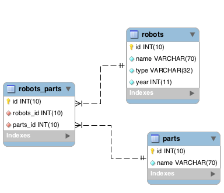
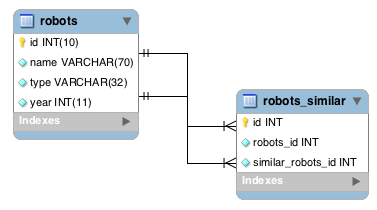
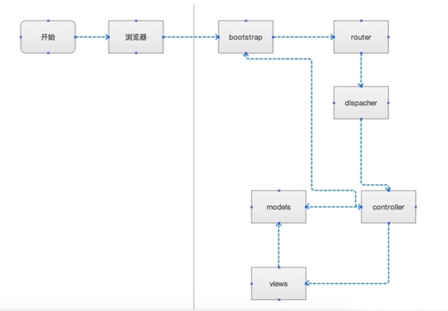

# Phalcon 分享第二季

[TOC]

## 一、前言

通过上次分享，假设你们对Phalcon有了一个大致的了解，本次分享主要介绍一些组件。接下来的内容大部分都是来自于官方文档，由于很大一部分内容没有中文内容，存在中英文对照的部分为我翻译，难免出错，勿怪！

另本次分享内容过多，如果有时间请提前看下文档

针对路上时间多的同学，可以采用以下方法在路上查看：

* ios设备：下载mweb app[免费]，将该文档导入
* 安卓设备：可以找下markdown应用，如果有需求，我可以制作一份epub电子书


## 二、模型

模型代表了应用程序中的信息（数据）和处理数据的规则。模型主要用于管理与相应数据库表进行交互的规则。 大多数情况中，在应用程序中，数据库中每个表将对应一个模型。 应用程序中的大部分业务逻辑都将集中在模型里。

Phalcon\Mvc\Model 是 Phalcon 应用程序中所有模型的基类。它保证了数据库的独立性，基本的 CURD 操作， 高级的查询功能，多表关联等功能。 Phalcon\Mvc\Model 不需要直接使用 SQL 语句，因为它的转换方法，会动态的调用相应的数据库引擎进行处理。

### 2.1 映射其他表

默认情况下，模型 “Store\Toys\RobotParts” 对应的是数据库表 “robot_parts”， 如果想映射到其他数据库表，可以使用 `setSource()` 方法：

```php
namespace Store\Toys;
use Phalcon\Mvc\Model;
class RobotParts extends Model {
    public function initialize() {
        $this->setSource("toys_robot_parts");
    }
}
```

### 2.2 Setters/Getters

#### 2.2.1 不使用
模型可以通过公共属性的方式实现，意味着模型的所有属性在实例化该模型的地方可以无限制的读取和更新。

```php
namespace Store\Toys;
use Phalcon\Mvc\Model;
class Robots extends Model{
    public $id;
    public $name;
    public $price;
}
```

#### 2.2.2 使用

通过使用 getters/setters 方法，可以控制哪些属性可以公开访问，并且对属性值执行不同的形式的转换，同时可以保存在模型中的数据添加相应的验证规则。

```php
namespace Store\Toys;
use InvalidArgumentException;
use Phalcon\Mvc\Model;
class Robots extends Model{
    protected $id;
    protected $name;
    protected $price;
    public function getId(){
        return $this->id;
    }

    public function setName($name){
        // The name is too short?
        if (strlen($name) < 10) {
            throw new InvalidArgumentException(
                "The name is too short"
            );
        }
        $this->name = $name;
    }

    public function getName(){
        return $this->name;
    }

    public function setPrice($price){
        // Negative prices aren't allowed
        if ($price < 0) {
            throw new InvalidArgumentException(
                "Price can't be negative"
            );
        }
        $this->price = $price;
    }

    public function getPrice(){
        // Convert the value to double before be used
        return (double) $this->price;
    }
}
```
#### 2.2.3 比较

* 公共属性的方式可以在开发中降低复杂度。
* getters/setters 的实现方式可以显著的增强应用的可测试性、扩展性和可维护性。
* ORM同时兼容这两种方法。

#### 2.2.4 注意

1. 如果你在字段名中使用了下划线，那么你必须使用驼峰命名法去代替下划线来访问属性<font color="red">todo</font>
    * `$model->getPropertyName` 代替 `$model->getProperty_name`
    * `$model->findByPropertyName` 代替 `$model->findByProperty_name`
2. 在模型名中也是同样的：例如，数据库名node_body对应的模型文件名和类名应该是NodeBody而不是Node_body
3. 如果你不想遵循这些规则，那么您可以通过列映射来正确让模型访问数据库

### 2.3 理解记录对象

#### 2.3.1 model中查询记录

通过主键找到某一条记录并且打印它的名称

表结构如下：

```sql
mysql> select * from robots;
+----+------------+------------+------+
| id | name       | type       | year |
+----+------------+------------+------+
|  1 | Robotina   | mechanical | 1972 |
|  2 | Astro Boy  | mechanical | 1952 |
|  3 | Terminator | cyborg     | 2029 |
+----+------------+------------+------+
3 rows in set (0.00 sec)
```

##### 1. 查询值

```php
use Store\Toys\Robots;
// Find record with id = 3
$robot = Robots::findFirst(3);
// Prints "Terminator"
echo $robot->name;
```

##### 2. 修改值

`findFirst()`方法查询的值会加载到内存中，可以直接修改其中部分或全部值，进行`save()`操作更新

```php
use Store\Toys\Robots;
$robot = Robots::findFirst(3);
$robot->name = "RoboCop";
$robot->save();
```

#### 2.3.2 查找记录

##### 1. find()基本查询

`find()`方法可以从一个模型中查找一条或多条记录

```php
// How many robots are there?
$robots = Robots::find();
echo "There are ", count($robots), "\n";

// How many mechanical robots are there?
$robots = Robots::find("type = 'mechanical'");
echo "There are ", count($robots), "\n";

// Get and print virtual robots ordered by name
$robots = Robots::find(
    [
        "type = 'virtual'",
        "order" => "name",
    ]
);
foreach ($robots as $robot) {
    echo $robot->name, "\n";
}

// Get first 100 virtual robots ordered by name
$robots = Robots::find(
    [
        "type = 'virtual'",
        "order" => "name",
        "limit" => 100,
    ]
);
foreach ($robots as $robot) {
   echo $robot->name, "\n";
}

```
##### 2. 查询条件

可用的查询选项如下：

| <div style="width:90px;">参数</div> | 描述 | 举例 |
| :-- | :-- | :-- |
| conditions | 查询操作的搜索条件。用于提取只有那些满足指定条件的记录。默认情况下 [Phalcon\Mvc\Model](http://www.iphalcon.cn/api/Phalcon_Mvc_Model.html) 假定第一个参数就是查询条件。 | `"conditions" => "name LIKE'steve%'"` |
| columns | 只返回指定的字段，而不是模型所有的字段。 当用这个选项时，返回的是一个不完整的对象。 | `"columns" => "id, name"` |
| bind | 绑定与选项一起使用，通过替换占位符以及转义字段值从而增加安全性。 | `"bind" => ["status" => "A","type" => "some-time"]` |
| bindTypes | 当绑定参数时，可以使用这个参数为绑定参数定义额外的类型限制从而更加增强安全性。 | `"bindTypes" =>[Column::BIND_PARAM_STR,Column::BIND_PARAM_INT]` |
| order | 用于结果排序。使用一个或者多个字段，逗号分隔。 | `"order" => "name DESC,status"` |
| limit | 限制查询结果的数量在一定范围内。 | `"limit" => 10` |
| offset | Offset the results of the query by a certain amount | `"offset" => 5` |
| group | 从多条记录中获取数据并且根据一个或多个字段对结果进行分组。 | `"group" => "name, status"` |
| for_update | 通过这个选项， [Phalcon\Mvc\Model](http://www.iphalcon.cn/api/Phalcon_Mvc_Model.html) 读取最新的可用数据，并且为读到的每条记录设置独占锁。 | `"for_update" => true` |
| shared_lock | 通过这个选项， [Phalcon\Mvc\Model](http://www.iphalcon.cn/api/Phalcon_Mvc_Model.html) 读取最新的可用数据，并且为读到的每条记录设置共享锁。 | `"shared_lock" => true` |
| cache | 缓存结果集，减少了连续访问数据库。 | `"cache" => ["lifetime" =>3600, "key" => "my-find-key"]` |
| hydration | Sets the hydration strategy to represent each returned record in the result | `"hydration" =>Resultset::HYDRATE_OBJECTS` |

1. 可以通过字符串查询

    ```php
    $robot = Robots::findFirst("type = 'mechanical'");
    ```

2. 通过关联数组

    ```php
    $robot = Robots::findFirst(
        [
            "type = 'virtual'",
            "order" => "name",
        ]
    );
    ```

3. 通过面向对象

    ```php
    $robots = Robots::query()
        ->where("type = :type:")
        ->andWhere("year < 2000")
        ->bind(["type" => "mechanical"])
        ->order("name")
        ->execute();
    ```

    静态方法 query() 返回一个对IDE自动完成友好的 Phalcon\Mvc\Model\Criteria 对象。

4. 通过属性名称

    Phalcon提供了一个`findFirstBy<property-name>()`方法

    这个方法扩展了前面提及的 findFirst() 方法。它允许您利用方法名中的属性名称，通过将要搜索的该字段的内容作为参数传给它，来快速从一个表执行检索操作

    ```php
    $name = "Terminator";
    $robot = Robots::findFirstByName($name);
    ```

5. 总结

    * 所有查询在内部都以 **PHQL** 查询的方式处理。
    * PHQL是一个高层的、面向对象的类SQL语言。
    * 通过PHQL语言你可以使用更多的比如join其他模型、定义分组、添加聚集等特性。

##### 3. 绑定查询特性

* [Phalcon\Mvc\Model](http://www.iphalcon.cn/api/Phalcon_Mvc_Model.html) 中支持绑定参数
* 使用绑定参数对性能有一点很小的影响
* 可以减少消除代码受SQL注入攻击的可能性
* 绑定参数支持字符串和整数占位符

##### 4. 绑定查询方式

1. 字符串占位符

    ```php
    // Query robots binding parameters with string placeholders
    // Parameters whose keys are the same as placeholders
    $robots = Robots::find(
        [
            "name = :name: AND type = :type:",
            "bind" => [
                "name" => "Robotina",
                "type" => "maid",
            ],
        ]
    );
    ```

2. 整数占位符

    ```php
    // Query robots binding parameters with integer placeholders
    $robots = Robots::find(
        [
            "name = ?1 AND type = ?2",
            "bind" => [
                1 => "Robotina",
                2 => "maid",
            ],
        ]
    );
    ```

3. 混合字符串

    ```php
    // Query robots binding parameters with both string and integer placeholders
    // Parameters whose keys are the same as placeholders
    $robots = Robots::find(
        [
            "name = :name: AND type = ?1",
            "bind" => [
                "name" => "Robotina",
                1      => "maid",
            ],
        ]
    );
    ```

4. 注意

   * 如果是数字占位符，则必须把它们定义成整型（如1或者2）。若是定义为字符串型（如”1”或者”2”），则这个占位符不会被替换。
   * 使用PDO_的方式会自动转义字符串。它依赖于字符集编码，因此建议在连接参数或者数据库配置中设置正确的字符集编码。 若是设置错误的字符集编码，在存储数据或检索数据时，可能会出现乱码。

5. 设置参数的“bindTypes”

    1. 使用bindTypes允许你根据数据类型来定义参数应该如何绑定

        ```php
        use Phalcon\Db\Column;
        use Store\Toys\Robots;
        // Bind parameters
        $parameters = [
            "name" => "Robotina",
            "year" => 2008,
        ];
        // Casting Types
        $types = [
            "name" => Column::BIND_PARAM_STR,
            "year" => Column::BIND_PARAM_INT,
        ];
        // Query robots binding parameters with string placeholders
        $robots = Robots::find(
            [
                "name = :name: AND year = :year:",
                "bind"      => $parameters,
                "bindTypes" => $types,
            ]
        );
        ```

        > 默认的参数绑定类型是 Phalcon\Db\Column::BIND_PARAM_STR , 若所有字段都是string类型，则不用特意去设置参数的“bindTypes”.

    2. 如果你的绑定参数是array数组，那么数组索引必须从数字0开始

        ```php
        use Store\Toys\Robots;
        $array = ["a","b","c"]; // $array: [[0] => "a", [1] => "b", [2] => "c"]
        unset($array[1]); // $array: [[0] => "a", [2] => "c"]
        // Now we have to renumber the keys
        $array = array_values($array); // $array: [[0] => "a", [1] => "c"]
        $robots = Robots::find(
            [
                'letter IN ({letter:array})',
                'bind' => [
                    'letter' => $array
                ]
            ]
        );
        ```

        > 参数绑定的方式适用于所有与查询相关的方法，如 find() , findFirst() 等等, 同时也适用于与计算相关的方法，如 count(), sum(), average() 等等.

6. 隐式的参数绑定

    若使用如下方式，phalcon也会自动为你进行参数绑定:

    ```php
    use Store\Toys\Robots;
    // Explicit query using bound parameters
    $robots = Robots::find(
        [
            "name = ?0",
            "bind" => [
                "Ultron",
            ],
        ]
    );
    // Implicit query using bound parameters（隐式的参数绑定）
    $robots = Robots::findByName("Ultron");
    ```

#### 2.3.4 模型结果集

* `findFirst()` 方法直接返回一个被调用对象的实例（如果有结果返回的话）
* `find()` 方法返回一个 [Phalcon\Mvc\Model\Resultset\Simple](http://www.iphalcon.cn/api/Phalcon_Mvc_Model_Resultset_Simple.html) 对象。这个对象也封装进了所有结果集的功能，比如遍历、查找特定的记录、统计等等。

这些对象比一般数组功能更强大。最大的特点是 [Phalcon\Mvc\Model\Resultset](http://www.iphalcon.cn/api/Phalcon_Mvc_Model_Resultset.html)  _**每时每刻只有一个结果在内存中**_。这对操作大数据量时的内存管理相当有帮助。

##### 1. 假设结果集

```php
use Store\Toys\Robots;
// Get all robots
$robots = Robots::find();
```

##### 2. 循环结果集

```php
// Traversing with a foreach
foreach ($robots as $robot) {
   echo $robot->name, "\n";
}

// Traversing with a while
$robots->rewind();
while ($robots->valid()) {
   $robot = $robots->current();
   echo $robot->name, "\n";
   $robots->next();
}
```

##### 3. 结果集总数

```php
// Count the resultset
echo count($robots);

// Alternative way to count the resultset
echo $robots->count();
```

##### 4. 结果集指针操作

```php
// Move the internal cursor to the third robot
$robots->seek(2);
$robot = $robots->current();

// Access a robot by its position in the resultset
$robot = $robots[5];

// Check if there is a record in certain position
if (isset($robots[3])) {
  $robot = $robots[3];
}

// Get the first record in the resultset
$robot = $robots->getFirst();

// Get the last record
$robot = $robots->getLast();
```

##### 5. 结果集总结

* Phalcon 的结果集模拟了可滚动的游标，你可以 _**通过位置，或者内部指针去访问任何一条特定的记录**_
* 注意有一些数据库系统不支持滚动游标（MySQL支持），这就使得查询会被重复执行， 以便回放光标到最开始的位置，然后获得相应的记录。类似地，如果多次遍历结果集，那么必须执行相同的查询次数。
* 将大数据量的查询结果存储在内存会消耗很多资源，正因为如此，分成每32行一块从数据库中获得结果集，以减少重复执行查询请求的次数，在一些情况下也节省内存。
* 注意结果集可以序列化后保存在一个后端缓存里面。 [Phalcon\Cache](http://www.iphalcon.cn/reference/cache.html) 可以用来实现这个。但是，序列化数据会导致 [Phalcon\Mvc\Model](http://www.iphalcon.cn/api/Phalcon_Mvc_Model.html) 将从数据库检索到的所有数据以一个数组的方式保存，因此在这样执行的地方 _**会消耗更多的内存**_。

```php
// Query all records from model parts
$parts = Parts::find();

// Store the resultset into a file
file_put_contents(
   "cache.txt",
   serialize($parts)
);

// Get parts from file
$parts = unserialize(
   file_get_contents("cache.txt")
);

// Traverse the parts
foreach ($parts as $part) {
   echo $part->id;
}
```

#### 2.3.5 过滤结果集

过滤数据最有效的方法是设置一些查询条件，数据库会利用表的索引快速返回数据。Phalcon 额外的允许你通过任何数据库不支持的方式过滤数据。

```php
$customers = Customers::find();
$customers = $customers->filter(
    function ($customer) {
        // Return only customers with a valid e-mail
        if (filter_var($customer->email, FILTER_VALIDATE_EMAIL)) {
            return $customer;
        }
    }
);
```

#### 2.3.6 获取记录的初始化以及准备

有时从数据库中获取了一条记录之后， _**在被应用程序使用之前，需要对数据进行初始化**_。 你可以在模型中实现”`afterFetch`”方法，在模型实例化之后会执行这个方法，并将数据分配给它:


```php
namespace Store\Toys;
use Phalcon\Mvc\Model;
class Robots extends Model
{
    public $id;
    public $name;
    public $status;
    public function beforeSave() {
        // Convert the array into a string
        $this->status = join(",", $this->status);
    }

    public function afterFetch() {
        // Convert the string to an array
        $this->status = explode(",", $this->status);
    }

    public function afterSave() {
        // Convert the string to an array
        $this->status = explode(",", $this->status);
    }
}
```

如果使用`getters/setters`方法代替公共属性的取/赋值，你能在它被调用时，对成员属性进行初始化:

```php
namespace Store\Toys;
use Phalcon\Mvc\Model;
class Robots extends Model {
    public $id;
    public $name;
    public $status;
    public function getStatus() {
        return explode(",", $this->status);
    }
}
```

#### 2.3.7 生成运算

Phalcon提供了一些计算的函数，如`COUNT, SUM, MAX, MIN or AVG`

##### 1. count

```php
// How many employees are?
$rowcount = Employees::count();

// How many different areas are assigned to employees?
$rowcount = Employees::count(
    [
        "distinct" => "area",
    ]
);

// How many employees are in the Testing area?
$rowcount = Employees::count(
    "area = 'Testing'"
);

// Count employees grouping results by their area
$group = Employees::count(
    [
        "group" => "area",
    ]
);
foreach ($group as $row) {
   echo "There are ", $row->rowcount, " in ", $row->area;
}

// Count employees grouping by their area and ordering the result by count
$group = Employees::count(
    [
        "group" => "area",
        "order" => "rowcount",
    ]
);

// Avoid SQL injections using bound parameters
$group = Employees::count(
    [
        "type > ?0",
        "bind" => [
            $type
        ],
    ]
);
```

##### 2. Sum

```php
// How much are the salaries of all employees?
$total = Employees::sum(
    [
        "column" => "salary",
    ]
);

// How much are the salaries of all employees in the Sales area?
$total = Employees::sum(
    [
        "column"     => "salary",
        "conditions" => "area = 'Sales'",
    ]
);

// Generate a grouping of the salaries of each area
$group = Employees::sum(
    [
        "column" => "salary",
        "group"  => "area",
    ]
);
foreach ($group as $row) {
   echo "The sum of salaries of the ", $row->area, " is ", $row->sumatory;
}

// Generate a grouping of the salaries of each area ordering
// salaries from higher to lower
$group = Employees::sum(
    [
        "column" => "salary",
        "group"  => "area",
        "order"  => "sumatory DESC",
    ]
);

// Avoid SQL injections using bound parameters
$group = Employees::sum(
    [
        "conditions" => "area > ?0",
        "bind"       => [
            $area
        ],
    ]
);
```

##### 3. Average

```php
// What is the average salary for all employees?
$average = Employees::average(
    [
        "column" => "salary",
    ]
);

// What is the average salary for the Sales's area employees?
$average = Employees::average(
    [
        "column"     => "salary",
        "conditions" => "area = 'Sales'",
    ]
);

// Avoid SQL injections using bound parameters
$average = Employees::average(
    [
        "column"     => "age",
        "conditions" => "area > ?0",
        "bind"       => [
            $area
        ],
    ]
);
```

##### 4. Max/Min

```php
// What is the oldest age of all employees?
$age = Employees::maximum(
    [
        "column" => "age",
    ]
);

// What is the oldest of employees from the Sales area?
$age = Employees::maximum(
    [
        "column"     => "age",
        "conditions" => "area = 'Sales'",
    ]
);
```

#### 2.3.8 创建与更新记录

    public boolean save ([array $data], [array $whiteList])

保存和更新均使用：`Phalcon\Mvc\Model::save()`

##### 1. 单独属性赋值保存


```php
use Store\Toys\Robots;
$robot = new Robots();
$robot->type = "mechanical";
$robot->name = "Astro Boy";
$robot->year = 1952;

if ($robot->save() === false) {
    echo "Umh, We can't store robots right now: \n";
    $messages = $robot->getMessages();
    foreach ($messages as $message) {
        echo $message, "\n";
    }
} else {
    echo "Great, a new robot was saved successfully!";
}
```

##### 2. 数组赋值保存

```php
$robot->save(
    [
        "type" => "mechanical",
        "name" => "Astro Boy",
        "year" => 1952,
    ]
);
```

##### 3. form传值保存

```php
$robot->save($_POST);
// 如上代码不安全，没有经过过滤，什么值都可以写入到数据库

$robot->save(
    $_POST,
    [
        "name",
        "type",
    ]
);
```

#### 2.3.9 创建与更新结果判断

* `save()`方法可以拆分成`create()`或`update()`


> create() will try to INSERT your data, while save() will check if it already exists (by primary key), and will INSERT it if not and UPDATE it if it does. The third relevant method is update(), respectively [参考](https://forum.phalconphp.com/discussion/14859/what-the-difference-between-save-and-create-while-saving-data-in)

#### 2.3.10 删除记录

##### 1. 删除一条记录

`Phalcon\Mvc\Model::delete()` ：删除一条记录

```php
use Store\Toys\Robots;
$robot = Robots::findFirst(11);
if ($robot !== false) {
    if ($robot->delete() === false) {
        echo "Sorry, we can't delete the robot right now: \n";
        $messages = $robot->getMessages();
        foreach ($messages as $message) {
            echo $message, "\n";
        }
    } else {
        echo "The robot was deleted successfully!";
    }
}
```

##### 2. 删除多条记录

使用循环

```php
use Store\Toys\Robots;
$robots = Robots::find(
    "type = 'mechanical'"
);
foreach ($robots as $robot) {
    if ($robot->delete() === false) {
        echo "Sorry, we can't delete the robot right now: \n";
        $messages = $robot->getMessages();
        foreach ($messages as $message) {
            echo $message, "\n";
        }
    } else {
        echo "The robot was deleted successfully!";
    }
}
```

##### 3. 删除时可执行方法

| Operation | Name | Can stop operation? | Explanation |
| :-- | :-- | :-- | :-- |
| Deleting | beforeDelete | YES | Runs before the delete operation is made |
| Deleting | afterDelete | NO | Runs after the delete operation was made |


```php
public function beforeDelete() {
   if ($this->status === "A") {
       echo "The robot is active, it can't be deleted";
       return false;
   }
   return true;
}
```

## 三、模型关系

### 3.1 模型关系

四种关系类型：

* 1对1
* 1对多
* 多对1
* 多对多

### 3.2 单向关系

单向关系在两个模型中的一个模型中定义了彼此的关系。

### 3.3 双向关系

双向关系在两个模型中建立关系，每个模型定义了另一个模型的反向关系。

### 3.4 定义关系

* 在Phalcon中，关系必须在模型的代码：`initialize()`方法中定义。
* 方法：`belongsTo()`，`hasOne()`， `hasMany()`和`hasManyToMany()`定义当前模型和另外一个模型中一个或多个字段之间的关系。
* 这些方法中的每一个都需要3个参数：local fields（当前模型字段）, referenced model（引用模型）, referenced fields（引用字段）


| Method | Description |
| :-- | :-- |
| hasMany | Defines a 1-n relationship |
| hasOne | Defines a 1-1 relationship |
| belongsTo | Defines a n-1 relationship |
| hasManyToMany | Defines a n-n relationship |

### 3.5 数据表结构(举例)

```sql
CREATE TABLE `robots` (
    `id` int(10) unsigned NOT NULL AUTO_INCREMENT,
    `name` varchar(70) NOT NULL,
    `type` varchar(32) NOT NULL,
    `year` int(11) NOT NULL,
    PRIMARY KEY (`id`)
);

CREATE TABLE `robots_parts` (
    `id` int(10) unsigned NOT NULL AUTO_INCREMENT,
    `robots_id` int(10) NOT NULL,
    `parts_id` int(10) NOT NULL,
    `created_at` DATE NOT NULL,
    PRIMARY KEY (`id`),
    KEY `robots_id` (`robots_id`),
    KEY `parts_id` (`parts_id`)
);

CREATE TABLE `parts` (
    `id` int(10) unsigned NOT NULL AUTO_INCREMENT,
    `name` varchar(70) NOT NULL,
    PRIMARY KEY (`id`)
);
```

* The model “Robots” has many “RobotsParts”.
* The model “Parts” has many “RobotsParts”.
* The model “RobotsParts” belongs to both “Robots” and “Parts” models as a many-to-one relation.
* The model “Robots” has a relation many-to-many to “Parts” through “RobotsParts”.



### 3.6 关系模型实现

#### 1. Robots 模型

```php
namespace Store\Toys;
use Phalcon\Mvc\Model;
class Robots extends Model {
    public $id;
    public $name;
    public function initialize() {
        $this->hasMany(
            "id",
            "RobotsParts",
            "robots_id"
        );
    }
}
```

#### 2. Parts 模型

```php
use Phalcon\Mvc\Model;
class Parts extends Model {
    public $id;
    public $name;
    public function initialize() {
        $this->hasMany(
            "id",
            "RobotsParts",
            "parts_id"
        );
    }
}
```

#### 3. RobotsParts 模型

```php
use Phalcon\Mvc\Model;
class RobotsParts extends Model {
    public $id;
    public $robots_id;
    public $parts_id;
    public function initialize() {
        $this->belongsTo(
            "robots_id", // 当前模型字段
            "Store\\Toys\\Robots", // 引用模型
            "id" // 引用字段
        );
        $this->belongsTo(
            "parts_id",
            "Parts",
            "id"
        );
    }
}
```

#### 4. 如上模型字段说明

如上述3中举例说明：


| 字段 | 字段说明 |
| --- | --- |
| robots_id | 当前模型字段 |
| Store\\Toys\\Robots | 引用模型 |
| id | 引用字段 |

#### 5. 多对对关系

```php
namespace Store\Toys;
use Phalcon\Mvc\Model;
class Robots extends Model {
    public $id;
    public $name;
    public function initialize() {
        $this->hasManyToMany(
            "id",
            "RobotsParts",
            "robots_id", "parts_id",
            "Parts",
            "id"
        );
    }
}
```

### 3.7 使用关系

当明确定义了模型关系，很容易查找到关联的记录

```php
use Store\Toys\Robots;
$robot = Robots::findFirst(2);
foreach ($robot->robotsParts as $robotPart) {
    echo $robotPart->parts->name, "\n";
}
```


Phalcon uses the magic methods `__set`/`__get`/`__call` to store or retrieve related data using relationships.

By accessing an attribute with the same name as the relationship will retrieve all its related record(s).

* Phalcon使用魔法`__set` / `__get` `__call`方法存储或检索相关数据使用的关系。
* 通过访问一个属性相同的名称作为关系将检索所有相关记录

#### 3.7.1 使用相同属性名称

```php
use Store\Toys\Robots;
$robot = Robots::findFirst();
// All the related records in RobotsParts
$robotsParts = $robot->robotsParts;
```

#### 3.7.2 getter

```php
use Store\Toys\Robots;
$robot = Robots::findFirst();
// All the related records in RobotsParts
$robotsParts = $robot->getRobotsParts();
// Passing parameters
$robotsParts = $robot->getRobotsParts(
    [
        "limit" => 5,
    ]
);
```

#### 3.7.3 是否使用魔术方法比较

##### 1. 魔术方法(get前缀)

```php
use Store\Toys\Robots;
$robot = Robots::findFirst(2);
// Robots model has a 1-n (hasMany)
// relationship to RobotsParts then
$robotsParts = $robot->robotsParts;

// Only parts that match conditions
$robotsParts = $robot->getRobotsParts(
    [
        "created_at = :date:",
        "bind" => [
            "date" => "2015-03-15"
        ]
    ]
);
$robotPart = RobotsParts::findFirst(1);
// RobotsParts model has a n-1 (belongsTo)
// relationship to RobotsParts then
$robot = $robotPart->robots;
```

##### 2. 手动方法

```php
use Store\Toys\Robots;
$robot = Robots::findFirst(2);
// Robots model has a 1-n (hasMany)
// relationship to RobotsParts, then
$robotsParts = RobotsParts::find(
    [
        "robots_id = :id:",
        "bind" => [
            "id" => $robot->id,
        ]
    ]
);

// Only parts that match conditions
$robotsParts = RobotsParts::find(
    [
        "robots_id = :id: AND created_at = :date:",
        "bind" => [
            "id"   => $robot->id,
            "date" => "2015-03-15",
        ]
    ]
);

$robotPart = RobotsParts::findFirst(1);

// RobotsParts model has a n-1 (belongsTo)
// relationship to RobotsParts then
$robot = Robots::findFirst(
    [
        "id = :id:",
        "bind" => [
            "id" => $robotPart->robots_id,
        ]
    ]
);
```

##### 3. 总结

The prefix “get” is used to `find()/findFirst()` related records. Depending on the type of relation it will use `find()` or `findFirst()`:

get前缀的方式 `find()/findFirst()`查找关联记录，取决于类型的关系

| Type | Description | Implicit Method |
| :-- | :-- | :-- |
| Belongs-To | Returns a model instance of the related record directly | findFirst |
| Has-One | Returns a model instance of the related record directly | findFirst |
| Has-Many | Returns a collection of model instances of the referenced model | find |
| Has-Many-to-Many | Returns a collection of model instances of the referenced model, it implicitly does ‘inner joins’ with the involved models | (complex query) |

##### 4. count前缀

You can also use the “count” prefix to return an integer denoting the count of the related records:

    使用count前缀返回相关记录的总数

```php
use Store\Toys\Robots;
$robot = Robots::findFirst(2);
echo "The robot has ", $robot->countRobotsParts(), " parts\n";
```

### 3.8 定义关系

To explain better how aliases work, let’s check the following example:

The “robots_similar” table has the function to define what robots are similar to others:

    为了更好地解释别名是如何工作的，我们来看看下面的例子：
    “robots_similar”表来定义机器人的其他类似的功能：

```sql
mysql> desc robots_similar;
+-------------------+------------------+------+-----+---------+----------------+
| Field             | Type             | Null | Key | Default | Extra          |
+-------------------+------------------+------+-----+---------+----------------+
| id                | int(10) unsigned | NO   | PRI | NULL    | auto_increment |
| robots_id         | int(10) unsigned | NO   | MUL | NULL    |                |
| similar_robots_id | int(10) unsigned | NO   |     | NULL    |                |
+-------------------+------------------+------+-----+---------+----------------+
```

“robots_id”和“similar_robots_id”都关联到Robots模型



#### 3.8.1 RobotsSimilar模型

```php
class RobotsSimilar extends Phalcon\Mvc\Model {
    public function initialize() {
        $this->belongsTo(
            "robots_id",
            "Store\\Toys\\Robots",
            "id"
        );

        $this->belongsTo(
            "similar_robots_id",
            "Store\\Toys\\Robots",
            "id"
        );
    }
}
```

由于这两种关联都指向同一个模型（Robots），因此获得与该关系相关的记录是不清楚的

```php
$robotsSimilar = RobotsSimilar::findFirst();

// Returns the related record based on the column (robots_id)
// Also as is a belongsTo it's only returning one record
// but the name 'getRobots' seems to imply that return more than one
$robot = $robotsSimilar->getRobots();

// but, how to get the related record based on the column (similar_robots_id)
// if both relationships have the same name?
```

#### 3.8.2 aliases解决问题

```php

class RobotsSimilar extends Model {
    public function initialize() {
        $this->belongsTo(
            "robots_id",
            "Store\\Toys\\Robots",
            "id",
            [
                "alias" => "Robot",
            ]
        );

        $this->belongsTo(
            "similar_robots_id",
            "Store\\Toys\\Robots",
            "id",
            [
                "alias" => "SimilarRobot",
            ]
        );
    }
}
```

通过别名方式，我们可以很容易的获取相关联的数据

```php
$robotsSimilar = RobotsSimilar::findFirst();

// Returns the related record based on the column (robots_id)
$robot = $robotsSimilar->getRobot();
$robot = $robotsSimilar->robot;

// Returns the related record based on the column (similar_robots_id)
$similarRobot = $robotsSimilar->getSimilarRobot();
$similarRobot = $robotsSimilar->similarRobot;
```

### 3.9 Getters vs. Explicit

Most IDEs and editors with auto-completion capabilities can not infer the correct types when using magic getters, instead of use the magic getters you can optionally define those methods explicitly with the corresponding docblocks helping the IDE to produce a better auto-completion

> 当使用getters时，大多数使用自动呢完成的IDE或编辑器不能推断正确的类型，你可以可选的定义相应的代码块来帮助IDE来创早一个更好的自动完成

```php
namespace Store\Toys;
use Phalcon\Mvc\Model;
class Robots extends Model {
    public $id;
    public $name;
    public function initialize()
    {
        $this->hasMany(
            "id",
            "RobotsParts",
            "robots_id"
        );
    }

    /**
     * Return the related "robots parts"
     *
     * @return \RobotsParts[]
     */
    public function getRobotsParts($parameters = null) {
        return $this->getRelated("RobotsParts", $parameters);
    }
}
```

### 3.10 虚拟外键

##### 1. 使用虚拟外键

By default, relationships do not act like database foreign keys, that is, if you try to insert/update a value without having a valid value in the referenced model, Phalcon will not produce a validation message. You can modify this behavior by adding a fourth parameter when defining a relationship.

The RobotsPart model can be changed to demonstrate this feature:

> 默认情况下，关系不象数据库外键，如果你试图插入/更新的值不在referenced model中有一个有效值时，Phalcon不会产生验证消息。您可以在定义关系时添加一个第四参数来修改此行为。

```php
use Phalcon\Mvc\Model;
class RobotsParts extends Model {
    public $id;
    public $robots_id;
    public $parts_id;
    public function initialize() {
        $this->belongsTo(
            "robots_id",
            "Store\\Toys\\Robots",
            "id",
            [
                "foreignKey" => true
            ]
        );

        $this->belongsTo(
            "parts_id",
            "Parts",
            "id",
            [
                "foreignKey" => [
                    "message" => "The part_id does not exist on the Parts model"
                ]
            ]
        );
    }
}
```

##### 2. 验证外键

If you alter a belongsTo() relationship to act as foreign key, it will validate that the values inserted/updated on those fields have a valid value on the referenced model. Similarly, if a hasMany()/hasOne() is altered it will validate that the records cannot be deleted if that record is used on a referenced model.

    如果你改变了一个`belongsto()`的关系作为外键，它会验证插入或更新这些字段在referenced model的有效值。
    同样，如果一个hasmany() / hasone()改变将验证记录，如果记录是不能用在参考模型中删除。

```php
use Phalcon\Mvc\Model;

class Parts extends Model
{
    public function initialize()
    {
        $this->hasMany(
            "id",
            "RobotsParts",
            "parts_id",
            [
                "foreignKey" => [
                    "message" => "The part cannot be deleted because other robots are using it",
                ]
            ]
        );
    }
}
```

##### 3. 设置空值

可以设置一个虚拟外键来允许空值

```php
use Phalcon\Mvc\Model;
class RobotsParts extends Model{
    public $id;
    public $robots_id;
    public $parts_id;
    public function initialize() {
        $this->belongsTo(
            "parts_id",
            "Parts",
            "id",
            [
                "foreignKey" => [
                    "allowNulls" => true,
                    "message"    => "The part_id does not exist on the Parts model",
                ]
            ]
        );
    }
}
```

### 3.11 级联与限制动作

默认情况下充当虚拟外键的关系限制记录的创建/更新/删除，以保持数据的完整性

```php
namespace Store\Toys;
use Phalcon\Mvc\Model;
use Phalcon\Mvc\Model\Relation;
class Robots extends Model {
    public $id;
    public $name;
    public function initialize() {
        $this->hasMany(
            "id",
            "Parts",
            "robots_id",
            [
                "foreignKey" => [
                    "action" => Relation::ACTION_CASCADE,
                ]
            ]
        );
    }
}
```

### 3.12 存储关系记录

> 可以使用魔术属性存储记录及其相关属性

```php
// Create an artist
$artist = new Artists();

$artist->name    = "Shinichi Osawa";
$artist->country = "Japan";

// Create an album
$album = new Albums();

$album->name   = "The One";
$album->artist = $artist; // Assign the artist
$album->year   = 2008;

// Save both records
$album->save();
```

> 保存记录及和它有has-many关系的数据

```php
// Get an existing artist
$artist = Artists::findFirst(
    "name = 'Shinichi Osawa'"
);

// Create an album
$album = new Albums();

$album->name   = "The One";
$album->artist = $artist;

$songs = [];

// Create a first song
$songs[0]           = new Songs();
$songs[0]->name     = "Star Guitar";
$songs[0]->duration = "5:54";

// Create a second song
$songs[1]           = new Songs();
$songs[1]->name     = "Last Days";
$songs[1]->duration = "4:29";

// Assign the songs array
$album->songs = $songs;

// Save the album + its songs
$album->save();
```

> 同时保存album和artist隐含地使用事务，因此如果保存相关记录出错，则不会保存父项。消息被传递给用户以获取关于任何错误的信息。


注意：通过重载下面的方法来添加相关的实体是不可能的：

* Phalcon\Mvc\Model::beforeSave()
* Phalcon\Mvc\Model::beforeCreate()
* Phalcon\Mvc\Model::beforeUpdate()

You need to overload Phalcon\Mvc\Model::save() for this to work from within a model.

### 2.13 更新关联表记录

```php
$parts = $robots->getParts();

foreach ($parts as $part) {
    $part->stock      = 100;
    $part->updated_at = time();

    if ($part->update() === false) {
        $messages = $part->getMessages();

        foreach ($messages as $message) {
            echo $message;
        }

        break;
    }
}
```

也可以这么做：

```php
$robots->getParts()->update(
    [
        "stock"      => 100,
        "updated_at" => time(),
    ]
);
```

update还接受匿名函数筛选必须更新的记录

```php
$data = [
    "stock"      => 100,
    "updated_at" => time(),
];

// Update all the parts except those whose type is basic
$robots->getParts()->update(
    $data,
    function ($part) {
        if ($part->type === Part::TYPE_BASIC) {
            return false;
        }

        return true;
    }
);
```

### 2.14 删除关联表记录

```php
$parts = $robots->getParts();

foreach ($parts as $part) {
    if ($part->delete() === false) {
        $messages = $part->getMessages();

        foreach ($messages as $message) {
            echo $message;
        }

        break;
    }
}
```

也可以这么做：

```php
$robots->getParts()->delete();
```

delete() 还接受匿名函数来筛选哪些记录必须被删除

```php
// Delete only whose stock is greater or equal than zero
$robots->getParts()->delete(
    function ($part) {
        if ($part->stock < 0) {
            return false;
        }

        return true;
    }
);
```

## 四、模型事件

### 4.1 事件与事件管理器

* 模型允许你实现在执行插入/更新/删除时抛出的事件
* 可以帮助定义特定模型的业务规则


| Operation | Name | Can stop operation? | Explanation |
| :-- | :-- | :-- | :-- |
| Inserting/Updating | beforeValidation | YES | Is executed before the fields are validated for not nulls/empty strings or foreign keys |
| Inserting | beforeValidationOnCreate | YES | Is executed before the fields are validated for not nulls/empty strings or foreign keys when an insertion operation is being made |
| Updating | beforeValidationOnUpdate | YES | Is executed before the fields are validated for not nulls/empty strings or foreign keys when an updating operation is being made |
| Inserting/Updating | onValidationFails | YES (already stopped) | Is executed after an integrity validator fails |
| Inserting | afterValidationOnCreate | YES | Is executed after the fields are validated for not nulls/empty strings or foreign keys when an insertion operation is being made |
| Updating | afterValidationOnUpdate | YES | Is executed after the fields are validated for not nulls/empty strings or foreign keys when an updating operation is being made |
| Inserting/Updating | afterValidation | YES | Is executed after the fields are validated for not nulls/empty strings or foreign keys |
| Inserting/Updating | beforeSave | YES | Runs before the required operation over the database system |
| Updating | beforeUpdate | YES | Runs before the required operation over the database system only when an updating operation is being made |
| Inserting | beforeCreate | YES | Runs before the required operation over the database system only when an inserting operation is being made |
| Updating | afterUpdate | NO | Runs after the required operation over the database system only when an updating operation is being made |
| Inserting | afterCreate | NO | Runs after the required operation over the database system only when an inserting operation is being made |
| Inserting/Updating | afterSave | NO | Runs after the required operation over the database system |


### 4.2 模型中自定义事件

#### 4.2.1 直接使用

使模型对事件作出反应的更简单的方法是在模型类中实现具有相同名称的方法：

```php
namespace Store\Toys;
use Phalcon\Mvc\Model;
class Robots extends Model {
    public function beforeValidationOnCreate() {
        echo "This is executed before creating a Robot!";
    }
}
```

#### 4.2.2 定义值

Events can be useful to assign values before performing an operation, for example:

```php
use Phalcon\Mvc\Model;
class Products extends Model{
    public function beforeCreate() {
        // Set the creation date
        $this->created_at = date("Y-m-d H:i:s");
    }

    public function beforeUpdate() {
        // Set the modification date
        $this->modified_in = date("Y-m-d H:i:s");
    }
}
```

### 4.3 使用自定义事件管理器

该组件集成在[Phalcon\Events\Manager](http://www.iphalcon.cn/api/Phalcon_Events_Manager.html)，可以创建监听器运行事件时触发

```php
namespace Store\Toys;

use Phalcon\Mvc\Model;
use Phalcon\Events\Event;
use Phalcon\Events\Manager as EventsManager;

class Robots extends Model {
    public function initialize() {
        $eventsManager = new EventsManager();

        // Attach an anonymous function as a listener for "model" events
        $eventsManager->attach(
            "model:beforeSave",
            function (Event $event, $robot) {
                if ($robot->name === "Scooby Doo") {
                    echo "Scooby Doo isn't a robot!";
                    return false;
                }
                return true;
            }
        );

        // Attach the events manager to the event
        $this->setEventsManager($eventsManager);
    }
}
```

In the example given above, the Events Manager only acts as a bridge between an object and a listener (the anonymous function). Events will be fired to the listener when ‘robots’ are saved:

> 上述的例子中，事件管理器只是扮演在对象和监听器之间的桥梁，当robots保存以后，事件会干掉监听器

```php
use Store\Toys\Robots;
$robot = new Robots();
$robot->name = "Scooby Doo";
$robot->year = 1969;
$robot->save();
```

If we want all objects created in our application use the same EventsManager, then we need to assign it to the Models Manager:

> 如果想要在外我们的应用中，所有的对象都使用相同的时间管理器，那么我们需要给model管理器进行赋值一个事件管理器

```php

use Phalcon\Events\Event;
use Phalcon\Events\Manager as EventsManager;

// Registering the modelsManager service
$di->setShared(
    "modelsManager",
    function () {
        $eventsManager = new EventsManager();
        // Attach an anonymous function as a listener for "model" events
        $eventsManager->attach(
            "model:beforeSave",
            function (Event $event, $model) {
                // Catch events produced by the Robots model
                if (get_class($model) === "Store\\Toys\\Robots") {
                    if ($model->name === "Scooby Doo") {
                        echo "Scooby Doo isn't a robot!";

                        return false;
                    }
                }
                return true;
            }
        );

        // Setting a default EventsManager
        $modelsManager = new ModelsManager();
        $modelsManager->setEventsManager($eventsManager);
        return $modelsManager;
    }
);
```

If a listener returns false that will stop the operation that is executing currently.

> 如果侦听器返回false，则将停止当前正在执行的操作。

### 4.4 记录底层 SQL 语句

When using high-level abstraction components such as Phalcon\Mvc\Model to access a database, it is difficult to understand which statements are finally sent to the database system. Phalcon\Mvc\Model is supported internally by Phalcon\Db. Phalcon\Logger interacts with Phalcon\Db, providing logging capabilities on the database abstraction layer, thus allowing us to log SQL statements as they happen.

> 当使用高层次的抽象组件如`Phalcon\Mvc\Model`来访问数据库，这是很难理解哪些语句最后发送到数据库系统。`Phalcon\Mvc\Model`由`Phalcon\Db`内部支持。`Phalcon\Logger`和`Phalcon\Db`交互，提供日志记录功能的数据库抽象层，从而使我们能够记录的SQL语句所发生的。

```php
use Phalcon\Logger;
use Phalcon\Events\Manager;
use Phalcon\Logger\Adapter\File as FileLogger;
use Phalcon\Db\Adapter\Pdo\Mysql as Connection;

$di->set(
    "db",
    function () {
        $eventsManager = new EventsManager();
        $logger = new FileLogger("app/logs/debug.log");
        // Listen all the database events
        $eventsManager->attach(
            "db:beforeQuery",
            function ($event, $connection) use ($logger) {
                $logger->log(
                    $connection->getSQLStatement(),
                    Logger::INFO
                );
            }
        );
        $connection = new Connection(
            [
                "host"     => "localhost",
                "username" => "root",
                "password" => "secret",
                "dbname"   => "invo",
            ]
        );
        // Assign the eventsManager to the db adapter instance
        $connection->setEventsManager($eventsManager);
        return $connection;
    }
);

```

As models access the default database connection, all SQL statements that are sent to the database system will be logged in the file:

> 当模型访问默认数据库连接时，发送到数据库系统的所有SQL语句都将在文件中记录：

```php
use Store\Toys\Robots;
$robot = new Robots();
$robot->name       = "Robby the Robot";
$robot->created_at = "1956-07-21";

if ($robot->save() === false) {
    echo "Cannot save robot";
}
```

生成的日志如下：

```
[Mon, 30 Apr 12 13:47:18 -0500][DEBUG][Resource Id #77] INSERT INTO robots
(name, created_at) VALUES ('Robby the Robot', '1956-07-21')
```

### 4.5 分析 SQL 语句

Thanks to [Phalcon\Db](http://www.iphalcon.cn/api/Phalcon_Db.html), the underlying component of [Phalcon\Mvc\Model](http://www.iphalcon.cn/api/Phalcon_Mvc_Model.html), it’s possible to profile the SQL statements generated by the ORM in order to analyze the performance of database operations. With this you can diagnose performance problems and to discover bottlenecks.

> 由于`Phalcon\Db`，对`Phalcon\Mvc\Model`的基本组成部分，以轮廓为ORM生成分析数据库操作性能的SQL语句可能。通过这种方法，您可以诊断性能问题并发现瓶颈。


```php
use Phalcon\Db\Profiler as ProfilerDb;
use Phalcon\Events\Manager as EventsManager;
use Phalcon\Db\Adapter\Pdo\Mysql as MysqlPdo;
$di->set(
    "profiler",
    function () {
        return new ProfilerDb();
    },
    true
);

$di->set(
    "db",
    function () use ($di) {
        $eventsManager = new EventsManager();
        // Get a shared instance of the DbProfiler
        $profiler = $di->getProfiler();
        // Listen all the database events
        $eventsManager->attach(
            "db",
            function ($event, $connection) use ($profiler) {
                if ($event->getType() === "beforeQuery") {
                    $profiler->startProfile(
                        $connection->getSQLStatement()
                    );
                }
                if ($event->getType() === "afterQuery") {
                    $profiler->stopProfile();
                }
            }
        );

        $connection = new MysqlPdo(
            [
                "host"     => "localhost",
                "username" => "root",
                "password" => "secret",
                "dbname"   => "invo",
            ]
        );
        // Assign the eventsManager to the db adapter instance
        $connection->setEventsManager($eventsManager);
        return $connection;
    }
);
```

分析某些查询

```php
use Store\Toys\Robots;
// Send some SQL statements to the database
Robots::find();
Robots::find(
    [
        "order" => "name",
    ]
);
Robots::find(
    [
        "limit" => 30,
    ]
);
// Get the generated profiles from the profiler
$profiles = $di->get("profiler")->getProfiles();
foreach ($profiles as $profile) {
   echo "SQL Statement: ", $profile->getSQLStatement(), "\n";
   echo "Start Time: ", $profile->getInitialTime(), "\n";
   echo "Final Time: ", $profile->getFinalTime(), "\n";
   echo "Total Elapsed Time: ", $profile->getTotalElapsedSeconds(), "\n";
}
```

Each generated profile contains the duration in milliseconds that each instruction takes to complete as well as the generated SQL statement.

> 每个生成的概要文件包含每个指令所需的毫秒时间，以及生成的SQL语句。


## 五、模型行为

Behaviors are shared conducts that several models may adopt in order to re-use code, the ORM provides an API to implement behaviors in your models. Also, you can use the events and callbacks as seen before as an alternative to implement Behaviors with more freedom.

> 行为是几种模型可能采用的共享行为，为了重用代码，ORM提供了一个API来实现模型中的行为。此外，您可以使用事件和回调正如前作为替代更自由实施的行为。

A behavior must be added in the model initializer, a model can have zero or more behaviors:

> 行为必须在模型初始化中添加，模型可以有零个或多个行为：

```php
use Phalcon\Mvc\Model;
use Phalcon\Mvc\Model\Behavior\Timestampable;
class Users extends Model {
    public $id;
    public $name;
    public $created_at;
    public function initialize() {
        $this->addBehavior(
            new Timestampable(
                [
                    "beforeCreate" => [
                        "field"  => "created_at",
                        "format" => "Y-m-d",
                    ]
                ]
            )
        );
    }
}
```

### 5.1 内置行为

The following built-in behaviors are provided by the framework:

> 框架提供以下内置行为

| Name | Description |
| :-- | :-- |
| Timestampable | Allows to automatically update a model’s attribute saving the datetime when a record is created or updated |
| SoftDelete | Instead of permanently delete a record it marks the record as deleted changing the value of a flag column |

> 翻译后

| Name | Description |
| :-- | :-- |
| Timestampable | 当一条记录创建或更新时，自动更新模型的属性 |
| SoftDelete | 不会永久删除一条记录，而是将记录标记为删除，更改标志列的值 |

### 5.2 生成时间戳

This behavior receives an array of options, the first level key must be an event name indicating when the column must be assigned:

> 此行为接收array选项，第一级键必须是一个事件名称，指示何时必须分配该列

```php
use Phalcon\Mvc\Model\Behavior\Timestampable;
public function initialize() {
    $this->addBehavior(
        new Timestampable(
            [
                "beforeCreate" => [
                    "field"  => "created_at",
                    "format" => "Y-m-d",
                ]
            ]
        )
    );
}
```

Each event can have its own options, ‘field’ is the name of the column that must be updated, if ‘format’ is a string it will be used as format of the PHP’s function date, format can also be an anonymous function providing you the free to generate any kind timestamp:

> 每个事件都可以有自己的选项，“字段”是必须更新的列的名称，如果“格式”是一个字符串，它将被用作PHP函数日期的格式，格式也可以是一个匿名函数，为您提供自由生成任何类型的时间戳：

```php
use DateTime;
use DateTimeZone;
use Phalcon\Mvc\Model\Behavior\Timestampable;

public function initialize()
{
    $this->addBehavior(
        new Timestampable(
            [
                "beforeCreate" => [
                    "field"  => "created_at",
                    "format" => function () {
                        $datetime = new Datetime(
                            new DateTimeZone("Europe/Stockholm")
                        );

                        return $datetime->format("Y-m-d H:i:sP");
                    }
                ]
            ]
        )
    );
}
```

If the option ‘format’ is omitted a timestamp using the PHP’s function time, will be used.

> 如果选项“格式”省略了使用PHP函数时间的时间戳，则将被使用。

### 5.3 软删除

This behavior can be used in the following way:

```php
use Phalcon\Mvc\Model;
use Phalcon\Mvc\Model\Behavior\SoftDelete;
class Users extends Model {
    const DELETED = "D";
    const NOT_DELETED = "N";
    public $id;
    public $name;
    public $status;
    public function initialize() {
        $this->addBehavior(
            new SoftDelete(
                [
                    "field" => "status",
                    "value" => Users::DELETED,
                ]
            )
        );
    }
}
```

This behavior accepts two options: ‘field’ and ‘value’, ‘field’ determines what field must be updated and ‘value’ the value to be deleted. Let’s pretend the table ‘users’ has the following data:

> 此行为接受两个选项：“字段”和“值”，“字段”决定必须更新哪些字段和“值”要删除的值。让我们假设表“用户”有以下数据：

```sql
mysql> select * from users;
+----+---------+--------+
| id | name    | status |
+----+---------+--------+
|  1 | Lana    | N      |
|  2 | Brandon | N      |
+----+---------+--------+
```

If we delete any of the two records the status will be updated instead of delete the record:

> 如果我们删除这两个记录中的任何一个，状态将被更新，而不是删除记录：

```php
Users::findFirst(2)->delete();
```

The operation will result in the following data in the table:

```sql
mysql> select * from users;
+----+---------+--------+
| id | name    | status |
+----+---------+--------+
|  1 | Lana    | N      |
|  2 | Brandon | D      |
+----+---------+--------+
```

Note that you need to specify the deleted condition in your queries to effectively ignore them as deleted records, this behavior doesn’t support that.

> 请注意，您需要在查询中指定已删除的条件，以有效地忽略它们作为已删除的记录，这种行为不支持这一点。

### 5.4 创建行为

The ORM provides an API to create your own behaviors. A behavior must be a class implementing the [Phalcon\Mvc\Model\BehaviorInterface](http://www.iphalcon.cn/api/Phalcon_Mvc_Model_BehaviorInterface.html). Also, [Phalcon\Mvc\Model\Behavior](http://www.iphalcon.cn/api/Phalcon_Mvc_Model_Behavior.html) provides most of the methods needed to ease the implementation of behaviors.

> ORM提供了一个API来创建自己的行为。一个行为必须实现`Phalcon\Mvc\Model\BehaviorInterface`类。同时，`Phalcon\Mvc\Model\Behavior`提供了最需要的易行为的实现方法。

The following behavior is an example, it implements the Blameable behavior which helps identify the user that is performed operations over a model:

> 以下行为就是一个例子，它实现的行为，有助于识别进行操作在一个模型的用户：

```php
use Phalcon\Mvc\Model\Behavior;
use Phalcon\Mvc\Model\BehaviorInterface;
class Blameable extends Behavior implements BehaviorInterface {
    public function notify($eventType, $model) {
        switch ($eventType) {
            case "afterCreate":
            case "afterDelete":
            case "afterUpdate":
                $userName = // ... get the current user from session
                // Store in a log the username, event type and primary key
                file_put_contents(
                    "logs/blamable-log.txt",
                    $userName . " " . $eventType . " " . $model->id
                );
                break;
            default:
                /* ignore the rest of events */
        }
    }
}
```

The former is a very simple behavior, but it illustrates how to create a behavior, now let’s add this behavior to a model:

> 前者是一个非常简单的行为，但它演示了如何创建一个行为，现在让我们将这个行为添加到模型中：

```php
use Phalcon\Mvc\Model;
class Profiles extends Model {
    public function initialize() {
        $this->addBehavior(
            new Blameable()
        );
    }
}
```

A behavior is also capable of intercepting missing methods on your models:

> 行为也可以拦截模型中丢失的方法：

```php
use Phalcon\Tag;
use Phalcon\Mvc\Model\Behavior;
use Phalcon\Mvc\Model\BehaviorInterface;

class Sluggable extends Behavior implements BehaviorInterface
{
    public function missingMethod($model, $method, $arguments = [])
    {
        // If the method is 'getSlug' convert the title
        if ($method === "getSlug") {
            return Tag::friendlyTitle($model->title);
        }
    }
}
```

Call that method on a model that implements Sluggable returns a SEO friendly title:

> 调用实现了Sluggable的模型，返回一个搜索引擎友好的标题的方法：

```php
$title = $post->getSlug();
```

### 5.5 使用 Traits 实现行为

#### 5.5.1 Traits参考

* [官方文档](http://php.net/manual/zh/language.oop5.traits.php)
* [PHP中的Traits详解](https://segmentfault.com/a/1190000002970128)
* [我所理解的 PHP Trait](http://overtrue.me/articles/2016/04/about-php-trait.html)

Traits使用场景（个人理解）：

1. 代码重用
2. 在已有的代码中插入自己的代码

Starting from PHP 5.4 you can use Traits to re-use code in your classes, this is another way to implement custom behaviors. The following trait implements a simple version of the Timestampable behavior:

> 从PHP 5.4开始，您可以使用特性来重用类中的代码，这是实现自定义行为的另一种方式。下面的特点实现了一个简单的timestampable行为

```php
trait MyTimestampable {
    public function beforeCreate() {
        $this->created_at = date("r");
    }

    public function beforeUpdate() {
        $this->updated_at = date("r");
    }
}
```

在model中使用：

```php
use Phalcon\Mvc\Model;
class Products extends Model {
    use MyTimestampable;
}
```

## 六、模型元数据

To speed up development [Phalcon\Mvc\Model](http://www.iphalcon.cn/api/Phalcon_Mvc_Model.html) helps you to query fields and constraints from tables related to models. To achieve this, [Phalcon\Mvc\Model\MetaData](http://www.iphalcon.cn/api/Phalcon_Mvc_Model_MetaData.html) is available to manage and cache table metadata.

> 加快发展`Phalcon\Mvc\Model`可以帮助你从相关表的查询字段和约束模型。为了实现这一目标，`Phalcon\Mvc\Model\MetaData`是用于管理和缓存表的元数据。

Sometimes it is necessary to get those attributes when working with models. You can get a metadata instance as follows:

> 有时在使用模型时需要获得这些属性。您可以获得元数据实例，如下所示：

```php
$robot = new Robots();
// Get Phalcon\Mvc\Model\Metadata instance
$metadata = $robot->getModelsMetaData();

// Get robots fields names
$attributes = $metadata->getAttributes($robot);
print_r($attributes);

// Get robots fields data types
$dataTypes = $metadata->getDataTypes($robot);
print_r($dataTypes);
```

### 6.1 缓存元数据

Once the application is in a production stage, it is not necessary to query the metadata of the table from the database system each time you use the table. This could be done caching the metadata using any of the following adapters:

> 一旦应用程序处于生产阶段，就不必每次使用该表时从数据库系统查询表的元数据。可以使用以下适配器缓存元数据：


| Adapter | Description | <div style="width:150px;">API</div> |
| :-- | :-- | :-- |
| Memory | This adapter is the default. The metadata is cached only during the request. When the request is completed, the metadata are released as part of the normal memory of the request. This adapter is perfect when the application is in development so as to refresh the metadata in each request containing the new and/or modified fields. | [Phalcon\Mvc\Model\MetaData\Memory](http://www.iphalcon.cn/api/Phalcon_Mvc_Model_MetaData_Memory.html) |
| Session | This adapter stores metadata in the `$_SESSION` superglobal. This adapter is recommended only when the application is actually using a small number of models. The metadata are refreshed every time a new session starts. This also requires the use of `session_start()` to start the session before using any models. | [Phalcon\Mvc\Model\MetaData\Session](http://www.iphalcon.cn/api/Phalcon_Mvc_Model_MetaData_Session.html) |
| Apc | This adapter uses the [Alternative PHP Cache (APC)](http://www.php.net/manual/zh/book.apc.php) to store the table metadata. You can specify the lifetime of the metadata with options. This is the most recommended way to store metadata when the application is in production stage. | [Phalcon\Mvc\Model\MetaData\Apc](http://www.iphalcon.cn/api/Phalcon_Mvc_Model_MetaData_Apc.html) |
| XCache | This adapter uses [XCache](http://xcache.lighttpd.net/) to store the table metadata. You can specify the lifetime of the metadata with options. This is the most recommended way to store metadata when the application is in production stage. | [Phalcon\Mvc\Model\MetaData\Xcache](http://www.iphalcon.cn/api/Phalcon_Mvc_Model_MetaData_Xcache.html) |
| Files | This adapter uses plain files to store metadata. By using this adapter the disk-reading is increased but the database access is reduced. | [Phalcon\Mvc\Model\MetaData\Files](http://www.iphalcon.cn/api/Phalcon_Mvc_Model_MetaData_Files.html) |

As other ORM’s dependencies, the metadata manager is requested from the services container:

> 与其他ORM的依赖项一样，元数据管理器是从服务容器中请求的：

```php
use Phalcon\Mvc\Model\MetaData\Apc as ApcMetaData;
$di["modelsMetadata"] = function () {
    // Create a metadata manager with APC
    $metadata = new ApcMetaData(
        [
            "lifetime" => 86400,
            "prefix"   => "my-prefix",
        ]
    );

    return $metadata;
};
```

### 6.2 元数据策略

As mentioned above the default strategy to obtain the model’s metadata is database introspection. In this strategy, the information schema is used to know the fields in a table, its primary key, nullable fields, data types, etc.

You can change the default metadata introspection in the following way:

> 如上所述，获取模型元数据的默认策略是数据库内部策略。在这个策略中，信息架构用于知道表中的字段、主键，可空字段，数据类型，等等。

> 可以通过以下方式更改默认元数据策略：

```php
use Phalcon\Mvc\Model\MetaData\Apc as ApcMetaData;

$di["modelsMetadata"] = function () {
    // Instantiate a metadata adapter
    $metadata = new ApcMetaData(
        [
            "lifetime" => 86400,
            "prefix"   => "my-prefix",
        ]
    );

    // Set a custom metadata introspection strategy
    $metadata->setStrategy(
        new MyIntrospectionStrategy()
    );

    return $metadata;
};
```

### 6.3 数据库内部策略

This strategy doesn’t require any customization and is implicitly used by all the metadata adapters.

> 此策略不需要任何定制，并且被所有元数据适配器隐式使用。

### 6.4 注释策略

This strategy makes use of annotations to describe the columns in a model:

> 此策略使用注释来描述模型中的列

```php
use Phalcon\Mvc\Model;

class Robots extends Model
{
    /**
     * @Primary
     * @Identity
     * @Column(type="integer", nullable=false)
     */
    public $id;

    /**
     * @Column(type="string", length=70, nullable=false)
     */
    public $name;

    /**
     * @Column(type="string", length=32, nullable=false)
     */
    public $type;

    /**
     * @Column(type="integer", nullable=false)
     */
    public $year;
}
```

Annotations must be placed in properties that are mapped to columns in the mapped source. Properties without the @Column annotation are handled as simple class attributes.

> 注释必须放在映射到映射源中的列的属性中。没有列注释的属性被处理为简单的类属性。

The following annotations are supported:

> 下面的注释的支持


| Name | Description |
| :-- | :-- |
| Primary | Mark the field as part of the table’s primary key |
| Identity | The field is an auto_increment/serial column |
| Column | This marks an attribute as a mapped column |

The annotation @Column supports the following parameters:

| Name | Description |
| :-- | :-- |
| type | The column’s type (string, integer, decimal, boolean) |
| length | The column’s length if any |
| nullable | Set whether the column accepts null values or not |

The annotations strategy could be set up this way:

```php
use Phalcon\Mvc\Model\MetaData\Apc as ApcMetaData;
use Phalcon\Mvc\Model\MetaData\Strategy\Annotations as StrategyAnnotations;

$di["modelsMetadata"] = function () {
    // Instantiate a metadata adapter
    $metadata = new ApcMetaData(
        [
            "lifetime" => 86400,
            "prefix"   => "my-prefix",
        ]
    );

    // Set a custom metadata database introspection
    $metadata->setStrategy(
        new StrategyAnnotations()
    );

    return $metadata;
};
```

### 6.5 自定义元数据（未翻译）

Phalcon can obtain the metadata for each model automatically without the developer must set them manually using any of the introspection strategies presented above.

The developer also has the option of define the metadata manually. This strategy overrides any strategy set in the metadata manager. New columns added/modified/removed to/from the mapped table must be added/modified/removed also for everything to work properly.

The following example shows how to define the metadata manually:

```php
use Phalcon\Mvc\Model;
use Phalcon\Db\Column;
use Phalcon\Mvc\Model\MetaData;

class Robots extends Model{
    public function metaData(){
        return array(
            // Every column in the mapped table
            MetaData::MODELS_ATTRIBUTES => [
                "id",
                "name",
                "type",
                "year",
            ],

            // Every column part of the primary key
            MetaData::MODELS_PRIMARY_KEY => [
                "id",
            ],

            // Every column that isn't part of the primary key
            MetaData::MODELS_NON_PRIMARY_KEY => [
                "name",
                "type",
                "year",
            ],

            // Every column that doesn't allows null values
            MetaData::MODELS_NOT_NULL => [
                "id",
                "name",
                "type",
            ],

            // Every column and their data types
            MetaData::MODELS_DATA_TYPES => [
                "id"   => Column::TYPE_INTEGER,
                "name" => Column::TYPE_VARCHAR,
                "type" => Column::TYPE_VARCHAR,
                "year" => Column::TYPE_INTEGER,
            ],

            // The columns that have numeric data types
            MetaData::MODELS_DATA_TYPES_NUMERIC => [
                "id"   => true,
                "year" => true,
            ],

            // The identity column, use boolean false if the model doesn't have
            // an identity column
            MetaData::MODELS_IDENTITY_COLUMN => "id",

            // How every column must be bound/casted
            MetaData::MODELS_DATA_TYPES_BIND => [
                "id"   => Column::BIND_PARAM_INT,
                "name" => Column::BIND_PARAM_STR,
                "type" => Column::BIND_PARAM_STR,
                "year" => Column::BIND_PARAM_INT,
            ],

            // Fields that must be ignored from INSERT SQL statements
            MetaData::MODELS_AUTOMATIC_DEFAULT_INSERT => [
                "year" => true,
            ],

            // Fields that must be ignored from UPDATE SQL statements
            MetaData::MODELS_AUTOMATIC_DEFAULT_UPDATE => [
                "year" => true,
            ],

            // Default values for columns
            MetaData::MODELS_DEFAULT_VALUES => [
                "year" => "2015",
            ],

            // Fields that allow empty strings
            MetaData::MODELS_EMPTY_STRING_VALUES => [
                "name" => true,
            ],
        );
    }
}
```

## 七、事务管理

### 7.1 自定义事务

如果一个应用只用到了一个数据库连接并且这些事务都不太复杂，那么可以通过简单的将当前数据库连接设置成事务模式实现事务功能，根据操作的成功与否提交或者回滚

```php
use Phalcon\Mvc\Controller;
class RobotsController extends Controller {
    public function saveAction() {
        // Start a transaction
        $this->db->begin();
        $robot = new Robots();
        $robot->name       = "WALL·E";
        $robot->created_at = date("Y-m-d");
        // The model failed to save, so rollback the transaction
        if ($robot->save() === false) {
            $this->db->rollback();
            return;
        }

        $robotPart = new RobotParts();
        $robotPart->robots_id = $robot->id;
        $robotPart->type      = "head";
        // The model failed to save, so rollback the transaction
        if ($robotPart->save() === false) {
            $this->db->rollback();
            return;
        }

        // Commit the transaction
        $this->db->commit();
    }
}
```

### 7.2 隐含的事务

也可以通过已有的关系来存储记录以及其相关记录，这种操作将隐式地创建一个事务来保证所有数据都能够正确地保存：

```php
$robotPart = new RobotParts();
$robotPart->type = "head";
$robot = new Robots();
$robot->name       = "WALL·E";
$robot->created_at = date("Y-m-d");
$robot->robotPart  = $robotPart;
// Creates an implicit transaction to store both records
$robot->save();
```

### 7.3 单独的事务

#### 7.3.1 事务管理器

单独事务在一个新的连接中执行所有的SQL，虚拟外键检查和业务规则与主数据库连接是相互独立的。 这种事务需要一个事务管理器来全局的管理每一个事务，保证他们在请求结束前能正确的回滚或者提交。

```php
use Phalcon\Mvc\Model\Transaction\Failed as TxFailed;
use Phalcon\Mvc\Model\Transaction\Manager as TxManager;

try {
    // Create a transaction manager
    $manager = new TxManager();
    // Request a transaction
    $transaction = $manager->get();

    $robot = new Robots();
    $robot->setTransaction($transaction);
    $robot->name       = "WALL·E";
    $robot->created_at = date("Y-m-d");
    if ($robot->save() === false) {
        $transaction->rollback(
            "Cannot save robot"
        );
    }

    $robotPart = new RobotParts();
    $robotPart->setTransaction($transaction);
    $robotPart->robots_id = $robot->id;
    $robotPart->type      = "head";
    if ($robotPart->save() === false) {
        $transaction->rollback(
            "Cannot save robot part"
        );
    }

    // Everything's gone fine, let's commit the transaction
    $transaction->commit();
} catch (TxFailed $e) {
    echo "Failed, reason: ", $e->getMessage();
}
```

#### 7.3.2 删除多条记录

事务可以用以保证以一致性的方式删除多条记录：

```php
use Phalcon\Mvc\Model\Transaction\Failed as TxFailed;
use Phalcon\Mvc\Model\Transaction\Manager as TxManager;

try {
    // Create a transaction manager
    $manager = new TxManager();

    // Request a transaction
    $transaction = $manager->get();

    // Get the robots to be deleted
    $robots = Robots::find(
        "type = 'mechanical'"
    );

    foreach ($robots as $robot) {
        $robot->setTransaction($transaction);

        // Something's gone wrong, we should rollback the transaction
        if ($robot->delete() === false) {
            $messages = $robot->getMessages();

            foreach ($messages as $message) {
                $transaction->rollback(
                    $message->getMessage()
                );
            }
        }
    }

    // Everything's gone fine, let's commit the transaction
    $transaction->commit();

    echo "Robots were deleted successfully!";
} catch (TxFailed $e) {
    echo "Failed, reason: ", $e->getMessage();
}
```

#### 7.3.3 全局事务管理器

事务对象可以重用，不管事务对象是在什么地方获取的。只有当一个`commit()`或者一个`rollback()`执行时才会创建一个新的事务对象。可以通过服务容器在整个应用中来创建和管理全局事务管理器。

##### 1. 注册服务

```php
use Phalcon\Mvc\Model\Transaction\Manager as TransactionManager

$di->setShared(
    "transactions",
    function () {
        return new TransactionManager();
    }
);
```

##### 2. 访问

在控制器或者视图中访问：

```php
use Phalcon\Mvc\Controller;
class ProductsController extends Controller {
    public function saveAction(){
        // Obtain the TransactionsManager from the services container
        $manager = $this->di->getTransactions();
        // Or
        $manager = $this->transactions;
        // Request a transaction
        $transaction = $manager->get();
        // ...
    }
}
```

注意：当一个事务处于活动状态时，在整个应用中事务管理器将总是返回这个相同的事务。

## 八、验证模型

Phalcon\Mvc\Model provides several events to validate data and implement business rules. The special “validation” event allows us to call built-in validators over the record. Phalcon exposes a few built-in validators that can be used at this stage of validation.

> `Phalcon\Mvc\Model`为验证数据和执行业务规则提供了几个事件。特殊的“验证”事件让我们调用内置验证器的记录。Phalcon暴露了一些内置的验证用于验证。

### 8.1 InclusionIn

```php
namespace Store\Toys;

use Phalcon\Mvc\Model;
use Phalcon\Validation;
use Phalcon\Validation\Validator\Uniqueness;
use Phalcon\Validation\Validator\InclusionIn;

class Robots extends Model {
    public function validation() {
        $validator = new Validation();
        $validator->add(
            "type",
            new InclusionIn(
                [
                    "domain" => [
                        "Mechanical",
                        "Virtual",
                    ]
                ]
            )
        );

        $validator->add(
            "name",
            new Uniqueness(
                [
                    "message" => "The robot name must be unique",
                ]
            )
        );

        return $this->validate($validator);
    }
}
```

The above example performs a validation using the built-in validator “InclusionIn”. It checks the value of the field “type” in a domain list. If the value is not included in the method then the validator will fail and return false.

> 上面的例子进行验证使用内置验证器”InclusionIn“。它在域列表中检查字段“type”的值。如果该值不包括在方法然后验证将失败并返回错误。

The idea of creating validators is make them reusable between several models. A validator can also be as simple as:

### 8.2 可重用

> 创建验证的想法是让他们之间的几个模型的可重用

```php
namespace Store\Toys;
use Phalcon\Mvc\Model;
use Phalcon\Mvc\Model\Message;
class Robots extends Model {
    public function validation() {
        if ($this->type === "Old") {
            $message = new Message(
                "Sorry, old robots are not allowed anymore",
                "type",
                "MyType"
            );
            $this->appendMessage($message);
            return false;
        }
        return true;
    }
}
```

### 8.3 验证信息

Phalcon\Mvc\Model has a messaging subsystem that provides a flexible way to output or store the validation messages generated during the insert/update processes.

> `Phalcon\Mvc\Model`有一个消息分发系统，提供了一个灵活的方式输出或存储插入/更新过程中产生的验证消息的过程。

Each message is an instance of Phalcon\Mvc\Model\Message and the set of messages generated can be retrieved with the getMessages() method. Each message provides extended information like the field name that generated the message or the message type:

> 每个消息都是`Phalcon\Mvc\Model\Message`和生成的消息集的实例可以与`getmessages()`方法检索。每个消息都提供扩展信息，比如生成消息的字段名或消息类型：

```php
if ($robot->save() === false) {
    $messages = $robot->getMessages();
    foreach ($messages as $message) {
        echo "Message: ", $message->getMessage();
        echo "Field: ", $message->getField();
        echo "Type: ", $message->getType();
    }
}
```

### 8.4 验证消息类型

| Type | Description |
| :-- | :-- |
| PresenceOf | Generated when a field with a non-null attribute on the database is trying to insert/update a null value |
| ConstraintViolation | Generated when a field part of a virtual foreign key is trying to insert/update a value that doesn’t exist in the referenced model |
| InvalidValue | Generated when a validator failed because of an invalid value |
| InvalidCreateAttempt | Produced when a record is attempted to be created but it already exists |
| InvalidUpdateAttempt | Produced when a record is attempted to be updated but it doesn’t exist |

The getMessages() method can be overridden in a model to replace/translate the default messages generated automatically by the ORM:

> 在一个model中，`getMessages()`可以通过`ORM`来重写用于替代或翻译默认消息生成器

```php
namespace Store\Toys;
use Phalcon\Mvc\Model;
class Robots extends Model {
    public function getMessages() {
        $messages = [];

        foreach (parent::getMessages() as $message) {
            switch ($message->getType()) {
                case "InvalidCreateAttempt":
                    $messages[] = "The record cannot be created because it already exists";
                    break;

                case "InvalidUpdateAttempt":
                    $messages[] = "The record cannot be updated because it doesn't exist";
                    break;

                case "PresenceOf":
                    $messages[] = "The field " . $message->getField() . " is mandatory";
                    break;
            }
        }

        return $messages;
    }
}
```

### 8.5 验证失败事件

Another type of events are available when the data validation process finds any inconsistency:

> 当数据验证过程发现任何不一致时，可以使用另一种类型的事件：

| Operation | Name | Explanation |
| :-- | :-- | :-- |
| Insert or Update | notSaved | Triggered when the INSERT or UPDATE operation fails for any reason |
| Insert, Delete or Update | onValidationFails | Triggered when any data manipulation operation fails |


## 九、使用Model（进阶）

### 9.1 stackoverflow实例 (HYDRATE)

这块内容我没有搞特清楚，然后查了下stackoverflow，下边有个实例，拿过来分享下：[What is Doctrine hydration? ](https://stackoverflow.com/questions/2661762/what-is-doctrine-hydration)

#### 9.1.1 HYDRATE_ARRAY

This will return you an array of records that are represented by another array:

```php
$q = Doctrine_Query::create()
   ->from('Post p')
   ->setHydrationMode(Doctrine::HYDRATE_ARRAY);

$resultSet = $q->execute(); // $resultSet is an array

foreach ($resultSet as $post) {
    // $post is an array
    echo $post['title'];
}
```

#### 9.1.2 HYDRATE_RECORD

This will return you an collection ([Doctrine_Collection](http://www.doctrine-project.org/documentation/api/1_2)) of objects:

```php
$q = Doctrine_Query::create()
   ->from('Post p')
   ->setHydrationMode(Doctrine::HYDRATE_RECORD);
   // Unnecessary, HYDATE_RECORD is default method

$resultSet = $q->execute();
// $resultSet is an Doctrine_Collection object

foreach ($resultSet as $post) {
    // $post is an Post object
    echo $post->getTitle();
    echo $post['title'];
    // Each Doctrine's Model object implements ArrayAccess
    // interface so this is possible
    echo $post->myCustomMethod();
}
```

#### 9.1.3 HYDRATE_SINGULAR_SCALAR

Will return the value of first column of query's result:

```php
$q = Doctrine_Query::create()
   ->select('p.created_at')
   ->from('Post p')
   ->where('p.id = ?', 321)
   ->setHydrationMode(Doctrine::HYDRATE_SINGULAR_SCALAR);

$createdAt = $q->execute();
// $createdAt has value of first column from first record
// from result set (eg.: 2008-04-06 21:22:35)
```

### 9.2 结果集结合模式

As mentioned previously, resultsets are collections of complete objects, this means that every returned result is an object representing a row in the database. These objects can be modified and saved again to persistence:

> 如前所述，结果集是完整的对象的集合，这意味着每个返回的结果是表示数据库中的行的对象。这些对象可以修改并保存到持久性：

```php
use Store\Toys\Robots;
$robots = Robots::find();
// Manipulating a resultset of complete objects
foreach ($robots as $robot) {
    $robot->year = 2000;
    $robot->save();
}
```

Sometimes records are obtained only to be presented to a user in read-only mode, in these cases it may be useful to change the way in which records are represented to facilitate their handling. The strategy used to represent objects returned in a resultset is called ‘hydration mode’:

> 有时，记录仅以只读模式提交给用户，在这种情况下，更改记录的方式可能有助于记录它们的处理。战略用来描述一个结果集返回的对象被称为“结合模式”：

```php
use Phalcon\Mvc\Model\Resultset;
use Store\Toys\Robots;
$robots = Robots::find();
// Return every robot as an array
$robots->setHydrateMode(
    Resultset::HYDRATE_ARRAYS
);
foreach ($robots as $robot) {
    echo $robot["year"], PHP_EOL;
}
// Return every robot as a stdClass
$robots->setHydrateMode(
    Resultset::HYDRATE_OBJECTS
);
foreach ($robots as $robot) {
    echo $robot->year, PHP_EOL;
}
// Return every robot as a Robots instance
$robots->setHydrateMode(
    Resultset::HYDRATE_RECORDS
);
foreach ($robots as $robot) {
    echo $robot->year, PHP_EOL;
}
```

Hydration mode can also be passed as a parameter of ‘find’：

> Hydration mode也可以作为"find"的参数传递

```php
use Phalcon\Mvc\Model\Resultset;
use Store\Toys\Robots;

$robots = Robots::find(
    [
        "hydration" => Resultset::HYDRATE_ARRAYS,
    ]
);

foreach ($robots as $robot) {
    echo $robot["year"], PHP_EOL;
}
```

### 9.3 自动生成标识列

Some models may have identity columns. These columns usually are the primary key of the mapped table. Phalcon\Mvc\Model can recognize the identity column omitting it in the generated SQL INSERT, so the database system can generate an auto-generated value for it. Always after creating a record, the identity field will be registered with the value generated in the database system for it:

> 有些模型可能具有标识列。这些列通常是映射表的主键。 `Phalcon\Mvc\Model`能够识别的标识列省略它生成的SQL插入，所以数据库系统可以生成它的值自动生成。在创建记录之后，标识字段将被注册为数据库系统中生成的值：

```php
$robot->save();

echo "The generated id is: ", $robot->id;
```

Phalcon\Mvc\Model is able to recognize the identity column. Depending on the database system, those columns may be serial columns like in PostgreSQL or auto_increment columns in the case of MySQL.

PostgreSQL uses sequences to generate auto-numeric values, by default, Phalcon tries to obtain the generated value from the sequence “table_field_seq”, for example: robots_id_seq, if that sequence has a different name, the getSequenceName() method needs to be implemented:

> `Phalcon\Mvc\Model`能够识别的标识列。基于数据库的系统，这些列可以是一系列像PostgreSQL或MySQL中的auto_increment列的情况。
> PostgreSQL使用序列自动生成数字值，默认情况下，`Phalcon`试图获取生成的价值序列中的“table_field_seq”，

例如：robots_id_seq，如果序列具有不同的名称，getsequencename()需要实施的方法：

```php
namespace Store\Toys;
use Phalcon\Mvc\Model;
class Robots extends Model {
    public function getSequenceName() {
        return "robots_sequence_name";
    }
}
```

### 9.4 忽略指定列的数据

To tell Phalcon\Mvc\Model that always omits some fields in the creation and/or update of records in order to delegate the database system the assignation of the values by a trigger or a default:

```php
namespace Store\Toys;
use Phalcon\Mvc\Model;
class Robots extends Model {
    public function initialize() {
        // Skips fields/columns on both INSERT/UPDATE operations
        $this->skipAttributes(
            [
                "year",
                "price",
            ]
        );

        // Skips only when inserting
        $this->skipAttributesOnCreate(
            [
                "created_at",
            ]
        );

        // Skips only when updating
        $this->skipAttributesOnUpdate(
            [
                "modified_in",
            ]
        );
    }
}
```

This will ignore globally these fields on each INSERT/UPDATE operation on the whole application. If you want to ignore different attributes on different INSERT/UPDATE operations, you can specify the second parameter (boolean) - true for replacement. Forcing a default value can be done in the following way:

```php
use Store\Toys\Robots;
use Phalcon\Db\RawValue;
$robot = new Robots();
$robot->name       = "Bender";
$robot->year       = 1999;
$robot->created_at = new RawValue("default");
$robot->create();
```

A callback also can be used to create a conditional assignment of automatic default values:

```php
namespace Store\Toys;
use Phalcon\Mvc\Model;
use Phalcon\Db\RawValue;

class Robots extends Model {
    public function beforeCreate() {
        if ($this->price > 10000) {
            $this->type = new RawValue("default");
        }
    }
}
```

> Never use a Phalcon\Db\RawValue to assign external data (such as user input) or variable data. The value of these fields is ignored when binding parameters to the query. So it could be used to attack the application injecting SQL.

### 9.5 动态更新

SQL UPDATE statements are by default created with every column defined in the model (full all-field SQL update). You can change specific models to make dynamic updates, in this case, just the fields that had changed are used to create the final SQL statement.

In some cases this could improve the performance by reducing the traffic between the application and the database server, this specially helps when the table has blob/text fields:

```php
namespace Store\Toys;
use Phalcon\Mvc\Model;
class Robots extends Model {
    public function initialize() {
        $this->useDynamicUpdate(true);
    }
}
```

### 9.6 独立的列映射

The ORM supports an independent column map, which allows the developer to use different column names in the model to the ones in the table. Phalcon will recognize the new column names and will rename them accordingly to match the respective columns in the database. This is a great feature when one needs to rename fields in the database without having to worry about all the queries in the code. A change in the column map in the model will take care of the rest. For example:

```php
namespace Store\Toys;
use Phalcon\Mvc\Model;
class Robots extends Model {
    public $code;
    public $theName;
    public $theType;
    public $theYear;
    public function columnMap() {
        // Keys are the real names in the table and
        // the values their names in the application
        return [
            "id"       => "code",
            "the_name" => "theName",
            "the_type" => "theType",
            "the_year" => "theYear",
        ];
    }
}
```

Then you can use the new names naturally in your code:

```php
use Store\Toys\Robots;

// Find a robot by its name
$robot = Robots::findFirst(
    "theName = 'Voltron'"
);

echo $robot->theName, "\n";

// Get robots ordered by type
$robot = Robots::find(
    [
        "order" => "theType DESC",
    ]
);

foreach ($robots as $robot) {
    echo "Code: ", $robot->code, "\n";
}

// Create a robot
$robot = new Robots();

$robot->code    = "10101";
$robot->theName = "Bender";
$robot->theType = "Industrial";
$robot->theYear = 2999;

$robot->save();
```

Take into consideration the following the next when renaming your columns:

* References to attributes in relationships/validators must use the new names
* Refer the real column names will result in an exception by the ORM

The independent column map allow you to:

* Write applications using your own conventions
* Eliminate vendor prefixes/suffixes in your code
* Change column names without change your application code

### 9.7 记录快照

Specific models could be set to maintain a record snapshot when they’re queried. You can use this feature to implement auditing or just to know what fields are changed according to the data queried from the persistence:

```php
namespace Store\Toys;

use Phalcon\Mvc\Model;

class Robots extends Model
{
    public function initialize()
    {
        $this->keepSnapshots(true);
    }
}
```

When activating this feature the application consumes a bit more of memory to keep track of the original values obtained from the persistence. In models that have this feature activated you can check what fields changed:

```php
use Store\Toys\Robots;

// Get a record from the database
$robot = Robots::findFirst();

// Change a column
$robot->name = "Other name";

var_dump($robot->getChangedFields()); // ["name"]

var_dump($robot->hasChanged("name")); // true

var_dump($robot->hasChanged("type")); // false
```

### 9.8 设置模式

如果一个模型映射到一个在非默认的schemas/数据库中的表，你可以通过 `setSchema()` 方法去定义它：

```php
namespace Store\Toys;
use Phalcon\Mvc\Model;
class Robots extends Model {
    public function initialize() {
        $this->setSchema("toys");
    }
}
```

### 9.9 设置多个数据库

在Phalcon中，所有模型可以属于同一个数据库连接，也可以分属独立的数据库连接。实际上，当 `Phalcon\Mvc\Model` 需要连接数据库的时候，它在应用服务容器内请求”db”这个服务。 可以通过在 `initialize()` 方法内重写这个服务的设置。

#### 9.9.1 注册DB服务

```php
use Phalcon\Db\Adapter\Pdo\Mysql as MysqlPdo;
use Phalcon\Db\Adapter\Pdo\PostgreSQL as PostgreSQLPdo;

// This service returns a MySQL database
$di->set(
    "dbMysql",
    function () {
        return new MysqlPdo(
            [
                "host"     => "localhost",
                "username" => "root",
                "password" => "secret",
                "dbname"   => "invo",
            ]
        );
    }
);

// This service returns a PostgreSQL database
$di->set(
    "dbPostgres",
    function () {
        return new PostgreSQLPdo(
            [
                "host"     => "localhost",
                "username" => "postgres",
                "password" => "",
                "dbname"   => "invo",
            ]
        );
    }
);
```

#### 9.9.2 定义数据库链接

然后，在 `initialize()` 方法内，我们为这个模型定义数据库连接。

```php

namespace Store\Toys;
use Phalcon\Mvc\Model;
class Robots extends Model{
    public function initialize() {
        $this->setConnectionService("dbPostgres");
    }
}
```

#### 9.9.3 设置读写

另外Phalcon还提供了更多的灵活性，你可分别定义用来读取和写入的数据库连接。这对实现主从架构的数据库负载均衡非常有用。 （译者注：EvaEngine项目为使用Phalcon提供了更多的灵活性，推荐了解和使用）

```php
namespace Store\Toys;
use Phalcon\Mvc\Model;
class Robots extends Model {
    public function initialize() {
        $this->setReadConnectionService("dbSlave");
        $this->setWriteConnectionService("dbMaster");
    }
}
```

#### 9.9.4 shard选择器

另外ORM还可以通过根据当前查询条件来实现一个 ‘shard’ 选择器，来实现水平切分的功能。

```php

namespace Store\Toys;

use Phalcon\Mvc\Model;

class Robots extends Model
{
    /**
     * Dynamically selects a shard
     *
     * @param array $intermediate
     * @param array $bindParams
     * @param array $bindTypes
     */
    public function selectReadConnection($intermediate, $bindParams, $bindTypes)
    {
        // Check if there is a 'where' clause in the select
        if (isset($intermediate["where"])) {
            $conditions = $intermediate["where"];

            // Choose the possible shard according to the conditions
            if ($conditions["left"]["name"] === "id") {
                $id = $conditions["right"]["value"];

                if ($id > 0 && $id < 10000) {
                    return $this->getDI()->get("dbShard1");
                }

                if ($id > 10000) {
                    return $this->getDI()->get("dbShard2");
                }
            }
        }

        // Use a default shard
        return $this->getDI()->get("dbShard0");
    }
}
```

注意：`selectReadConnection()`方法用来选择正确的数据库连接，这个方法拦截任何新的查询操作：

```php
use Store\Toys\Robots;
$robot = Robots::findFirst('id = 101');
```

### 9.10 注入服务到模型

你可能需要在模型中用到应用中注入的服务，下面的例子会教你如何去做：

```php
namespace Store\Toys;
use Phalcon\Mvc\Model;
class Robots extends Model {
    public function notSaved() {
        // Obtain the flash service from the DI container
        $flash = $this->getDI()->getFlash();
        $messages = $this->getMessages();
        // Show validation messages
        foreach ($messages as $message) {
            $flash->error($message);
        }
    }
}
```

每当 “create” 或者 “update” 操作失败时会触发 “notSave” 事件。所以我们从DI中获取 “flash” 服务并推送确认消息。这样的话，我们不需要每次在save之后去打印信息。

### 9.11 禁用或启用特性

In the ORM we have implemented a mechanism that allow you to enable/disable specific features or options globally on the fly. According to how you use the ORM you can disable that you aren’t using. These options can also be temporarily disabled if required:

```php
use Phalcon\Mvc\Model;

Model::setup(
    [
        "events"         => false,
        "columnRenaming" => false,
    ]
);
```

The available options are:

| Option | Description | Default |
| :-- | :-- | :-- |
| events | Enables/Disables callbacks, hooks and event notifications from all the models | true |
| columnRenaming | Enables/Disables the column renaming | true |
| notNullValidations | The ORM automatically validate the not null columns present in the mapped table | true |
| virtualForeignKeys | Enables/Disables the virtual foreign keys | true |
| phqlLiterals | Enables/Disables literals in the PHQL parser | true |
| lateStateBinding | Enables/Disables late state binding of the Mvc\Model::cloneResultMap() method | false |

### 9.12 独立的组件


## 十、PHQL

Phalcon查询语言，PhalconQL或者简单的称之为PHQL，是 _**一种面向对象的高级SQL语言，允许使用标准化的SQL编写操作语句**_ 。 PHQL实现了一个解析器（C编写）来把操作语句解析成RDBMS的语法。

为了达到高性能，Phalcon实现了一个和 SQLite 中相似的解析器。它只占用了非常低的内存，同时也是线程安全的。

The parser first checks the syntax of the pass PHQL statement, then builds an intermediate representation of the statement and finally it converts it to the respective SQL dialect of the target RDBMS.

> 解析器首先检查合格phql语句的语法，然后构建语句的中间表示，最后将其转换到目标数据库的SQL方言。

In PHQL, we’ve implemented a set of features to make your access to databases more secure:

> 在PHQL，我们已经实现了一个功能集，使您的访问数据库更安全：

* Bound parameters are part of the PHQL language helping you to secure your code
* PHQL only allows one SQL statement to be executed per call preventing injections
* PHQL ignores all SQL comments which are often used in SQL injections
* PHQL only allows data manipulation statements, avoiding altering or dropping tables/databases by mistake or externally without authorization
* PHQL implements a high-level abstraction allowing you to handle tables as models and fields as class attributes

翻译：

* 绑定参数的phql语言帮助您保护您的代码的一部分
* phql每次请求只允许一个要执行的SQL语句预防注入
* phql忽略这是通常用于SQL注入所有SQL注释
* phql只允许数据操作语句，避免改变或删除表/数据库错误或未经授权的外部
* phql实现一个高层次的抽象，让你的模型和领域类的属性处理表

### 10.1 范例

为了更好的说明PHQL是如何使用的，在接下的例子中，我们定义了两个模型 “Cars” and “Brands”:

#### 10.1.1 Cars model

```php
use Phalcon\Mvc\Model;
class Cars extends Model {
    public $id;
    public $name;
    public $brand_id;
    public $price;
    public $year;
    public $style;

    /**
     * This model is mapped to the table sample_cars
     */
    public function getSource() {
        return "sample_cars";
    }

    /**
     * A car only has a Brand, but a Brand have many Cars
     */
    public function initialize() {
        $this->belongsTo("brand_id", "Brands", "id");
    }
}
```

#### 10.1.2 Brands model

然后每辆车(Car)都有一个品牌(Brand)，一个品牌(Brand)却可以有很多辆车(Car):

```php
use Phalcon\Mvc\Model;
class Brands extends Model {
    public $id;
    public $name;

    /**
     * The model Brands is mapped to the "sample_brands" table
     */
    public function getSource() {
        return "sample_brands";
    }

    /**
     * A Brand can have many Cars
     */
    public function initialize() {
        $this->hasMany("id", "Cars", "brand_id");
    }
}
```

### 10.2 创建 PHQL 查询

#### 10.2.1 实例化Query方式

PHQL查询可以通过实例化 [Phalcon\Mvc\Model\Query](http://www.iphalcon.cn/api/Phalcon_Mvc_Model_Query.html) 这个类来创建:

```php
use Phalcon\Mvc\Model\Query;
// Instantiate the Query
$query = new Query(
   "SELECT * FROM Cars",
   $this->getDI()
);

// Execute the query returning a result if any
$cars = $query->execute();
```

#### 10.2.2 models manager方式

在控制器或者视图中，通过 [models manager](http://www.iphalcon.cn/api/Phalcon_Mvc_Model_Manager.html) 可以非常容易 create/execute PHQL查询:

```php
// Executing a simple query
$query = $this->modelsManager->createQuery("SELECT * FROM Cars");
$cars  = $query->execute();

// With bound parameters
$query = $this->modelsManager->createQuery("SELECT * FROM Cars WHERE name = :name:");
$cars  = $query->execute(
   [
       "name" => "Audi",
   ]
);
```

#### 10.2.3 更简单的执行方式:

```php
// Executing a simple query
$cars = $this->modelsManager->executeQuery(
    "SELECT * FROM Cars"
);

// Executing with bound parameters
$cars = $this->modelsManager->executeQuery(
"SELECT * FROM Cars WHERE name = :name:",
[
   "name" => "Audi",
]
);
```

### 10.3 选取记录

和SQL类似，PHQL也允许使用`SELECT`来查询记录，但必须用模型类替换语句的表名:

```php
$query = $manager->createQuery(
    "SELECT * FROM Cars ORDER BY Cars.name"
);

$query = $manager->createQuery(
    "SELECT Cars.name FROM Cars ORDER BY Cars.name"
);
```

带命名空间的模型类名也是允许的

```php
$phql  = "SELECT * FROM Formula\Cars ORDER BY Formula\Cars.name";
$query = $manager->createQuery($phql);

$phql  = "SELECT Formula\Cars.name FROM Formula\Cars ORDER BY Formula\Cars.name";
$query = $manager->createQuery($phql);

$phql  = "SELECT c.name FROM Formula\Cars c ORDER BY c.name";
$query = $manager->createQuery($phql);
```

PHQL支持绝大多数的标准SQL语法，甚至非标准的SQL语法也支持，比如LIMIT

```php
$phql = "SELECT c.name FROM Cars AS c WHERE c.brand_id = 21 ORDER BY c.name LIMIT 100";

$query = $manager->createQuery($phql);
```

### 10.4 结果类型

查询结果的类型依赖于我们查询时列的类型，所以结果类型是多样化的。 如果你获得了一个完整的对象，那么这个对象是 [Phalcon\Mvc\Model\Resultset\Simple](http://www.iphalcon.cn/api/Phalcon_Mvc_Model_Resultset_Simple.html) 的实例。 这样的查询结果集是一组完整的模型对象:

#### 10.4.1 原生Sql语句

```php
$phql = "SELECT c.* FROM Cars AS c ORDER BY c.name";
$cars = $manager->executeQuery($phql);
foreach ($cars as $car) {
    echo "Name: ", $car->name, "\n";
}
```

#### 10.4.2 PHQL语句

下面这种方式的查询结果集也是一样的:

```php
$cars = Cars::find(
    [
        "order" => "name"
    ]
);

foreach ($cars as $car) {
    echo "Name: ", $car->name, "\n";
}
```

#### 10.4.3 查询部分值

完整的对象中的数据可以被修改，并且可以重新保存在数据库中，因为它们在数据表里面本身就是一条完整的数据记录。 但是如下这种查询方式，就不会返回一个完整的对象:

```php
$phql = "SELECT c.id, c.name FROM Cars AS c ORDER BY c.name";
$cars = $manager->executeQuery($phql);
foreach ($cars as $car) {
    echo "Name: ", $car->name, "\n";
}
```

我们只想要数据表中的一些字段，尽管返回的结果集对象仍然是 [Phalcon\Mvc\Model\Resultset\Simple](http://www.iphalcon.cn/api/Phalcon_Mvc_Model_Resultset_Simple.html) 的实例，但是却不能认为是一个完整的对象。 上述例子中，返回的结果集中的每个对象仅仅只有两个列对应的数据。

These values that don’t represent complete objects are what we call scalars. PHQL allows you to query all types of scalars: fields, functions, literals, expressions, etc..:

> 这些值不代表完整的对象就是我们所称的标量。phql允许您查询所有类型的标量：字段、方法、字面值、表达式等

```php
$phql = "SELECT CONCAT(c.id, ' ', c.name) AS id_name FROM Cars AS c ORDER BY c.name";
$cars = $manager->executeQuery($phql);
foreach ($cars as $car) {
    echo $car->id_name, "\n";
}
```

As we can query complete objects or scalars, we can also query both at once:

> 我们可以查询完整的对象或方法，也可以一次都进行查询：

```php
$phql = "SELECT c.price*0.16 AS taxes, c.* FROM Cars AS c ORDER BY c.name";
$result = $manager->executeQuery($phql);
```

The result in this case is an object [Phalcon\Mvc\Model\Resultset\Complex](http://www.iphalcon.cn/api/Phalcon_Mvc_Model_Resultset_Complex.html). This allows access to both complete objects and scalars at once:

```php
foreach ($result as $row) {
    echo "Name: ", $row->cars->name, "\n";
    echo "Price: ", $row->cars->price, "\n";
    echo "Taxes: ", $row->taxes, "\n";
}
```

Scalars are mapped as properties of each “row”, while complete objects are mapped as properties with the name of its related model.

### 10.5 Joins查询

#### 10.5.1 使用Join查询

通过PHQL可以非常方便的从多个模型中请求数据记录。PHQL支持绝大多数的JOIN操作。
既然我们已经在model中添加了对应关系，PHQL会自动添加这些条件。

```php
$phql = "SELECT Cars.name AS car_name, Brands.name AS brand_name FROM Cars JOIN Brands";
$rows = $manager->executeQuery($phql);
foreach ($rows as $row) {
    echo $row->car_name, "\n";
    echo $row->brand_name, "\n";
}
```

#### 10.5.2 设置Join类型

```php
$phql = "SELECT Cars.*, Brands.* FROM Cars INNER JOIN Brands";
$rows = $manager->executeQuery($phql);

$phql = "SELECT Cars.*, Brands.* FROM Cars LEFT JOIN Brands";
$rows = $manager->executeQuery($phql);

$phql = "SELECT Cars.*, Brands.* FROM Cars LEFT OUTER JOIN Brands";
$rows = $manager->executeQuery($phql);

$phql = "SELECT Cars.*, Brands.* FROM Cars CROSS JOIN Brands";
$rows = $manager->executeQuery($phql);
```

#### 10.5.3 手动设置Join条件

##### 1. JOIN ON方式

```php
$phql = "SELECT Cars.*, Brands.* FROM Cars INNER JOIN Brands ON Brands.id = Cars.brands_id";
$rows = $manager->executeQuery($phql);
```

##### 2. FROM方式

Also, the joins can be created using multiple tables in the FROM clause:

> 此外，可以使用from子句的多个表创建连接

```php
$phql = "SELECT Cars.*, Brands.* FROM Cars, Brands WHERE Brands.id = Cars.brands_id";
$rows = $manager->executeQuery($phql);
foreach ($rows as $row) {
    echo "Car: ", $row->cars->name, "\n";
    echo "Brand: ", $row->brands->name, "\n";
}
```

##### 3. FROM别名方式

If an alias is used to rename the models in the query, those will be used to name the attributes in the every row of the result:

> 如果别名用于在查询中重命名模型，则将使用这些别名命名结果的每一行中的属性

```php
$phql = "SELECT c.*, b.* FROM Cars c, Brands b WHERE b.id = c.brands_id";
$rows = $manager->executeQuery($phql);
foreach ($rows as $row) {
    echo "Car: ", $row->c->name, "\n";
    echo "Brand: ", $row->b->name, "\n";
}
```

##### 4. 隐式添加

When the joined model has a many-to-many relation to the ‘from’ model, the intermediate model is implicitly added to the generated query

> 当连接模型与`‘from’ model`具有多对多关系时，中间模型隐式地添加到生成的查询中。

```php
$phql = "SELECT Artists.name, Songs.name FROM Artists " .
        "JOIN Songs WHERE Artists.genre = 'Trip-Hop'";

$result = $this->modelsManager->executeQuery($phql);
```

执行结果：

```sql
SELECT `artists`.`name`, `songs`.`name` FROM `artists`
INNER JOIN `albums` ON `albums`.`artists_id` = `artists`.`id`
INNER JOIN `songs` ON `albums`.`songs_id` = `songs`.`id`
WHERE `artists`.`genre` = 'Trip-Hop'
```

### 10.6 聚合

实例：

#### 10.6.1 SUM

```php
// How much are the prices of all the cars?
$phql = "SELECT SUM(price) AS summatory FROM Cars";
$row  = $manager->executeQuery($phql)->getFirst();
echo $row['summatory'];
```

#### 10.6.2 COUNT

```
// How many cars are by each brand?
$phql = "SELECT Brands.name, COUNT(*) FROM Cars JOIN Brands GROUP BY 1";
$rows = $manager->executeQuery($phql);
foreach ($rows as $row) {
    echo $row->name, ' ', $row["1"], "\n";
}
```

#### 10.6.3 MAX、MIN

```
$phql = "SELECT MAX(price) AS maximum, MIN(price) AS minimum FROM Cars";
$rows = $manager->executeQuery($phql);
foreach ($rows as $row) {
    echo $row["maximum"], ' ', $row["minimum"], "\n";
}
```

#### 10.6.4 Count distinct

```
// Count distinct used brands
$phql = "SELECT COUNT(DISTINCT brand_id) AS brandId FROM Cars";
$rows = $manager->executeQuery($phql);
foreach ($rows as $row) {
    echo $row->brandId, "\n";
}
```

### 10.7 条件

```php
// Simple conditions
$phql = "SELECT * FROM Cars WHERE Cars.name = 'Lamborghini Espada'";
$cars = $manager->executeQuery($phql);

$phql = "SELECT * FROM Cars WHERE Cars.price > 10000";
$cars = $manager->executeQuery($phql);

$phql = "SELECT * FROM Cars WHERE TRIM(Cars.name) = 'Audi R8'";
$cars = $manager->executeQuery($phql);

$phql = "SELECT * FROM Cars WHERE Cars.name LIKE 'Ferrari%'";
$cars = $manager->executeQuery($phql);

$phql = "SELECT * FROM Cars WHERE Cars.name NOT LIKE 'Ferrari%'";
$cars = $manager->executeQuery($phql);

$phql = "SELECT * FROM Cars WHERE Cars.price IS NULL";
$cars = $manager->executeQuery($phql);

$phql = "SELECT * FROM Cars WHERE Cars.id IN (120, 121, 122)";
$cars = $manager->executeQuery($phql);

$phql = "SELECT * FROM Cars WHERE Cars.id NOT IN (430, 431)";
$cars = $manager->executeQuery($phql);

$phql = "SELECT * FROM Cars WHERE Cars.id BETWEEN 1 AND 100";
$cars = $manager->executeQuery($phql);
```

Also, as part of PHQL, prepared parameters automatically escape the input data, introducing more security:

```php
$phql = "SELECT * FROM Cars WHERE Cars.name = :name:";
$cars = $manager->executeQuery(
    $phql,
    [
        "name" => "Lamborghini Espada"
    ]
);

$phql = "SELECT * FROM Cars WHERE Cars.name = ?0";
$cars = $manager->executeQuery(
    $phql,
    [
        0 => "Lamborghini Espada"
    ]
);
```

### 10.8 插入数据

```php

// Inserting without columns
$phql = "INSERT INTO Cars VALUES (NULL, 'Lamborghini Espada', "
      . "7, 10000.00, 1969, 'Grand Tourer')";
$manager->executeQuery($phql);

// Specifying columns to insert
$phql = "INSERT INTO Cars (name, brand_id, year, style) "
      . "VALUES ('Lamborghini Espada', 7, 1969, 'Grand Tourer')";
$manager->executeQuery($phql);

// Inserting using placeholders
$phql = "INSERT INTO Cars (name, brand_id, year, style) "
      . "VALUES (:name:, :brand_id:, :year:, :style)";
$manager->executeQuery(
    $phql,
    [
        "name"     => "Lamborghini Espada",
        "brand_id" => 7,
        "year"     => 1969,
        "style"    => "Grand Tourer",
    ]
);
```

Phalcon doesn’t only transform the PHQL statements into SQL. All events and business rules defined in the model are executed as if we created individual objects manually. Let’s add a business rule on the model cars. A car cannot cost less than $ 10,000:

> Phalcon不只是变换phql语句到SQL。在模型中定义的所有事件和业务规则都执行，就像我们手动创建单个对象一样。让我们在`model cars`上添加一条业务规则。汽车的价格不能低于10000美元：


```php
use Phalcon\Mvc\Model;
use Phalcon\Mvc\Model\Message;

class Cars extends Model {
    public function beforeCreate() {
        if ($this->price < 10000) {
            $this->appendMessage(
                new Message("A car cannot cost less than $ 10,000")
            );

            return false;
        }
    }
}
```

If we made the following INSERT in the models Cars, the operation will not be successful because the price does not meet the business rule that we implemented. By checking the status of the insertion we can print any validation messages generated internally

> 如果我们在models Cars上做了以下的插入操作，操作就不会成功，因为`price`不符合我们执行的业务规则。通过检查插入的状态，我们可以打印内部生成的任何验证消息。

```php

$phql = "INSERT INTO Cars VALUES (NULL, 'Nissan Versa', 7, 9999.00, 2015, 'Sedan')";
$result = $manager->executeQuery($phql);
if ($result->success() === false) {
    foreach ($result->getMessages() as $message) {
        echo $message->getMessage();
    }
}
```

### 10.9 更新数据

Updating rows is very similar than inserting rows. As you may know, the instruction to update records is UPDATE. When a record is updated the events related to the update operation will be executed for each row.

> 更新行与插入行非常相似。更新记录的指令是更新。当记录更新时，每行将执行与更新操作相关的事件。

```php
// Updating a single column
$phql = "UPDATE Cars SET price = 15000.00 WHERE id = 101";
$manager->executeQuery($phql);

// Updating multiples columns
$phql = "UPDATE Cars SET price = 15000.00, type = 'Sedan' WHERE id = 101";
$manager->executeQuery($phql);

// Updating multiples rows
$phql = "UPDATE Cars SET price = 7000.00, type = 'Sedan' WHERE brands_id > 5";
$manager->executeQuery($phql);

// Using placeholders
$phql = "UPDATE Cars SET price = ?0, type = ?1 WHERE brands_id > ?2";
$manager->executeQuery(
    $phql,
    [
        0 => 7000.00,
        1 => 'Sedan',
        2 => 5,
    ]
);
```

An UPDATE statement performs the update in two phases:

* First, if the UPDATE has a WHERE clause it retrieves all the objects that match these criteria,
* Second, based on the queried objects it updates/changes the requested attributes storing them to the relational database


> UPDATE语句分两个阶段执行更新：

> 1. 如果更新有WHERE子句，它将检索符合这些条件的所有对象，
> 2. 基于查询对象，它更新/更改请求的属性，将它们存储到关系数据库中。

This way of operation allows that events, virtual foreign keys and validations take part of the updating process. In summary, the following code:

> 这样的操作允许的事件，虚拟的外键和验证以更新过程的一部分。总之，下面的代码：

```php
$phql = "UPDATE Cars SET price = 15000.00 WHERE id > 101";
$result = $manager->executeQuery($phql);
if ($result->success() === false) {
    $messages = $result->getMessages();

    foreach ($messages as $message) {
        echo $message->getMessage();
    }
}
```

**等价于：**

```php
$messages = null;
$process = function () use (&$messages) {
    $cars = Cars::find("id > 101");
    foreach ($cars as $car) {
        $car->price = 15000;
        if ($car->save() === false) {
            $messages = $car->getMessages();
            return false;
        }
    }
    return true;
};
$success = $process();
```

### 10.10 删除数据

When a record is deleted the events related to the delete operation will be executed for each row:

> 当删除记录时，将执行与删除操作相关的事件：

```php
// Deleting a single row
$phql = "DELETE FROM Cars WHERE id = 101";
$manager->executeQuery($phql);

// Deleting multiple rows
$phql = "DELETE FROM Cars WHERE id > 100";
$manager->executeQuery($phql);

// Using placeholders
$phql = "DELETE FROM Cars WHERE id BETWEEN :initial: AND :final:";
$manager->executeQuery(
    $phql,
    [
        "initial" => 1,
        "final"   => 100,
    ]
);
```

DELETE operations are also executed in two phases like UPDATEs. To check if the deletion produces any validation messages you should check the status code returned:

> 删除操作也在两个阶段执行，比如更新。要检查删除是否产生任何验证消息，你应该检查返回的状态码：

```php
// Deleting multiple rows
$phql = "DELETE FROM Cars WHERE id > 100";
$result = $manager->executeQuery($phql);
if ($result->success() === false) {
    $messages = $result->getMessages();
    foreach ($messages as $message) {
        echo $message->getMessage();
    }
}
```

### 10.11 查询构建器

A builder is available to create PHQL queries without the need to write PHQL statements, also providing IDE facilities:

> 一个生成器可创建phql查询，而不需要编写phql语句：

```php
// Getting a whole set
$robots = $this->modelsManager->createBuilder()
    ->from("Robots")
    ->join("RobotsParts")
    ->orderBy("Robots.name")
    ->getQuery()
    ->execute();

// Getting the first row
$robots = $this->modelsManager->createBuilder()
    ->from("Robots")
    ->join("RobotsParts")
    ->orderBy("Robots.name")
    ->getQuery()
    ->getSingleResult();
```

等价于：

```php
$phql = "SELECT Robots.* FROM Robots JOIN RobotsParts p ORDER BY Robots.name LIMIT 20";
$result = $manager->executeQuery($phql);
```

More examples of the builder:

```php
// 'SELECT Robots.* FROM Robots';
$builder->from("Robots");

// 'SELECT Robots.*, RobotsParts.* FROM Robots, RobotsParts';
$builder->from(
    [
        "Robots",
        "RobotsParts",
    ]
);

// 'SELECT * FROM Robots';
$phql = $builder->columns("*")
                ->from("Robots");

// 'SELECT id FROM Robots';
$builder->columns("id")
        ->from("Robots");

// 'SELECT id, name FROM Robots';
$builder->columns(["id", "name"])
        ->from("Robots");

// 'SELECT Robots.* FROM Robots WHERE Robots.name = "Voltron"';
$builder->from("Robots")
        ->where("Robots.name = 'Voltron'");

// 'SELECT Robots.* FROM Robots WHERE Robots.id = 100';
$builder->from("Robots")
        ->where(100);

// 'SELECT Robots.* FROM Robots WHERE Robots.type = "virtual" AND Robots.id > 50';
$builder->from("Robots")
        ->where("type = 'virtual'")
        ->andWhere("id > 50");

// 'SELECT Robots.* FROM Robots WHERE Robots.type = "virtual" OR Robots.id > 50';
$builder->from("Robots")
        ->where("type = 'virtual'")
        ->orWhere("id > 50");

// 'SELECT Robots.* FROM Robots GROUP BY Robots.name';
$builder->from("Robots")
        ->groupBy("Robots.name");

// 'SELECT Robots.* FROM Robots GROUP BY Robots.name, Robots.id';
$builder->from("Robots")
        ->groupBy(["Robots.name", "Robots.id"]);

// 'SELECT Robots.name, SUM(Robots.price) FROM Robots GROUP BY Robots.name';
$builder->columns(["Robots.name", "SUM(Robots.price)"])
    ->from("Robots")
    ->groupBy("Robots.name");

// 'SELECT Robots.name, SUM(Robots.price) FROM Robots GROUP BY Robots.name HAVING SUM(Robots.price) > 1000';
$builder->columns(["Robots.name", "SUM(Robots.price)"])
    ->from("Robots")
    ->groupBy("Robots.name")
    ->having("SUM(Robots.price) > 1000");

// 'SELECT Robots.* FROM Robots JOIN RobotsParts';
$builder->from("Robots")
    ->join("RobotsParts");

// 'SELECT Robots.* FROM Robots JOIN RobotsParts AS p';
$builder->from("Robots")
    ->join("RobotsParts", null, "p");

// 'SELECT Robots.* FROM Robots JOIN RobotsParts ON Robots.id = RobotsParts.robots_id AS p';
$builder->from("Robots")
    ->join("RobotsParts", "Robots.id = RobotsParts.robots_id", "p");

// 'SELECT Robots.* FROM Robots
// JOIN RobotsParts ON Robots.id = RobotsParts.robots_id AS p
// JOIN Parts ON Parts.id = RobotsParts.parts_id AS t';
$builder->from("Robots")
    ->join("RobotsParts", "Robots.id = RobotsParts.robots_id", "p")
    ->join("Parts", "Parts.id = RobotsParts.parts_id", "t");

// 'SELECT r.* FROM Robots AS r';
$builder->addFrom("Robots", "r");

// 'SELECT Robots.*, p.* FROM Robots, Parts AS p';
$builder->from("Robots")
    ->addFrom("Parts", "p");

// 'SELECT r.*, p.* FROM Robots AS r, Parts AS p';
$builder->from(["r" => "Robots"])
        ->addFrom("Parts", "p");

// 'SELECT r.*, p.* FROM Robots AS r, Parts AS p';
$builder->from(["r" => "Robots", "p" => "Parts"]);

// 'SELECT Robots.* FROM Robots LIMIT 10';
$builder->from("Robots")
    ->limit(10);

// 'SELECT Robots.* FROM Robots LIMIT 10 OFFSET 5';
$builder->from("Robots")
        ->limit(10, 5);

// 'SELECT Robots.* FROM Robots WHERE id BETWEEN 1 AND 100';
$builder->from("Robots")
        ->betweenWhere("id", 1, 100);

// 'SELECT Robots.* FROM Robots WHERE id IN (1, 2, 3)';
$builder->from("Robots")
        ->inWhere("id", [1, 2, 3]);

// 'SELECT Robots.* FROM Robots WHERE id NOT IN (1, 2, 3)';
$builder->from("Robots")
        ->notInWhere("id", [1, 2, 3]);

// 'SELECT Robots.* FROM Robots WHERE name LIKE '%Art%';
$builder->from("Robots")
        ->where("name LIKE :name:", ["name" => "%" . $name . "%"]);

// 'SELECT r.* FROM Store\Robots WHERE r.name LIKE '%Art%';
$builder->from(['r' => 'Store\Robots'])
        ->where("r.name LIKE :name:", ["name" => "%" . $name . "%"]);
```

### 10.12 绑定参数

```php
// Passing parameters in the query construction
$robots = $this->modelsManager->createBuilder()
    ->from("Robots")
    ->where("name = :name:", ["name" => $name])
    ->andWhere("type = :type:", ["type" => $type])
    ->getQuery()
    ->execute();

// Passing parameters in query execution
$robots = $this->modelsManager->createBuilder()
    ->from("Robots")
    ->where("name = :name:")
    ->andWhere("type = :type:")
    ->getQuery()
    ->execute(["name" => $name, "type" => $type]);
```

### 10.13 禁止使用字面值

Literals can be disabled in PHQL, this means that directly using strings, numbers and boolean values in PHQL strings will be disallowed. If PHQL statements are created embedding external data on them, this could open the application to potential SQL injections:

> 文字可以被禁用，在PHQL，这意味着直接使用字符串、数字和布尔值phql字符串将被禁止。如果phql报表创建嵌入在他们的外部数据，这将潜在的SQL注入的应用：

```php
$login = 'voltron';
$phql = "SELECT * FROM Models\Users WHERE login = '$login'";
$result = $manager->executeQuery($phql);
```

If `$login` is changed to `' OR '' = '`, the produced PHQL is:

```sql
SELECT * FROM Models\Users WHERE login = '' OR '' = ''
```

Which is always true no matter what the login stored in the database is.

If literals are disallowed strings can be used as part of a PHQL statement, thus an exception will be thrown forcing the developer to use bound parameters. The same query can be written in a secure way like this:

> 无论数据库中存储的登录是什么，它都是正确的。
> 如果文字是不可以使用字符串作为一个phql语句的一部分，从而将抛出一个异常强迫开发者使用绑定参数。同样的查询可以用这样安全的方式编写：

```php
$phql = "SELECT Robots.* FROM Robots WHERE Robots.name = :name:";
$result = $manager->executeQuery(
    $phql,
    [
        "name" => $name,
    ]
);
```

**You can disallow literals in the following way:**

```php
use Phalcon\Mvc\Model;
Model::setup(
    [
        "phqlLiterals" => false
    ]
);
```

### 10.14 转义保留字

PHQL has a few reserved words, if you want to use any of them as attributes or models names, you need to escape those words using the cross-database escaping delimiters ‘[‘ and ‘]’:

> phql有一些保留字，如果你想使用其中的任何属性或模型的名称，你需要摆脱那些话使用跨数据库的逃逸符“[”和“]”：

```php
$phql   = "SELECT * FROM [Update]";
$result = $manager->executeQuery($phql);

$phql   = "SELECT id, [Like] FROM Posts";
$result = $manager->executeQuery($phql);
```

The delimiters are dynamically translated to valid delimiters depending on the database system where the application is currently running on.

> 分隔符的动态转化为有效的分隔符取决于当前运行的应用程序对数据库系统。

### 10.15 PHQL 生命周期

Being a high-level language, PHQL gives developers the ability to personalize and customize different aspects in order to suit their needs. The following is the life cycle of each PHQL statement executed:

* The PHQL is parsed and converted into an Intermediate Representation (IR) which is independent of the SQL implemented by database system
* The IR is converted to valid SQL according to the database system associated to the model
* PHQL statements are parsed once and cached in memory. Further executions of the same statement result in a slightly faster execution

> 作为一个高层次的语言，phql给开发者提供了个性化和定制的不同方面，为了满足他们的需求的能力。以下是生命周期的每个phql语句执行：

> * phql被解析并转换为一种中间表示（IR）是独立的数据库系统实现的SQL
> * 根据与该模型相关联的数据库系统，IR被转换为有效的SQL。
> * phql语句的解析一次缓存在内存中。对同一语句的进一步执行会导致执行速度稍快一些。

### 10.16 使用原生 SQL

A database system could offer specific SQL extensions that aren’t supported by PHQL, in this case, a raw SQL can be appropriate:

> 一个数据库系统可以提供不支持phql的特定的SQL扩展，在这种情况下，可以使用一个原始的SQL：

```php

use Phalcon\Mvc\Model;
use Phalcon\Mvc\Model\Resultset\Simple as Resultset;

class Robots extends Model {
    public static function findByCreateInterval() {
        // A raw SQL statement
        $sql = "SELECT * FROM robots WHERE id > 0";

        // Base model
        $robot = new Robots();

        // Execute the query
        return new Resultset(
            null,
            $robot,
            $robot->getReadConnection()->query($sql)
        );
    }
}
```

If Raw SQL queries are common in your application a generic method could be added to your model:

> 如果原始SQL查询在应用程序中是常见的，则可以将泛型方法添加到模型中：

```php
use Phalcon\Mvc\Model;
use Phalcon\Mvc\Model\Resultset\Simple as Resultset;

class Robots extends Model {
    public static function findByRawSql($conditions, $params = null) {
        // A raw SQL statement
        $sql = "SELECT * FROM robots WHERE $conditions";

        // Base model
        $robot = new Robots();

        // Execute the query
        return new Resultset(
            null,
            $robot,
            $robot->getReadConnection()->query($sql, $params)
        );
    }
}
```

The above findByRawSql could be used as follows:

```php
$robots = Robots::findByRawSql(
    "id > ?",
    [
        10
    ]
);
```

### 10.17 注意事项

* Classes are case-sensitive, if a class is not defined with the same name as it was created this could lead to an unexpected behavior in operating systems with case-sensitive file systems such as Linux.
* Correct charset must be defined in the connection to bind parameters with success.
* Aliased classes aren’t replaced by full namespaced classes since this only occurs in PHP code and not inside strings.
* If column renaming is enabled avoid using column aliases with the same name as columns to be renamed, this may confuse the query resolver.

有些事情要记住当使用phql：

* 类是区分大小写的，如果一个类的定义与创建的名称不一样，这可能会导致操作系统中的意外行为，比如Linux之类的区分大小写的文件系统。
* 正确的字符集必须在连接定义绑定参数成功。
* 别名类没有被充分使用命名空间的类因为这只发生在PHP代码而不是字符串内。
* 如果启用列重命名，则避免使用与重命名的列同名的列别名，这可能会混淆查询解析器。

## 十一、缓存对象关系映射 （ORM）

    ORM：Object Relational Mapping 对象关系映射

现实中的每个应用都不同，一些应用的模型数据经常改变而另一些模型的数据几乎不同。访问数据库在很多时候对我们应用的来说 是个瓶颈。这是由于我们每次访问应用时都会和数据库数据通信，和数据库进行通信的代价是很大的。因此在必要时我们可以通过增加缓存层来获取更高的性能。 本章内容的重点即是探讨实施缓存来提高性能的可行性。Phalcon框架给我们提供了灵活的缓存技术来实现我们的应用缓存。

### 11.1 缓存结果集

一个非常可行的方案是我们可以为那些不经常改变且经常访问的数据库数据进行缓存，比如把他们放入内存，这样可以加快程序的执行速度。

当 [Phalcon\Mvc\Model](http://www.iphalcon.cn/api/Phalcon_Mvc_Model.html) 需要使用缓存数据的服务时Model可以直接从DI中取得此缓存服务modelsCache(惯例名).

Phalcon提供了一个组件（服务）可以用来 [缓存](http://www.iphalcon.cn/reference/cache.html) 任何种类的数据，下面我们会解释如何在model使用它。

#### 11.1.1 注册服务

第一步我们要在启动文件注册这个服务:

```php
use Phalcon\Cache\Frontend\Data as FrontendData;
use Phalcon\Cache\Backend\Memcache as BackendMemcache;

// 设置模型缓存服务
$di->set(
    "modelsCache",
    function () {
        // 默认缓存时间为一天
        $frontCache = new FrontendData(
            [
                "lifetime" => 86400,
            ]
        );

        // Memcached连接配置 这里使用的是Memcache适配器
        $cache = new BackendMemcache(
            $frontCache,
            [
                "host" => "localhost",
                "port" => "11211",
            ]
        );

        return $cache;
    }
);
```

在注册缓存服务时我们可以按照我们的需要进行配置。一旦完成正确的缓存设置之后，我们可以按如下的方式缓存查询的结果了:

#### 11.1.2 使用缓存

```php
// 直接取Products模型里的数据（未缓存）
$products = Products::find();

// 缓存查询结果.缓存时间为默认1天。
$products = Products::find(
    [
        "cache" => [
            "key" => "my-cache",
        ],
    ]
);

// 缓存查询结果时间为300秒
$products = Products::find(
    [
        "cache" => [
            "key"      => "my-cache",
            "lifetime" => 300,
        ],
    ]
);

// Use the 'cache' service from the DI instead of 'modelsCache'
$products = Products::find(
    [
        "cache" => [
            "key"     => "my-cache",
            "service" => "cache",
        ],
    ]
);
```

#### 11.1.3 缓存查询关联表

```php
// Query some post
$post = Post::findFirst();

// Get comments related to a post, also cache it
$comments = $post->getComments(
    [
        "cache" => [
            "key" => "my-key",
        ],
    ]
);

// Get comments related to a post, setting lifetime
$comments = $post->getComments(
    [
        "cache" => [
            "key"      => "my-key",
            "lifetime" => 3600,
        ],
    ]
);
```

如果想删除已经缓存的结果，则只需要使用前面指定的缓存的键值进行删除即可。

注意并不是所有的结果都必须缓存下来。那些经常改变的数据就不应该被缓存，这样做只会影响应用的性能。另外对于那些特别大的不易变的数据集，开发者应用根据实际情况进行选择是否进行缓存。

### 11.2 强制缓存

#### 11.2.1 cache作参数

前面的例子中我们在 Phalcon\Mvc\Model 中使用框架内建的缓存组件。为实现强制缓存我们传递了cache作为参数：

```php
// 缓存查询结果5分钟
$products = Products::find(
    [
        "cache" => [
            "key"      => "my-cache",
            "lifetime" => 300,
        ],
    ]
);
```

#### 11.2.2 缓存所有查询

这给了我们自由选择需要缓存的查询结果，但是如果我们想对模型中的所有查询结果进行缓存，那么我们可以重写`find()`/`findFirst()`方法：

```php
use Phalcon\Mvc\Model;

class Robots extends Model {
    /**
     * Implement a method that returns a string key based
     * on the query parameters
     */
    protected static function _createKey($parameters) {
        $uniqueKey = [];

        foreach ($parameters as $key => $value) {
            if (is_scalar($value)) {
                $uniqueKey[] = $key . ":" . $value;
            } elseif (is_array($value)) {
                $uniqueKey[] = $key . ":[" . self::_createKey($value) . "]";
            }
        }

        return join(",", $uniqueKey);
    }

    public static function find($parameters = null) {
        // Convert the parameters to an array
        if (!is_array($parameters)) {
            $parameters = [$parameters];
        }

        // Check if a cache key wasn't passed
        // and create the cache parameters
        if (!isset($parameters["cache"])) {
            $parameters["cache"] = [
                "key"      => self::_createKey($parameters),
                "lifetime" => 300,
            ];
        }

        return parent::find($parameters);
    }

    public static function findFirst($parameters = null) {
        // ...
    }
}
```

#### 11.2.3 缓存基类

如果其他的模型也需要共用此缓存，可以建立一个模型缓存基类：

```php
use Phalcon\Mvc\Model;
class CacheableModel extends Model {
    protected static function _createKey($parameters) {
        // ... Create a cache key based on the parameters
    }

    public static function find($parameters = null) {
        // ... Custom caching strategy
    }

    public static function findFirst($parameters = null) {
        // ... Custom caching strategy
    }
}
```

### 11.3 缓存PHQL查询

_**ORM中的所有查询，不论多高级的查询方法，内部都是通过PHQL进行实现的**_。PHQL可以让我们非常自由的创建各种查询，当然这些查询也可以被缓存：

```php
$phql = "SELECT * FROM Cars WHERE name = :name:";
$query = $this->modelsManager->createQuery($phql);
$query->cache(
    [
        "key"      => "cars-by-name",
        "lifetime" => 300,
    ]
);

$cars = $query->execute(
    [
        "name" => "Audi",
    ]
);
```

### 11.4 可重用的相关记录

一些模型可能与其他模型之间有关联关系。下面的例子可以让我们非常容易的在内存中检索相关联的数据：

```php
// Get some invoice
$invoice = Invoices::findFirst();
// Get the customer related to the invoice
$customer = $invoice->customer;
// Print his/her name
echo $customer->name, "\n";
```

这个例子非常简单，依据查询到的订单信息取得用户信息之后再取得用户名。下面的例子也是如此：我们查询了一些订单的信息，然后取得这些订单相关联 用户的信息，之后取得用户名：

```php
// Get a set of invoices
// SELECT * FROM invoices;
$invoices = Invoices::find();
foreach ($invoices as $invoice) {
    // Get the customer related to the invoice
    // SELECT * FROM customers WHERE id = ?;
    $customer = $invoice->customer;

    // Print his/her name
    echo $customer->name, "\n";
}
```

每个客户可能会有一个或多个帐单，这就意味着客户对象没必须取多次。为了避免一次次的重复取客户信息，我们这里设置关系为reusable[可重用的]为true, 这样ORM就可以重复使用客户信息

```php
use Phalcon\Mvc\Model;
class Invoices extends Model {
    public function initialize() {
        $this->belongsTo(
            "customers_id",
            "Customer",
            "id",
            [
                "reusable" => true,
            ]
        );
    }
}
```

此Cache存在于内存中，这意味着当请求结束时缓存数据即被释放。

### 11.5 缓存相关记录

当使用`find()`或`findFirst()`查询关联数据时，ORM内部会自动的依据以下规则创建查询条件：

| 类型 | 描述 | 隐含方法 |
| :-- | :-- | :-- |
| Belongs-To | 直接的返回模型相关的记录 | `findFirst()` |
| Has-One | 直接的返回模型相关的记录 | `findFirst()` |
| Has-Many | 返回模型相关的记录集合 | `find()` |

这意味着当我们取得关联记录时，我们需要解析如何取得数据的方法：

```php
// Get some invoice
$invoice = Invoices::findFirst();

// Get the customer related to the invoice
$customer = $invoice->customer; // Invoices::findFirst("...");

// Same as above
$customer = $invoice->getCustomer(); // Invoices::findFirst("...");
```

因此，我们可以替换掉Invoices模型中的`findFirst()`方法然后实现我们使用适合的方法

```php
use Phalcon\Mvc\Model;
class Invoices extends Model{
    public static function findFirst($parameters = null) {
        // ... Custom caching strategy
    }
}
```

### 11.6 递归缓存相关记录

在这种场景下我们假定我们每次取主记录时都会取模型的关联记录，如果我们此时保存这些记录可能会为我们的系统带来一些性能上的提升：

```php
use Phalcon\Mvc\Model;
class Invoices extends Model {
    protected static function _createKey($parameters) {
        // ... Create a cache key based on the parameters
    }

    protected static function _getCache($key) {
        // Returns data from a cache
    }

    protected static function _setCache($key, $results) {
        // Stores data in the cache
    }

    public static function find($parameters = null) {
        // Create a unique key
        $key = self::_createKey($parameters);
        // Check if there are data in the cache
        $results = self::_getCache($key);
        // Valid data is an object
        if (is_object($results)) {
            return $results;
        }

        $results = [];
        $invoices = parent::find($parameters);
        foreach ($invoices as $invoice) {
            // Query the related customer
            $customer = $invoice->customer;
            // Assign it to the record
            $invoice->customer = $customer;
            $results[] = $invoice;
        }

        // Store the invoices in the cache + their customers
        self::_setCache($key, $results);
        return $results;
    }

    public function initialize() {
        // Add relations and initialize other stuff
    }
}
```

从已经缓存的订单中取得用户信息，可以减少系统的负载。注意我们也可以使用PHQL来实现这个，下面使用了PHQL来实现：

```php
use Phalcon\Mvc\Model;
class Invoices extends Model {
    public function initialize() {
        // Add relations and initialize other stuff
    }

    protected static function _createKey($conditions, $params) {
        // ... Create a cache key based on the parameters
    }

    public function getInvoicesCustomers($conditions, $params = null) {
        $phql = "SELECT Invoices.*, Customers.* FROM Invoices JOIN Customers WHERE " . $conditions;
        $query = $this->getModelsManager()->executeQuery($phql);
        $query->cache(
            [
                "key"      => self::_createKey($conditions, $params),
                "lifetime" => 300,
            ]
        );

        return $query->execute($params);
    }
}
```

### 11.7 缓存PHQL查询计划

像大多数现代的操作系统一样PHQL内部会缓存执行计划，如果同样的语句多次执行，PHQL会使用之前生成的查询计划以提升系统的性能， 对开发者来说只采用绑定参数的形式传递参数即可实现：

```php
for ($i = 1; $i <= 10; $i++) {
    $phql = "SELECT * FROM Store\Robots WHERE id = " . $i;
    $robots = $this->modelsManager->executeQuery($phql);
    // ...
}
```

上面的例子中，Phalcon产生了10个查询计划，这导致了应用的内存使用量增加。重写以上代码，我们使用绑定参数的这个优点可以减少系统和数据库的过多操作：

```php
$phql = "SELECT * FROM Store\Robots WHERE id = ?0";
for ($i = 1; $i <= 10; $i++) {
    $robots = $this->modelsManager->executeQuery(
        $phql,
        [
            $i,
        ]
    );
    // ...
}
```

使用PHQL查询亦可以提升查询性能：

```php
$phql = "SELECT * FROM Store\Robots WHERE id = ?0";
$query = $this->modelsManager->createQuery($phql);
for ($i = 1; $i <= 10; $i++) {
    $robots = $query->execute(
        $phql,
        [
            $i,
        ]
    );
    // ...
}
```

[预先准备的查询语句](http://en.wikipedia.org/wiki/Prepared_statement) 的查询计划亦可以被大多数的数据库所缓存，这样可以减少执行的时间，也可以使我们的系统免受 [SQL注入](http://en.wikipedia.org/wiki/SQL_injection) 的影响。

## 十二、 路由

* 路由器组件用来定义处理接收到的请求的路由，指向相应的控制器或者处理程序。
* 路由器只是简单解析一个URI获取这些信息。
* 路由器有两种模式：
    * MVC模式
    * 匹配模式




### 12.1 定义路由

#### 12.1.1 单独定义

[Phalcon\Mvc\Router](http://www.iphalcon.cn/api/Phalcon_Mvc_Router.html) 提供高级路由支持。在MVC模式下，你可以定义路由并映射向需要的控制器/动作。 一个路由定义方法如下所示：

```php
use Phalcon\Mvc\Router;
// Create the router
$router = new Router();
// Define a route
$router->add(
    "/admin/users/my-profile",
    [
        "controller" => "users",
        "action"     => "profile",
    ]
);
// Another route
$router->add(
    "/admin/users/change-password",
    [
        "controller" => "users",
        "action"     => "changePassword",
    ]
);
$router->handle();
```

`add()` 方法接受一个匹配模式作为第一个参数，一组可选的路径作为第二个参数。如上，如果URI就是/admin/users/my-profile的话， 那么 “users” 控制的 “profile” 方法将被调用。当然路由器并不马上就调用这个方法，它只是收集这些信息并且通知相应的组件（ 比如 [Phalcon\Mvc\Dispatcher](http://www.iphalcon.cn/api/Phalcon_Mvc_Dispatcher.html) ）应该调用这个控制器的这个动作。

#### 12.1.2 批量定义

一个应用程序可以由很多路径，一个一个定义是一个非常笨重的工作。这种情况下我们可以创建一个更加灵活的路由：

```php
use Phalcon\Mvc\Router;
// Create the router
$router = new Router();
// Define a route
$router->add(
    "/admin/:controller/a/:action/:params",
    [
        "controller" => 1,
        "action"     => 2,
        "params"     => 3,
    ]
);
```

在上面的例子中我们通过使用通配符定义了一个可以匹配多个URI的路由，比如，访问这个URL（/admin/users/a/delete/dave/301），那么：

| | |
|---|---|
| Controller | users |
| Action | delete |
| Parameter | dave |
| Parameter | 301 |

The `add()` method receives a pattern that can optionally have predefined placeholders and regular expression modifiers. All the routing patterns must start with a forward slash character (/). The regular expression syntax used is the same as the PCRE regular expressions. Note that, it is not necessary to add regular expression delimiters. All route patterns are case-insensitive.

> `add()`方法接收模式可以选择预定义的占位符和正则表达式修饰符。所有路由模式必须以前斜杠字符（/）开始。使用正则表达式的语法是PCRE正则表达式相同。注意，这是没有必要添加正则表达式定界符。所有路由模式都不区分大小写。

The second parameter defines how the matched parts should bind to the controller/action/parameters. Matching parts are placeholders or subpatterns delimited by parentheses (round brackets). In the example given above, the first subpattern matched (:controller) is the controller part of the route, the second the action and so on.

> 第二个参数定义匹配的部分如何绑定到控制器/动作/参数。匹配部件占位符或子模式分隔括号（圆括号）。在上述例子中，第一个子模式匹配`（:controller）`是路由控制器部分，第二动作等。

#### 12.1.3 占位符

| Placeholder | Regular Expression | Usage |
| :-- | :-- | :-- |
| `/:module` | `/([a-zA-Z0-9\_\-]+)` | Matches a valid module name with alpha-numeric characters only |
| `/:controller` | `/([a-zA-Z0-9\_\-]+)` | Matches a valid controller name with alpha-numeric characters only |
| `/:action` | `/([a-zA-Z0-9\_]+)` | Matches a valid action name with alpha-numeric characters only |
| `/:params` | `(/.*)*` | Matches a list of optional words separated by slashes. Only use this placeholder at the end of a route |
| `/:namespace` | `/([a-zA-Z0-9\_\-]+)` | Matches a single level namespace name |
| `/:int` | `/([0-9]+)` | Matches an integer parameter |

Controller names are camelized, this means that characters (-) and (_) are removed and the next character is uppercased. For instance, some_controller is converted to SomeController.

> 控制器命名使用驼峰方式，这意味着字符（-）和（_）将被删除，然后的下一个字符是大写字母。例如，some_controller转换为somecontroller。

### 12.2 参数名称

下面的例子演示了如何定义路由参数:

```php
$router->add(
    "/news/([0-9]{4})/([0-9]{2})/([0-9]{2})/:params",
    [
        "controller" => "posts",
        "action"     => "show",
        "year"       => 1, // ([0-9]{4})
        "month"      => 2, // ([0-9]{2})
        "day"        => 3, // ([0-9]{2})
        "params"     => 4, // :params
    ]
);
```

在上述示例中，路由规则里并没有定义 “controller” 或者 “action” 部分。它们已经被路由替换为(“posts” and “show”)。 用户不会知道请求当中实际分发到的是哪个控制器。在控制器内部，可以通过如下方式来接收参数:

```php
use Phalcon\Mvc\Controller;
class PostsController extends Controller {
    public function showAction() {
        // Get "year" parameter
        $year = $this->dispatcher->getParam("year");
        // Get "month" parameter
        $month = $this->dispatcher->getParam("month");
        // Get "day" parameter
        $day = $this->dispatcher->getParam("day");
        // ...
    }
}
```

Note that the values of the parameters are obtained from the dispatcher. This happens because it is the component that finally interacts with the drivers of your application. Moreover, there is also another way to create named parameters as part of the pattern

> 参数的值是从dispatcher(调度器)获得的。这是因为它是最终与应用程序驱动程序交互的组件。此外，还有另一种方法来创建命名参数作为模式的一部分。

```php
$router->add(
    "/documentation/{chapter}/{name}.{type:[a-z]+}",
    [
        "controller" => "documentation",
        "action"     => "show",
    ]
);
```

You can access their values in the same way as before:

```php
use Phalcon\Mvc\Controller;
class DocumentationController extends Controller {
    public function showAction() {
        // Get "name" parameter
        $name = $this->dispatcher->getParam("name");
        // Get "type" parameter
        $type = $this->dispatcher->getParam("type");
        // ...
    }
}
```

### 12.3 短语法

If you don’t like using an array to define the route paths, an alternative syntax is also available. The following examples produce the same result:

> 如果您不喜欢使用数组来定义路由路径，也可以使用另一种语法。下面的示例产生相同的结果：

```php
// Short form
$router->add(
    "/posts/{year:[0-9]+}/{title:[a-z\-]+}",
    "Posts::show"
);

// Array form
$router->add(
    "/posts/([0-9]+)/([a-z\-]+)",
    [
       "controller" => "posts",
       "action"     => "show",
       "year"       => 1,
       "title"      => 2,
    ]
);
```

### 12.4 混合使用数组和短语法

Array and short syntax can be mixed to define a route, in this case note that named parameters automatically are added to the route paths according to the position on which they were defined:

> 可以混合数组和短语法来定义路由，在这种情况下，根据路径的位置，自动将命名参数添加到路由路径中：

```php
// First position must be skipped because it is used for
// the named parameter 'country'
$router->add(
    "/news/{country:[a-z]{2}}/([a-z+])/([a-z\-+])",
    [
        "section" => 2, // Positions start with 2
        "article" => 3,
    ]
);
```

### 12.5 路由到模块

你可以在路由规则中包含模块。这种用法特别适合于多模块的应用程序。

```php
use Phalcon\Mvc\Router;
$router = new Router(false);
$router->add(
    "/:module/:controller/:action/:params",
    [
        "module"     => 1,
        "controller" => 2,
        "action"     => 3,
        "params"     => 4,
    ]
);
```

在上述示例中，URL中必须总是含有模块名才能进行路由解析。比如URL: /admin/users/edit/sonny, 将会被路由解析为:

| | |
| ---|---|
| Module | admin |
| Controller | users |
| Action | edit |
| Parameter | sonny |

你也可以将特定的路由规则绑定到特定的模块:

```php
$router->add(
    "/login",
    [
        "module"     => "backend",
        "controller" => "login",
        "action"     => "index",
    ]
);

$router->add(
    "/products/:action",
    [
        "module"     => "frontend",
        "controller" => "products",
        "action"     => 1,
    ]
);
```

Or bind them to specific namespaces:

```php
$router->add(
    "/:namespace/login",
    [
        "namespace"  => 1,
        "controller" => "login",
        "action"     => "index",
    ]
);
```

Namespaces/class names must be passed separated:

```php
$router->add(
    "/login",
    [
        "namespace"  => "Backend\\Controllers",
        "controller" => "login",
        "action"     => "index",
    ]
);
```

### 12.6 限制HTTP请求传入方式

当使用 `add()` 方法来添加路由规则时, 这条路由规则可以支持HTTP协议的任何数据传输方法。 有时我们需要限制路由规则只能匹配HTTP协议的某个方法，这在创建 RESTful 风格的应用程序时特别有用:

```php
// This route only will be matched if the HTTP method is GET
$router->addGet(
    "/products/edit/{id}",
    "Products::edit"
);

// This route only will be matched if the HTTP method is POST
$router->addPost(
    "/products/save",
    "Products::save"
);

// This route will be matched if the HTTP method is POST or PUT
$router->add(
    "/products/update",
    "Products::update"
)->via(
    [
        "POST",
        "PUT",
    ]
);
```

### 12.7 使用转换

Conversors allow you to freely transform the route’s parameters before passing them to the dispatcher. The following examples show how to use them:

> 转换允许你自由变换路径的参数在传送到调度。

```php
// The action name allows dashes, an action can be: /products/new-ipod-nano-4-generation
$route = $router->add(
    "/products/{slug:[a-z\-]+}",
    [
        "controller" => "products",
        "action"     => "show",
    ]
);

$route->convert(
    "slug",
    function ($slug) {
        // Transform the slug removing the dashes
        return str_replace("-", "", $slug);
    }
);
```

Another use case for conversors is binding a model into a route. This allows the model to be passed into the defined action directly:

> 对于转换另一个用例是结合模型转化为路径。这允许将模型直接传递给定义的操作：

```php
// This example works off the assumption that the ID is being used as parameter
// in the url: /products/4
$route = $router->add(
    "/products/{id}",
    [
        "controller" => "products",
        "action"     => "show",
    ]
);

$route->convert(
    "id",
    function ($id) {
        // Fetch the model
        return Product::findFirstById($id);
    }
);
```

### 12.8 路由分组

If a set of routes have common paths they can be grouped to easily maintain them:

> 如果一组路由具有公共路径，可以将它们分组，以方便地维护它们：

```php
use Phalcon\Mvc\Router;
use Phalcon\Mvc\Router\Group as RouterGroup;
$router = new Router();
// Create a group with a common module and controller
$blog = new RouterGroup(
    [
        "module"     => "blog",
        "controller" => "index",
    ]
);

// All the routes start with /blog
$blog->setPrefix("/blog");
// Add a route to the group
$blog->add(
    "/save",
    [
        "action" => "save",
    ]
);

// Add another route to the group
$blog->add(
    "/edit/{id}",
    [
        "action" => "edit",
    ]
);

// This route maps to a controller different than the default
$blog->add(
    "/blog",
    [
        "controller" => "blog",
        "action"     => "index",
    ]
);

// Add the group to the router
$router->mount($blog);
```

You can move groups of routes to separate files in order to improve the organization and code reusing in the application:

> 为了改进应用程序中的组织和代码重用，可以将路由组移动到单独的文件中：

```php
use Phalcon\Mvc\Router\Group as RouterGroup;
class BlogRoutes extends RouterGroup {
    public function initialize() {
        // Default paths
        $this->setPaths(
            [
                "module"    => "blog",
                "namespace" => "Blog\\Controllers",
            ]
        );

        // All the routes start with /blog
        $this->setPrefix("/blog");
        // Add a route to the group
        $this->add(
            "/save",
            [
                "action" => "save",
            ]
        );

        // Add another route to the group
        $this->add(
            "/edit/{id}",
            [
                "action" => "edit",
            ]
        );

        // This route maps to a controller different than the default
        $this->add(
            "/blog",
            [
                "controller" => "blog",
                "action"     => "index",
            ]
        );
    }
}
```

Then mount the group in the router:

> 然后在路由器中挂载组：

```php
// Add the group to the router
$router->mount(
    new BlogRoutes()
);
```

### 12.9 匹配路由

A valid URI must be passed to the Router so that it can process it and find a matching route. By default, the routing URI is taken from the `$_GET["_url"]` variable that is created by the rewrite engine module. A couple of rewrite rules that work very well with Phalcon are

> 一个有效的URI必须传递给路由器，以便它能处理它并找到一条匹配的路由。默认情况下，路由URI是来自于`$_get [“_url”]`由重写引擎模块创建的变量

```
RewriteEngine On
RewriteCond   %{REQUEST_FILENAME} !-d
RewriteCond   %{REQUEST_FILENAME} !-f
RewriteRule   ^((?s).*)$ index.php?_url=/$1 [QSA,L]
```

In this configuration, any requests to files or folders that don’t exist will be sent to index.php.

The following example shows how to use this component in stand-alone mode:

> 在这种配置中，对文件或文件夹不存在任何请求将被发送到index.php。
> 下面的示例演示如何在独立模式下使用此组件：

```php
use Phalcon\Mvc\Router;

// Creating a router
$router = new Router();

// Define routes here if any
// ...

// Taking URI from $_GET["_url"]
$router->handle();

// Or Setting the URI value directly
$router->handle("/employees/edit/17");

// Getting the processed controller
echo $router->getControllerName();

// Getting the processed action
echo $router->getActionName();

// Get the matched route
$route = $router->getMatchedRoute();
```

### 12.10 路由命名

Each route that is added to the router is stored internally as a [Phalcon\Mvc\Router\Route](http://www.iphalcon.cn/api/Phalcon_Mvc_Router_Route.html) object. That class encapsulates all the details of each route. For instance, we can give a name to a path to identify it uniquely in our application. This is especially useful if you want to create URLs from it.

> 每个路由添加到路由器的内部存储为`Phalcon\Mvc\Router\Route`对象。该类封装了每条路由的所有细节。例如，我们可以给路径命名，以便在应用程序中唯一地标识它。如果您想从它创建URL，这特别有用。

```php
$route = $router->add(
    "/posts/{year}/{title}",
    "Posts::show"
);

$route->setName("show-posts");
```

Then, using for example the component [Phalcon\Mvc\Url](http://www.iphalcon.cn/api/Phalcon_Mvc_Url.html) we can build routes from its name:

```php
// Returns /posts/2012/phalcon-1-0-released
echo $url->get(
    [
        "for"   => "show-posts",
        "year"  => "2012",
        "title" => "phalcon-1-0-released",
    ]
);
```

### 12.11 范例

The following are examples of custom routes:

```php
// Matches "/system/admin/a/edit/7001"
$router->add(
    "/system/:controller/a/:action/:params",
    [
        "controller" => 1,
        "action"     => 2,
        "params"     => 3,
    ]
);

// Matches "/es/news"
$router->add(
    "/([a-z]{2})/:controller",
    [
        "controller" => 2,
        "action"     => "index",
        "language"   => 1,
    ]
);

// Matches "/es/news"
$router->add(
    "/{language:[a-z]{2}}/:controller",
    [
        "controller" => 2,
        "action"     => "index",
    ]
);

// Matches "/admin/posts/edit/100"
$router->add(
    "/admin/:controller/:action/:int",
    [
        "controller" => 1,
        "action"     => 2,
        "id"         => 3,
    ]
);

// Matches "/posts/2015/02/some-cool-content"
$router->add(
    "/posts/([0-9]{4})/([0-9]{2})/([a-z\-]+)",
    [
        "controller" => "posts",
        "action"     => "show",
        "year"       => 1,
        "month"      => 2,
        "title"      => 4,
    ]
);

// Matches "/manual/en/translate.adapter.html"
$router->add(
    "/manual/([a-z]{2})/([a-z\.]+)\.html",
    [
        "controller" => "manual",
        "action"     => "show",
        "language"   => 1,
        "file"       => 2,
    ]
);

// Matches /feed/fr/le-robots-hot-news.atom
$router->add(
    "/feed/{lang:[a-z]+}/{blog:[a-z\-]+}\.{type:[a-z\-]+}",
    "Feed::get"
);

// Matches /api/v1/users/peter.json
$router->add(
    "/api/(v1|v2)/{method:[a-z]+}/{param:[a-z]+}\.(json|xml)",
    [
        "controller" => "api",
        "version"    => 1,
        "format"     => 4,
    ]
);
```

Beware of characters allowed in regular expression for controllers and namespaces. As these become class names and in turn they’re passed through the file system could be used by attackers to read unauthorized files. A safe regular expression is:`/([a-zA-Z0-9\_\-]+)`

> 注意控制器和命名空间中正则表达式中允许的字符。由于这些文件成为类名，反过来，它们通过文件系统被攻击者用来读取未经授权的文件。安全的正则表达式是：`/([a-zA-Z0-9\_\-]+)`

### 12.12 默认行为


Phalcon\Mvc\Router has a default behavior that provides a very simple routing that always expects a URI that matches the following pattern: `/:controller/:action/:params`

For example, for a URL like this `http://phalconphp.com/documentation/show/about.html`, this router will translate it as follows:

 |
--- | ---
| Controller | documentation |
| Action | show |
| Parameter | about.html |

If you don’t want the router to have this behavior, you must create the router passing false as the first parameter:

```php
use Phalcon\Mvc\Router;

// Create the router without default routes
$router = new Router(false);
```

### 12.13 设置默认路由

When your application is accessed without any route, the ‘/’ route is used to determine what paths must be used to show the initial page in your website/application:

> 当您的应用程序没有任何路径访问时，“/”路由用于确定在您的网站/应用程序中必须显示哪些路径来显示初始页面：

```php
$router->add(
    "/",
    [
        "controller" => "index",
        "action"     => "index",
    ]
);
```

### 12.14 没有找到路径

f none of the routes specified in the router are matched, you can define a group of paths to be used in this scenario:

```php
// Set 404 paths
$router->notFound(
    [
        "controller" => "index",
        "action"     => "route404",
    ]
);
```

### 12.15 设置默认路径

可以为通用路径中的 module, controller, action 定义默认值。当一个路由缺少其中任何一项时，路由器可以自动用默认值填充：

```php
// Setting a specific default
$router->setDefaultModule("backend");
$router->setDefaultNamespace("Backend\\Controllers");
$router->setDefaultController("index");
$router->setDefaultAction("index");

// Using an array
$router->setDefaults(
    [
        "controller" => "index",
        "action"     => "index",
    ]
);
```

### 12.16 处理结尾额外的斜杆

Sometimes a route could be accessed with extra/trailing slashes. Those extra slashes would lead to produce a not-found status in the dispatcher. You can set up the router to automatically remove the slashes from the end of handled route:

> 有时一个路径可以访问额外/尾随斜线。这些额外的削减将导致在调度产生没有找到状态。你可以设置路由器自动从处理路线结束删除斜线：

```php
use Phalcon\Mvc\Router;

$router = new Router();

// Remove trailing slashes automatically
$router->removeExtraSlashes(true);
```

Or, you can modify specific routes to optionally accept trailing slashes:

> 或者，可以修改具体路线选择接受尾随斜线：

```php
// The [/]{0,1} allows this route to have optionally have a trailing slash
$router->add(
    "/{language:[a-z]{2}}/:controller[/]{0,1}",
    [
        "controller" => 2,
        "action"     => "index",
    ]
);
```

### 12.17 匹配回调函数

Sometimes, routes should only be matched if they meet specific conditions. You can add arbitrary conditions to routes using the `beforeMatch()` callback. If this function return `false`, the route will be treated as non-matched:

> 有时，路线只有在符合特定条件时才匹配。你可以任意添加条件到路由使用`beforematch()`回调。如果此函数返回`false`，则该路径将被视为不匹配：

```php
$route = $router->add("/login",
    [
        "module"     => "admin",
        "controller" => "session",
    ]
);

$route->beforeMatch(
    function ($uri, $route) {
        // Check if the request was made with Ajax
        if (isset($_SERVER["HTTP_X_REQUESTED_WITH"]) && $_SERVER["HTTP_X_REQUESTED_WITH"] === "XMLHttpRequest") {
            return false;
        }

        return true;
    }
);
```

You can re-use these extra conditions in classes:

> 你可以在class里重新使用这些额外的条件：

```php
class AjaxFilter
{
    public function check()
    {
        return $_SERVER["HTTP_X_REQUESTED_WITH"] === "XMLHttpRequest";
    }
}
```

And use this class instead of the anonymous function:

```php
$route = $router->add(
    "/get/info/{id}",
    [
        "controller" => "products",
        "action"     => "info",
    ]
);

$route->beforeMatch(
    [
        new AjaxFilter(),
        "check"
    ]
);
```

As of Phalcon 3, there is another way to check this:

```php
$route = $router->add(
    "/login",
    [
        "module"     => "admin",
        "controller" => "session",
    ]
);

$route->beforeMatch(
    function ($uri, $route) {
        /**
         * @var string $uri
         * @var \Phalcon\Mvc\Router\Route $route
         * @var \Phalcon\DiInterface $this
         * @var \Phalcon\Http\Request $request
         */
        $request = $this->getShared("request");

        // Check if the request was made with Ajax
        return $request->isAjax();
    }
);
```

### 12.18 测试路由

Since this component has no dependencies, you can create a file as shown below to test your routes:

> 由于这个组件没有依赖关系，所以您可以创建如下所示的文件来测试您的路由：


```php
use Phalcon\Mvc\Router;

// These routes simulate real URIs
$testRoutes = [
    "/",
    "/index",
    "/index/index",
    "/index/test",
    "/products",
    "/products/index/",
    "/products/show/101",
];

$router = new Router();

// Add here your custom routes
// ...

// Testing each route
foreach ($testRoutes as $testRoute) {
    // Handle the route
    $router->handle($testRoute);

    echo "Testing ", $testRoute, "<br>";

    // Check if some route was matched
    if ($router->wasMatched()) {
        echo "Controller: ", $router->getControllerName(), "<br>";
        echo "Action: ", $router->getActionName(), "<br>";
    } else {
        echo "The route wasn't matched by any route<br>";
    }

    echo "<br>";
}
```

### 12.19 注解路由

这个组件利用集成的注解服务 [annotations](http://www.iphalcon.cn/reference/annotations.html) 提供了一个路由定义的变体。通过这个策略，你可以直接在书写控制器 的时候编写路由，而不需要一个一个在服务注册的时候添加。

```php
use Phalcon\Mvc\Router\Annotations as RouterAnnotations;

$di["router"] = function () {
    // Use the annotations router. We're passing false as we don't want the router to add its default patterns
    $router = new RouterAnnotations(false);

    // Read the annotations from ProductsController if the URI starts with /api/products
    $router->addResource("Products", "/api/products");

    return $router;
};
```

注解通过如下的方式定义

```php
/**
 * @RoutePrefix("/api/products")
 */
class ProductsController
{
    /**
     * @Get(
     *     "/"
     * )
     */
    public function indexAction()
    {

    }

    /**
     * @Get(
     *     "/edit/{id:[0-9]+}",
     *     name="edit-robot"
     * )
     */
    public function editAction($id)
    {

    }

    /**
     * @Route(
     *     "/save",
     *     methods={"POST", "PUT"},
     *     name="save-robot"
     * )
     */
    public function saveAction()
    {

    }

    /**
     * @Route(
     *     "/delete/{id:[0-9]+}",
     *     methods="DELETE",
     *     conversors={
     *         id="MyConversors::checkId"
     *     }
     * )
     */
    public function deleteAction($id)
    {

    }

    public function infoAction($id)
    {

    }
}
```

只有标记了格式正确的注解的方法才能被用作路由。Phalcon支持如下注解：

| <div style="width:100px;">名称</div> | 描述 | 用法 |
| :-- | :-- | :-- |
| RoutePrefix | A prefix to be prepended to each route URI. This annotation must be placed at the class’ docblock | `@RoutePrefix("/api/products")` |
| Route | This annotation marks a method as a route. This annotation must be placed in a method docblock | `@Route("/api/products/show")` |
| Get | This annotation marks a method as a route restricting the HTTP method to GET | `@Get("/api/products/search")` |
| Post | This annotation marks a method as a route restricting the HTTP method to POST | `@Post("/api/products/save")` |
| Put | This annotation marks a method as a route restricting the HTTP method to PUT | `@Put("/api/products/save")` |
| Delete | This annotation marks a method as a route restricting the HTTP method to DELETE | `@Delete("/api/products/delete/{id}")` |
| Options | This annotation marks a method as a route restricting the HTTP method to OPTIONS | `@Option("/api/products/info")` |


用来添加路由的注解支持如下参数

| <div style="width:100px;">名称</div> | 描述 | 用法 |
| :-- | :-- | :-- |
| methods | Define one or more HTTP method that route must meet with | `@Route("/api/products", methods={"GET","POST"})` |
| name | Define a name for the route | `@Route("/api/products", name="get-products")` |
| paths | An array of paths like the one passed to `Phalcon\Mvc\Router::add()` | `@Route("/posts/{id}/{slug}", paths={module="backend"})` |
| conversors | A hash of conversors to be applied to the parameters | `@Route("/posts/{id}/{slug}",conversors={id="MyConversor::getId"})` |

如果路由对应的控制器属于一个模块，使用 `addModuleResource()` 效果更佳：

```php
use Phalcon\Mvc\Router\Annotations as RouterAnnotations;

$di["router"] = function () {
    // Use the annotations router
    $router = new RouterAnnotations(false);

    // Read the annotations from Backend\Controllers\ProductsController if the URI starts with /api/products
    $router->addModuleResource("backend", "Products", "/api/products");

    return $router;
};
```

## 十三、 调度控制器

[Phalcon\Mvc\Dispatcher](http://www.iphalcon.cn/api/Phalcon_Mvc_Dispatcher.html) 是MVC应用中负责实例化控制器和执行在这些控制器上必要动作的组件。理解它的操作和能力将能帮助我们获得更多Phalcon框架提供的服务。

### 13.1 循环调度

在MVC流中，这是一个重要的处理环节，特别对于控制器这部分。这些处理 发生在控制调度器中。控制器的文件将会被依次读取、加载和实例化。然后指定的action将会被执行。 如果一个动作将这个流转发给了另一个控制器/动作，控制调度器将会再次启动。为了更好 解释这一点，以下示例怡到好处地说明了在 Phalcon\Mvc\Dispatcher 中的处理过程

```php
// 循环调度
while (!$finished) {
    $finished = true;
    $controllerClass = $controllerName . "Controller";
    // 通过自动加载器实例化控制器类
    $controller = new $controllerClass();
    // 执行action
    call_user_func_array(
        [
            $controller,
            $actionName . "Action"
        ],
        $params
    );

    // $finished应该重新加载以检测MVC流
    // 是否转发给了另一个控制器
    $finished = true;
}
```

上面的代码缺少了验证，过滤器和额外的检查，但它演示了在调度器中正常的操作流。

### 13.2 循环调度事件

[Phalcon\Mvc\Dispatcher](http://www.iphalcon.cn/api/Phalcon_Mvc_Dispatcher.html) 可以发送事件给当前的 [EventsManager](http://www.iphalcon.cn/reference/events.html) 。 事件会以“dispatch”类型被所触发。当返回false时有些事件可以终止当前激活的操作。已支持的事件如下：

[INVO](http://www.iphalcon.cn/reference/tutorial-invo.html) 这篇导读说明了如何从通过结合 [Acl](http://www.iphalcon.cn/reference/acl.html) 实现的一个安全过滤器中获得事件调度的好处。

以下例子演示了如何将侦听者绑定到组件上：

```php
use Phalcon\Mvc\Dispatcher as MvcDispatcher;
use Phalcon\Events\Event;
use Phalcon\Events\Manager as EventsManager;

$di->set(
    "dispatcher",
    function () {
        // 创建一个事件管理
        $eventsManager = new EventsManager();
        // 为“dispatch”类型附上一个侦听者
        $eventsManager->attach(
            "dispatch",
            function (Event $event, $dispatcher) {
                // ...
            }
        );
        $dispatcher = new MvcDispatcher();
        // 将$eventsManager绑定到视图组件
        $dispatcher->setEventsManager($eventsManager);
        return $dispatcher;
    },
    true
);
```

一个实例化的控制器会自动作为事件调度的侦听者，所以你可以实现回调函数：

```php
use Phalcon\Mvc\Controller;
use Phalcon\Mvc\Dispatcher;
class PostsController extends Controller {
    public function beforeExecuteRoute(Dispatcher $dispatcher) {
        // 在每一个找到的动作前执行
    }

    public function afterExecuteRoute(Dispatcher $dispatcher) {
        // 在每一个找到的动作后执行
    }
}
```

Methods on event listeners accept an `Phalcon\Events\Event` object as their first parameter - methods in controllers do not.


### 13.3 转发到其他动作

#### 13.3.1 跳转

循环调度允许我们转发执行流到另一个控制器/动作。这对于检查用户是否可以 访问页面，将用户重定向到其他屏幕或简单地代码重用都非常有用。

```php
use Phalcon\Mvc\Controller;
class PostsController extends Controller {
    public function saveAction($year, $postTitle)  {
        // ... 储存一些产品并且转发用户
        // 将流转发到index动作
        $this->dispatcher->forward(
            [
                "controller" => "posts",
                "action"     => "index",
            ]
        );
    }
}
```

请注意制造一个“forward”并不等同于制造一个HTTP的重定向。尽管这两者表面上最终效果都一样。 “forward”不会重新加载当前页面，全部的重定向都只发生在一个请求里面，而HTTP重定向则需要两次请求 才能完成这个流程。

#### 13.3.2 传递参数

更多转发示例：

```php
// 将流转发到当前控制器的另一个动作
$this->dispatcher->forward(
    [
        "action" => "search"
    ]
);

// 将流转发到当前控制器的另一个动作
// 传递参数
$this->dispatcher->forward(
    [
        "action" => "search",
        "params" => [1, 2, 3]
    ]
);
```

#### 13.3.3 可用参数

一个转发的动作可以接受以下参数：

| 参数 | 触发 |
| :-- | :-- |
| controller | 一个待转发且有效的控制器名字。 |
| action | 一个待转发且有效的动作名字。 |
| params | 一个传递给动作的数组参数。 |
| namespace | 一个控制器对应的命名空间名字。 |

### 13.4 准备参数

多得 [Phalcon\Mvc\Dispatcher](http://www.iphalcon.cn/api/Phalcon_Mvc_Dispatcher.html) 提供的钩子函数， 你可以简单地 调整你的应用来匹配URL格式：

例如，你想把你的URL看起来像这样：`http://example.com/controller/key1/value1/key2/value`

默认下，参数会按URL传递的顺序传给对应的动作，你可以按期望来转换他们：

```php
use Phalcon\Dispatcher;
use Phalcon\Mvc\Dispatcher as MvcDispatcher;
use Phalcon\Events\Event;
use Phalcon\Events\Manager as EventsManager;
$di->set(
    "dispatcher",
    function () {
        // 创建一个事件管理
        $eventsManager = new EventsManager();
        // 附上一个侦听者
        $eventsManager->attach(
            "dispatch:beforeDispatchLoop",
            function (Event $event, $dispatcher) {
                $params = $dispatcher->getParams();
                $keyParams = [];
                // 用奇数参数作key，用偶数作值
                foreach ($params as $i => $value) {
                    if ($i & 1) {
                        // Previous param
                        $key = $params[$i - 1];
                        $keyParams[$key] = $value;
                    }
                }

                // 重写参数
                $dispatcher->setParams($keyParams);
            }
        );

        $dispatcher = new MvcDispatcher();
        $dispatcher->setEventsManager($eventsManager);
        return $dispatcher;
    }
);
```

如果期望的链接是这样： `http://example.com/controller/key1:value1/key2:value`，那么就需要以下这样的代码：

```php
use Phalcon\Dispatcher;
use Phalcon\Mvc\Dispatcher as MvcDispatcher;
use Phalcon\Events\Event;
use Phalcon\Events\Manager as EventsManager;
$di->set(
    "dispatcher",
    function () {
        // 创建一个事件管理
        $eventsManager = new EventsManager();
        // 附上一个侦听者
        $eventsManager->attach(
            "dispatch:beforeDispatchLoop",
            function (Event $event, $dispatcher) {
                $params = $dispatcher->getParams();
                $keyParams = [];
                // 将每一个参数分解成key、值 对
                foreach ($params as $number => $value) {
                    $parts = explode(":", $value);
                    $keyParams[$parts[0]] = $parts[1];
                }
                // 重写参数
                $dispatcher->setParams($keyParams);
            }
        );
        $dispatcher = new MvcDispatcher();
        $dispatcher->setEventsManager($eventsManager);
        return $dispatcher;
    }
);
```

### 13.5 获取参数

当路由提供了命名的参数变量，你就可以在控制器、视图或者任何一个继承了 [Phalcon\Di\Injectable](http://www.iphalcon.cn/api/Phalcon_Di_Injectable.html) 的组件中获得这些参数。

```php
use Phalcon\Mvc\Controller;
class PostsController extends Controller {
    public function saveAction() {
        // 从URL传递过来的参数中获取title
        // 或者在一个事件中准备
        $title = $this->dispatcher->getParam("title");
        // 从URL传递过来的参数中获取year
        // 或者在一个事件中准备并且进行过滤
        $year = $this->dispatcher->getParam("year", "int");
        // ...
    }
}
```

### 13.6 转换动作名

如果原始链接是：`http://example.com/admin/products/show-latest-products`， 例如你想把’`show-latest-products`’转换成’`ShowLatestProducts`’， 需要以下代码：

```php
use Phalcon\Text;
use Phalcon\Mvc\Dispatcher as MvcDispatcher;
use Phalcon\Events\Event;
use Phalcon\Events\Manager as EventsManager;
$di->set(
    "dispatcher",
    function () {
        // 创建一个事件管理
        $eventsManager = new EventsManager();
        // Camelize动作
        $eventsManager->attach(
            "dispatch:beforeDispatchLoop",
            function (Event $event, $dispatcher) {
                $dispatcher->setActionName(
                    Text::camelize($dispatcher->getActionName())
                );
            }
        );
        $dispatcher = new MvcDispatcher();
        $dispatcher->setEventsManager($eventsManager);
        return $dispatcher;
    }
);
```

### 13.7 删除遗留的扩展名

如果原始链接总是包含一个’.php’扩展名：

`http://example.com/admin/products/show-latest-products.php `
`http://example.com/admin/products/index.php`

你可以在调度对应的控制器/动作组前将它删除：


```php
use Phalcon\Mvc\Dispatcher as MvcDispatcher;
use Phalcon\Events\Event;
use Phalcon\Events\Manager as EventsManager;
$di->set(
    "dispatcher",
    function () {
        // 创建一个事件管理
        $eventsManager = new EventsManager();
        // 在调度前删除扩展
        $eventsManager->attach(
            "dispatch:beforeDispatchLoop",
            function (Event $event, $dispatcher) {
                $action = $dispatcher->getActionName();
                // 删除扩展
                $action = preg_replace("/\.php$/", "", $action);
                // 重写动作
                $dispatcher->setActionName($action);
            }
        );
        $dispatcher = new MvcDispatcher();
        $dispatcher->setEventsManager($eventsManager);
        return $dispatcher;
    }
);
```

### 13.8 注入模型实例

在这个实例中，开发人员想要观察动作接收到的参数以便可以动态注入模型实例。

控制器看起来像这样：

```php
use Phalcon\Mvc\Controller;
class PostsController extends Controller {
    /**
     * 显示$post
     *
     * @param \Posts $post
     */
    public function showAction(Posts $post) {
        $this->view->post = $post;
    }
}
```

‘showAction’方法接收到一个 Posts 模型的实例，开发人员可以 在调度动作和准备映射参数前进行观察：

```php
use Exception;
use Phalcon\Mvc\Model;
use Phalcon\Mvc\Dispatcher as MvcDispatcher;
use Phalcon\Events\Event;
use Phalcon\Events\Manager as EventsManager;
use ReflectionMethod;
$di->set(
    "dispatcher",
    function () {
        // 创建一个事件管理
        $eventsManager = new EventsManager();
        $eventsManager->attach(
            "dispatch:beforeDispatchLoop",
            function (Event $event, $dispatcher) {
                // 可能的控制器类名
                $controllerName = $dispatcher->getControllerClass();
                // 可能的方法名
                $actionName = $dispatcher->getActiveMethod();
                try {
                    // 从反射中获取将要被执行的方法
                    $reflection = new ReflectionMethod($controllerName, $actionName);
                    $parameters = $reflection->getParameters();
                    // 参数检查
                    foreach ($parameters as $parameter) {
                        // 获取期望的模型名字
                        $className = $parameter->getClass()->name;
                        // 检查参数是否为模型的实例
                        if (is_subclass_of($className, Model::class)) {
                            $model = $className::findFirstById($dispatcher->getParams()[0]);
                            // 根据模型实例重写参数
                            $dispatcher->setParams([$model]);
                        }
                    }
                } catch (Exception $e) {
                    // 异常触发，类或者动作不存在？
                }
            }
        );
        $dispatcher = new MvcDispatcher();
        $dispatcher->setEventsManager($eventsManager);
        return $dispatcher;
    }
);
```

上面示例出于学术目的已经作了简化。 开发人员可以在执行动作前注入任何类型的依赖或者模型，以进行提高和强化。

### 13.9 处理 Not-Found 错误

使用 [EventsManager](http://www.iphalcon.cn/reference/events.html) ，可以在调度器找不到对应的控制器/动作组时而抛出异常前，插入一个钩子：

```php
use Exception;
use Phalcon\Dispatcher;
use Phalcon\Mvc\Dispatcher as MvcDispatcher;
use Phalcon\Events\Event;
use Phalcon\Events\Manager as EventsManager;
use Phalcon\Mvc\Dispatcher\Exception as DispatchException;

$di->setShared(
    "dispatcher",
    function () {
        // 创建一个事件管理
        $eventsManager = new EventsManager();
        // 附上一个侦听者
        $eventsManager->attach(
            "dispatch:beforeException",
            function (Event $event, $dispatcher, Exception $exception) {
                // 处理404异常
                if ($exception instanceof DispatchException) {
                    $dispatcher->forward(
                        [
                            "controller" => "index",
                            "action"     => "show404",
                        ]
                    );
                    return false;
                }
                // 代替控制器或者动作不存在时的路径
                switch ($exception->getCode()) {
                    case Dispatcher::EXCEPTION_HANDLER_NOT_FOUND:
                    case Dispatcher::EXCEPTION_ACTION_NOT_FOUND:
                        $dispatcher->forward(
                            [
                                "controller" => "index",
                                "action"     => "show404",
                            ]
                        );
                        return false;
                }
            }
        );

        $dispatcher = new MvcDispatcher();
        // 将EventsManager绑定到调度器
        $dispatcher->setEventsManager($eventsManager);
        return $dispatcher;
    }
);
```

当然，这个方法也可以移至独立的插件类中，使得在循环调度产生异常时可以有超过一个类执行需要的动作：

```php
use Exception;
use Phalcon\Events\Event;
use Phalcon\Mvc\Dispatcher;
use Phalcon\Mvc\Dispatcher\Exception as DispatchException;
class ExceptionsPlugin {
    public function beforeException(Event $event, Dispatcher $dispatcher, Exception $exception) {
        // Default error action
        $action = "show503";
        // 处理404异常
        if ($exception instanceof DispatchException) {
            $action = "show404";
        }
        $dispatcher->forward(
            [
                "controller" => "index",
                "action"     => $action,
            ]
        );
        return false;
    }
}

```

> 仅仅当异常产生于调度器或者异常产生于被执行的动作时才会通知’`beforeException`’里面的事件。 侦听者或者控制器事件中产生的异常则会重定向到最近的try/catch。

## 十四、 使用命名空间

[Namespaces](http://php.net/manual/en/language.namespaces.php) 可以用来避免类名的冲突，比如如果在一个应用中有两个控制器使用同样的名称，那么可以用namespace来区分他们。 另外命名空间在创建组件或者模块的时候也是非常有用的。

### 14.1 设置框架

#### 14.1.1 设置常规命名空间

Using namespaces has some implications when loading the appropriate controller. To adjust the framework behavior to namespaces is necessary to perform one or all of the following tasks:

> 使用名称空间在加载适当的控制器时会有一些牵连。要将框架行为调整到命名空间，执行以下任务是必要的：

Use an autoload strategy that takes into account the namespaces, for example with Phalcon\Loader:

> 使用自动加载策略加载到命名空间，例如`Phalcon\Loader`

```php
$loader->registerNamespaces(
    [
       "Store\\Admin\\Controllers" => "../bundles/admin/controllers/",
       "Store\\Admin\\Models"      => "../bundles/admin/models/",
    ]
);
```

#### 14.1.2 设置默认命名空间

If you are only working with the same namespace for every controller in your application, then you can define a default namespace in the Dispatcher, by doing this, you don’t need to specify a full class name in the router path:

> 如果您只为应用程序中的每个控制器使用相同的名称空间，那么您可以在调度程序中定义一个默认的命名空间，这样做就不需要在路由器路径中指定一个完整的类名：

```php
use Phalcon\Mvc\Dispatcher;
// Registering a dispatcher
$di->set(
    "dispatcher",
    function () {
        $dispatcher = new Dispatcher();
        $dispatcher->setDefaultNamespace(
            "Store\\Admin\\Controllers"
        );
        return $dispatcher;
    }
);
```

### 14.2 控制器加入命名空间

The following example shows how to implement a controller that use namespaces:

```php
namespace Store\Admin\Controllers;
use Phalcon\Mvc\Controller;
class UsersController extends Controller {
    public function indexAction() {}
}
```

### 14.3 模型加入命名空间

#### 14.3.1 常规引入

```php
namespace Store\Models;
use Phalcon\Mvc\Model;
class Robots extends Model { ... }
```

#### 14.3.2 对应关系引入

```php
namespace Store\Models;
use Phalcon\Mvc\Model;
class Robots extends Model {
    public function initialize() {
        $this->hasMany(
            "id",
            "Store\\Models\\Parts",
            "robots_id",
            [
                "alias" => "parts",
            ]
        );
    }
}
```

#### 14.3.3 PHQL中注意

In PHQL you must write the statements including namespaces:

> 在PHSL中，你写语句时，必须写上命名空间

```php
$phql = "SELECT r.* FROM Store\Models\Robots r JOIN Store\Models\Parts p";
```

## 十五、事件管理器

此组件的目的是为了通过创建“钩子”拦截框架中大部分的组件操作。 这些钩子允许开发者获得状态信息，操纵数据或者改变某个组件进程中的执行流向。

### 15.1 命名约定

Phalcon events use namespaces to avoid naming collisions. Each component in Phalcon occupies a different event namespace and you are free to create your own as you see fit. Event names are formatted as “component:event”. For example, as [Phalcon\Db](http://www.iphalcon.cn/api/Phalcon_Db.html) occupies the “db” namespace, its “afterQuery” event’s full name is “db:afterQuery”.

> Phalcon事件使用命名空间来避免命名冲突。Phalcon中每个组件占据不同事件的命名空间，你可以随意创建你自己

When attaching event listeners to the events manager, you can use “component” to catch all events from that component (eg. “db” to catch all of the [Phalcon\Db](http://www.iphalcon.cn/api/Phalcon_Db.html) events) or “`component:event`” to target a specific event (eg. “db:afterQuery”).

> 当监听事件监听器到事件管理器时，你可以使用组件来捕获当前组件的所有事件

### 15.2 使用示例

In the following example, we will use the EventsManager to listen for the “afterQuery” event produced in a MySQL connection managed by Phalcon\Db:

```php
use Phalcon\Events\Event;
use Phalcon\Events\Manager as EventsManager;
use Phalcon\Db\Adapter\Pdo\Mysql as DbAdapter;
$eventsManager = new EventsManager();
$eventsManager->attach(
    "db:afterQuery",
    function (Event $event, $connection) {
        echo $connection->getSQLStatement();
    }
);
$connection = new DbAdapter(
    [
        "host"     => "localhost",
        "username" => "root",
        "password" => "secret",
        "dbname"   => "invo",
    ]
);
// 将$eventsManager赋值给数据库适配器
$connection->setEventsManager($eventsManager);
// 发送一个SQL命令到数据库服务器
$connection->query(
    "SELECT * FROM products p WHERE p.status = 1"
);
```

现在每次执行查询时，SQL语句都会得到响应。 第一个传递给事件侦听者的参数包含了关于正在运行事件的上下文信息，第二个则是连接本身。 还可以指定一个第三参数，该参数包含与事件相关的任意数据。


你可以使用事件侦听器类而不是使用lambda函数。事件侦听器还允许你侦听多个事件。作为些示例的一部分，我们同样实现了 [Phalcon\Db\Profiler](http://www.iphalcon.cn/api/Phalcon_Db_Profiler.html) 来检测SQL语句是否超出了期望的执行时间：

```php
use Phalcon\Db\Profiler;
use Phalcon\Events\Event;
use Phalcon\Logger;
use Phalcon\Logger\Adapter\File;
class MyDbListener {
    protected $_profiler;
    protected $_logger;
    /**
     *创建分析器并开始纪录
     */
    public function __construct() {
        $this->_profiler = new Profiler();
        $this->_logger   = new Logger("../apps/logs/db.log");
    }
    /**
     * 如果事件触发器是'beforeQuery'，此函数将会被执行
     */
    public function beforeQuery(Event $event, $connection) {
        $this->_profiler->startProfile(
            $connection->getSQLStatement()
        );
    }
    /**
     * 如果事件触发器是'afterQuery'，此函数将会被执行
     */
    public function afterQuery(Event $event, $connection) {
        $this->_logger->log(
            $connection->getSQLStatement(),
            Logger::INFO
        );
        $this->_profiler->stopProfile();
    }
    public function getProfiler() {
        return $this->_profiler;
    }
}
```

Attaching an event listener to the events manager is as simple as:

> 将事件侦听器附加到事件管理器非常简单：

```php
// 创建一个数据库侦听
$dbListener = new MyDbListener();
// 侦听全部数据库事件
$eventsManager->attach(
    "db",
    $dbListener
);
```

可以从侦听者中获取结果分析数据：

```php
// 发送一个SQL命令到数据库服务器
$connection->execute(
    "SELECT * FROM products p WHERE p.status = 1"
);

foreach ($dbListener->getProfiler()->getProfiles() as $profile) {
    echo "SQL语句: ", $profile->getSQLStatement(), "\n";
    echo "开始时间: ", $profile->getInitialTime(), "\n";
    echo "结束时间: ", $profile->getFinalTime(), "\n";
    echo "总共执行的时间: ", $profile->getTotalElapsedSeconds(), "\n";
}
```

### 15.3 创建组件触发事件

你可以在你的应用中为事件管理器的触发事件创建组件。这样的结果是，可以有很多存在的侦听者为这些产生的事件作出响应。 在以下的示例中，我们将会创建一个叫做“MyComponent”组件。这是个意识事件管理器组件； 当它的方法`someTask()`被执行时它将触发事件管理器中全部侦听者的两个事件：

```php
use Phalcon\Events\ManagerInterface;
use Phalcon\Events\EventsAwareInterface;
class MyComponent implements EventsAwareInterface {
    protected $_eventsManager;
    public function setEventsManager(ManagerInterface $eventsManager) {
        $this->_eventsManager = $eventsManager;
    }
    public function getEventsManager() {
        return $this->_eventsManager;
    }
    public function someTask() {
        $this->_eventsManager->fire("my-component:beforeSomeTask", $this);
        // 做一些你想做的事情
        echo "这里, someTask\n";
        $this->_eventsManager->fire("my-component:afterSomeTask", $this);
    }
}
```

Notice that in this example, we’re using the “my-component” event namespace. 现在让我们来为这个组件创建一个侦听者：

```php
use Phalcon\Events\Event;
class SomeListener {
    public function beforeSomeTask(Event $event, $myComponent) {
        echo "这里, beforeSomeTask\n";
    }
    public function afterSomeTask(Event $event, $myComponent) {
        echo "这里, afterSomeTask\n";
    }
}
```

现在让我们把全部的东西整合起来

```php
use Phalcon\Events\Manager as EventsManager;
// 创建一个事件管理器
$eventsManager = new EventsManager();

// 创建MyComponent实例
$myComponent = new MyComponent();
/ 将事件管理器绑定到创建MyComponent实例实例
$myComponent->setEventsManager($eventsManager);
// 为事件管理器附上侦听者
$eventsManager->attach(
    "my-component",
    new SomeListener()
);
// 执行组件的方法
$myComponent->someTask();
```

当`someTask()`被执行时，在侦听者里面的两个方法将会被执行，并产生以下输出：

```
这里, beforeSomeTask
这里, someTask
这里, afterSomeTask
```

当触发一个事件时也可以使用`fire()`中的第三个参数来传递额外的数据：

```php
$eventsManager->fire("my-component:afterSomeTask", $this, $extraData);
```

在一个侦听者里，第三个参数可用于接收此参数：

```php
use Phalcon\Events\Event;

// 从第三个参数接收数据
$eventsManager->attach(
    "my-component",
    function (Event $event, $component, $data) {
        print_r($data);
    }
);

// 从事件上下文中接收数据
$eventsManager->attach(
    "my-component",
    function (Event $event, $component) {
        print_r($event->getData());
    }
);
```

### 15.4 使用DI服务

By extending [Phalcon\Mvc\User\Plugin](http://www.iphalcon.cn/api/Phalcon_Mvc_User_Plugin.html), you can access services from the DI, just like you would in a controller:

```php
use Phalcon\Events\Event;
use Phalcon\Mvc\User\Plugin;

class SomeListener extends Plugin {
    public function beforeSomeTask(Event $event, $myComponent) {
        echo "Here, beforeSomeTask\n";
        $this->logger->debug(
            "beforeSomeTask has been triggered";
        );
    }
    public function afterSomeTask(Event $event, $myComponent) {
        echo "Here, afterSomeTask\n";
        $this->logger->debug(
            "afterSomeTask has been triggered";
        );
    }
}
```

### 15.5 事件传播与取消

可能会有多个侦听者添加到同一个事件管理器，这意味着对于相同的事件会通知多个侦听者。 这些侦听者会以它们在事件管理器注册的顺序来通知。有些事件是可以被取消的，暗示着这些事件可以被终止以防其他侦听都再收到事件的通知：

```php

use Phalcon\Events\Event;

$eventsManager->attach(
    "db",
    function (Event $event, $connection) {
        // 如果可以取消，我们就终止此事件
        if ($event->isCancelable()) {
            // 终止事件，这样的话其他侦听都就不会再收到此通知
            $event->stop();
        }

        // ...
    }
);
```

默认情况下全部的事件都是可以取消的，甚至框架提供的事件也是可以取消的。 你可以通过在 fire() 中的第四个参数中传递 false 来指明这是一个不可取消的事件：

```php
$eventsManager->fire("my-component:afterSomeTask", $this, $extraData, false);
```

### 15.6 侦听器优先级

当附上侦听者时，你可以设置一个优先级。使用此特性，你可以指定这些侦听者被调用的固定顺序：

```php
$eventsManager->enablePriorities(true);

$eventsManager->attach("db", new DbListener(), 150); // 高优先级
$eventsManager->attach("db", new DbListener(), 100); // 正常优先级
$eventsManager->attach("db", new DbListener(), 50);  // 低优先级
```

### 15.7 收集响应

事件管理器可以收集每一个被通知的侦听者返回的响应，以下这个示例解释了它是如何工作的：

```php
use Phalcon\Events\Manager as EventsManager;

$eventsManager = new EventsManager();

// 建立事件管理器以为收集结果响应
$eventsManager->collectResponses(true);

// 附上一个侦听者
$eventsManager->attach(
    "custom:custom",
    function () {
        return "first response";
    }
);

// 附上一个侦听者
$eventsManager->attach(
    "custom:custom",
    function () {
        return "second response";
    }
);

// 执行fire事件
$eventsManager->fire("custom:custom", null);

// 获取全部收集到的响应
print_r($eventsManager->getResponses());
```

上面示例将输出：

```
Array ( [0] => first response [1] => second response )
```

## 十六、 Request Environment

Every HTTP request (usually originated by a browser) contains additional information regarding the request such as header data, files, variables, etc. A web based application needs to parse that information so as to provide the correct response back to the requester. [Phalcon\Http\Request](http://www.iphalcon.cn/api/Phalcon_Http_Request.html) encapsulates the information of the request, allowing you to access it in an object-oriented way.

> 每个HTTP请求（通常由浏览器发起）包含关于请求的附加信息，如头数据、文件、变量等。基于Web的应用程序需要解析该信息，以便向请求者提供正确的响应。 [Phalcon\Http\Request](http://www.iphalcon.cn/api/Phalcon_Http_Request.html)封装HTTP请求的信息，让你在一个面向对象的方式访问它。

```php
use Phalcon\Http\Request;
// Getting a request instance
$request = new Request();
// Check whether the request was made with method POST
if ($request->isPost()) {
    // Check whether the request was made with Ajax
    if ($request->isAjax()) {
        echo "Request was made using POST and AJAX";
    }
}
```

### 16.1 获取值

PHP automatically fills the superglobal arrays `$_GET` and `$_POST` depending on the type of the request. These arrays contain the values present in forms submitted or the parameters sent via the URL. The variables in the arrays are never sanitized and can contain illegal characters or even malicious code, which can lead to [SQL injection](http://en.wikipedia.org/wiki/SQL_injection) or [Cross Site Scripting (XSS)](http://en.wikipedia.org/wiki/Cross-site_scripting) attacks.

> PHP超全局变量数组根据请求的类型自动填充`$_GET` and `$_POST` 。这些数组包含提交的表单中的值或通过URL发送的参数。在数组变量是没有验证，可以包含非法字符或恶意代码，从而导致SQL注入和跨站脚本（XSS）攻击。

[Phalcon\Http\Request](http://www.iphalcon.cn/api/Phalcon_Http_Request.html) allows you to access the values stored in the `$_REQUEST`, `$_GET` and `$_POST` arrays and sanitize or filter them with the ‘filter’ service, (by default[Phalcon\Filter](http://www.iphalcon.cn/reference/filter.html)). The following examples offer the same behavior:

> [Phalcon\Http\Request](http://www.iphalcon.cn/api/Phalcon_Http_Request.html) 允许你访问存储在`$_REQUEST`, `$_GET` and `$_POST`数组并且对其过滤的过滤服务，（通过[Phalcon\Filter](http://www.iphalcon.cn/reference/filter.html)）。下面的例子提供相同的行为：

```php
use Phalcon\Filter;
$filter = new Filter();
// Manually applying the filter
$email = $filter->sanitize($_POST["user_email"], "email");
// Manually applying the filter to the value
$email = $filter->sanitize($request->getPost("user_email"), "email");
// Automatically applying the filter
$email = $request->getPost("user_email", "email");
// Setting a default value if the param is null
$email = $request->getPost("user_email", "email", "some@example.com");
// Setting a default value if the param is null without filtering
$email = $request->getPost("user_email", null, "some@example.com");
```

### 16.2 控制器中访问请求

The most common place to access the request environment is in an action of a controller. To access the `Phalcon\Http\Request` object from a controller you will need to use the `$this->request` public property of the controller:

> 访问请求环境最常见的地方是控制器的操作。从一个控制器访问`Phalcon\Http\Request`对象，你需要使用`$this->request`获取控制器的请求公共属性：

```php
use Phalcon\Mvc\Controller;
class PostsController extends Controller {
    public function saveAction()  {
        // Check if request has made with POST
        if ($this->request->isPost()) {
            // Access POST data
            $customerName = $this->request->getPost("name");
            $customerBorn = $this->request->getPost("born");
        }
    }
}
```

### 16.3 使用头信息

As mentioned above, request headers contain useful information that allow us to send the proper response back to the user. The following examples show usages of that information:

> 如上所述，请求头包含有用的信息，允许我们向用户发送适当的响应。下面的例子显示这些信息的用途

```php
// Get the Http-X-Requested-With header
$requestedWith = $request->getHeader("HTTP_X_REQUESTED_WITH");
if ($requestedWith === "XMLHttpRequest") {
    echo "The request was made with Ajax";
}
// Same as above
if ($request->isAjax()) {
    echo "The request was made with Ajax";
}
// Check the request layer
if ($request->isSecure()) {
    echo "The request was made using a secure layer";
}
// Get the servers's IP address. ie. 192.168.0.100
$ipAddress = $request->getServerAddress();
// Get the client's IP address ie. 201.245.53.51
$ipAddress = $request->getClientAddress();
// Get the User Agent (HTTP_USER_AGENT)
$userAgent = $request->getUserAgent();
// Get the best acceptable content by the browser. ie text/xml
$contentType = $request->getAcceptableContent();
// Get the best charset accepted by the browser. ie. utf-8
$charset = $request->getBestCharset();
// Get the best language accepted configured in the browser. ie. en-us
$language = $request->getBestLanguage();
```

## 十七、返回响应

[Phalcon\Http\Response](http://www.iphalcon.cn/api/Phalcon_Http_Response.html) 是Phalcon中用来处理HTTP响应返回的组件。 HTTP响应通常是由响应头和响应体组成的。下面是一些基本用法:

```php
use Phalcon\Http\Response;

// 获取一个响应实例
$response = new Response();

// 设置HTTP状态码
$response->setStatusCode(404, "Not Found");

// 设置响应内容
$response->setContent("Sorry, the page doesn't exist");

// 返回响应到客户端
$response->send();
```

If you are using the full MVC stack there is no need to create responses manually. However, if you need to return a response directly from a controller’s action follow this example:

```php
use Phalcon\Http\Response;
use Phalcon\Mvc\Controller;

class FeedController extends Controller
{
    public function getAction()
    {
        // Getting a response instance
        $response = new Response();

        $feed = // ... Load here the feed

        // Set the content of the response
        $response->setContent(
            $feed->asString()
        );

        // Return the response
        return $response;
    }
}
```

### 17.1 使用头部信息（Working with Headers）

在HTTP响应返回中，响应头（Headers）是非常重要的组成部分. 它包含了一些非常有用的信息，比如HTTP状态码，响应类型等等.

你可以使用如下方式来设置头信息:

```php
// Setting a header by its name
$response->setHeader("Content-Type", "application/pdf");
$response->setHeader("Content-Disposition", 'attachment; filename="downloaded.pdf"');

// Setting a raw header
$response->setRawHeader("HTTP/1.1 200 OK");
```

A [Phalcon\Http\Response\Headers](http://www.iphalcon.cn/api/Phalcon_Http_Response_Headers.html) bag internally manages headers. This class retrieves the headers before sending it to client:

```php
// Get the headers bag
$headers = $response->getHeaders();

// Get a header by its name
$contentType = $headers->get("Content-Type");
```

### 17.2 重定向

可以通过 [Phalcon\Http\Response](http://www.iphalcon.cn/api/Phalcon_Http_Response.html) 来执行HTTP重定向：

```php
// Redirect to the default URI
$response->redirect();

// Redirect to the local base URI
$response->redirect("posts/index");

// Redirect to an external URL
$response->redirect("http://en.wikipedia.org", true);

// Redirect specifying the HTTP status code
$response->redirect("http://www.example.com/new-location", true, 301);
```

All internal URIs are generated using the ‘url’ service (by default [Phalcon\Mvc\Url](http://www.iphalcon.cn/reference/url.html)). This example demonstrates how you can redirect using a route you have defined in your application:

> 所有内部 URIs 都是通过 ‘url’ 来生成的（ 默认是 [Phalcon\Mvc\Url](http://www.iphalcon.cn/reference/url.html) ）。下面的例子演示如何通过一个应用内预先定义好的路由来重定向。

```php
// Redirect based on a named route
return $response->redirect(
    [
        "for"        => "index-lang",
        "lang"       => "jp",
        "controller" => "index",
    ]
);
```

Note that a redirection doesn’t disable the view component, so if there is a view associated with the current action it will be executed anyway. You can disable the view from a controller by executing `$this->view->disable()`;

> 值得注意的是重定向并不禁用view组件，所以如果当前的action存在一个关联的view的话，将会继续执行它。在控制器中可以通过 `$this->view->disable()` 来禁用view。


### 17.3  HTTP 缓存

One of the easiest ways to improve the performance in your applications and reduce the traffic is using HTTP Cache. Most modern browsers support HTTP caching and is one of the reasons why many websites are currently fast.

HTTP Cache can be altered in the following header values sent by the application when serving a page for the first time:

* *Expires:* With this header the application can set a date in the future or the past telling the browser when the page must expire.
* *Cache-Control:* This header allows to specify how much time a page should be considered fresh in the browser.
* *Last-Modified:* This header tells the browser which was the last time the site was updated avoiding page re-loads
* *ETag:* An etag is a unique identifier that must be created including the modification timestamp of the current page


### 设置过期时间

The expiration date is one of the easiest and most effective ways to cache a page in the client (browser). Starting from the current date we add the amount of time the page will be stored in the browser cache. Until this date expires no new content will be requested from the server:

```php
$expiryDate = new DateTime();
$expiryDate->modify("+2 months");

$response->setExpires($expiryDate);
```

The Response component automatically shows the date in GMT timezone as expected in an Expires header.

If we set this value to a date in the past the browser will always refresh the requested page:

```php
$expiryDate = new DateTime();
$expiryDate->modify("-10 minutes");

$response->setExpires($expiryDate);
```

Browsers rely on the client’s clock to assess if this date has passed or not. The client clock can be modified to make pages expire and this may represent a limitation for this cache mechanism.


### 17.4 Cache-Control

This header provides a safer way to cache the pages served. We simply must specify a time in seconds telling the browser how long it must keep the page in its cache:

```php
// Starting from now, cache the page for one day
$response->setHeader("Cache-Control", "max-age=86400");
```

The opposite effect (avoid page caching) is achieved in this way:

```php
// Never cache the served page
$response->setHeader("Cache-Control", "private, max-age=0, must-revalidate");
```

### 17.5 E-Tag
An “entity-tag” or “E-tag” is a unique identifier that helps the browser realize if the page has changed or not between two requests. The identifier must be calculated taking into account that this must change if the previously served content has changed:

```php
// Calculate the E-Tag based on the modification time of the latest news
$mostRecentDate = News::maximum(
    [
        "column" => "created_at"
    ]
);

$eTag = md5($mostRecentDate);

// Send an E-Tag header
$response->setHeader("E-Tag", $eTag);
```

## 十八、Cookie 管理

[Cookies](http://en.wikipedia.org/wiki/HTTP_cookie) 是一个将数据存储在客户端的有效途径，这样即使用户关闭了TA的浏览器也能获取这些数据。[Phalcon\Http\Response\Cookies](http://www.iphalcon.cn/api/Phalcon_Http_Response_Cookies.html) 作为全局的cookies包。 在请求执行的期间，Cookies存放于这个包里，并且在请求结束时会自动发送回给客户端。

### 18.1 基本使用

你可以在应用中任何可以访问服务的部分，通用使用“cookies”服务来设置/获取cookie 。

```php
use Phalcon\Mvc\Controller;
class SessionController extends Controller {
    public function loginAction() {
        // 检测cookie之前有没被设置过
        if ($this->cookies->has("remember-me")) {
            // 获取cookie
            $rememberMeCookie = $this->cookies->get("remember-me");
            // 获取cookie的值
            $value = $rememberMeCookie->getValue();
        }
    }
    public function startAction() {
        $this->cookies->set(
            "remember-me",
            "some value",
            time() + 15 * 86400
        );
    }

    public function logoutAction() {
        $rememberMeCookie = $this->cookies->get("remember-me");

        // Delete the cookie
        $rememberMeCookie->delete();
    }
}
```

### 18.2 Cookie 的加密和解密

默认情况下，cookie会在返回给客户端前自动加密并且在接收到后自动解密。 在保护机制下，即使未验证的用户在客户端（浏览器）查看了cookie的内容，也无妨。 即使这样，敏感的数据还是不应该存放到cookie。

你可以通过以下方式禁用加密：

```php
use Phalcon\Http\Response\Cookies;
$di->set(
    "cookies",
    function () {
        $cookies = new Cookies();
        $cookies->useEncryption(false);
        return $cookies;
    }
);
```

使用加密的话，必须在“crypt”服务中设置一个全局的key：

```php
use Phalcon\Crypt;

$di->set(
    "crypt",
    function () {
        $crypt = new Crypt();
        $crypt->setKey('#1dj8$=dp?.ak//j1V$'); // 使用你自己的key！
        return $crypt;
    }
);
```

> 将未加密且包含了复杂对象结构、结果集、服务信息等等的cookie数据发送给客户端， 可能会暴露应用内部的细节给外界，从而被黑客利用、发起攻击。 如果你不想使用加密，我们强烈建议你只返回基本的cookie数据，如数字或者小串的文字。

## 十九、分页

The process of pagination takes place when we need to present big groups of arbitrary data gradually. `Phalcon\Paginator` offers a fast and convenient way to split these sets of data into browsable pages.

> `Phalcon\Paginator` 组件提供了分页方式

### 19.1 数据适配器

This component makes use of adapters to encapsulate different sources of data:


| <div style="width:300px;">Adapter</div> | Description |
| :-- | :-- |
| [Phalcon\Paginator\Adapter\NativeArray](http://www.iphalcon.cn/api/Phalcon_Paginator_Adapter_NativeArray.html) | Use a PHP array as source data |
| [Phalcon\Paginator\Adapter\Model](http://www.iphalcon.cn/api/Phalcon_Paginator_Adapter_Model.html) | Use a [Phalcon\Mvc\Model\Resultset](http://www.iphalcon.cn/api/Phalcon_Mvc_Model_Resultset.html) object as source data. Since PDO doesn’t support scrollable cursors this adapter shouldn’t be used to paginate a large number of records |
| [Phalcon\Paginator\Adapter\QueryBuilder](http://www.iphalcon.cn/api/Phalcon_Paginator_Adapter_QueryBuilder.html) | Use a [Phalcon\Mvc\Model\Query\Builder](http://www.iphalcon.cn/api/Phalcon_Mvc_Model_Query_Builder.html) object as source data |

### 19.2 示例

#### 19.2.1 model代码

In the example below, the paginator will use the result of a query from a model as its source data, and limit the displayed data to 10 records per page:

```php
use Phalcon\Paginator\Adapter\Model as PaginatorModel;
// Current page to show
// In a controller/component this can be:
// $this->request->getQuery("page", "int"); // GET
// $this->request->getPost("page", "int"); // POST
$currentPage = (int) $_GET["page"];
// The data set to paginate
$robots = Robots::find();
// Create a Model paginator, show 10 rows by page starting from $currentPage
$paginator = new PaginatorModel(
    [
        "data"  => $robots,
        "limit" => 10,
        "page"  => $currentPage,
    ]
);
// Get the paginated results
$page = $paginator->getPaginate()
```

#### 19.2.2 view代码

The `$currentPage` variable controls the page to be displayed. The `$paginator->getPaginate()` returns a `$page` object that contains the paginated data. It can be used for generating the pagination:

```php
<table>
    <tr>
        <th>Id</th>
        <th>Name</th>
        <th>Type</th>
    </tr>
    <?php foreach ($page->items as $item) { ?>
    <tr>
        <td><?php echo $item->id; ?></td>
        <td><?php echo $item->name; ?></td>
        <td><?php echo $item->type; ?></td>
    </tr>
    <?php } ?>
</table>
```

#### 19.2.3 导航代码

```php
<a href="/robots/search">First</a>
<a href="/robots/search?page=<?= $page->before; ?>">Previous</a>
<a href="/robots/search?page=<?= $page->next; ?>">Next</a>
<a href="/robots/search?page=<?= $page->last; ?>">Last</a>

<?php echo "You are in page ", $page->current, " of ", $page->total_pages; ?>
```

### 19.3 适配器使用

An example of the source data that must be used for each adapter:

```php
use Phalcon\Paginator\Adapter\Model as PaginatorModel;
use Phalcon\Paginator\Adapter\NativeArray as PaginatorArray;
use Phalcon\Paginator\Adapter\QueryBuilder as PaginatorQueryBuilder;

// Passing a resultset as data
$paginator = new PaginatorModel(
    [
        "data"  => Products::find(),
        "limit" => 10,
        "page"  => $currentPage,
    ]
);

// Passing an array as data
$paginator = new PaginatorArray(
    [
        "data"  => [
            ["id" => 1, "name" => "Artichoke"],
            ["id" => 2, "name" => "Carrots"],
            ["id" => 3, "name" => "Beet"],
            ["id" => 4, "name" => "Lettuce"],
            ["id" => 5, "name" => ""],
        ],
        "limit" => 2,
        "page"  => $currentPage,
    ]
);

// Passing a QueryBuilder as data

$builder = $this->modelsManager->createBuilder()
    ->columns("id, name")
    ->from("Robots")
    ->orderBy("name");

$paginator = new PaginatorQueryBuilder(
    [
        "builder" => $builder,
        "limit"   => 20,
        "page"    => 1,
    ]
);
```

### 19.4 页面属性

The `$page` object has the following attributes:

| Attribute | Description |
| :-- | :-- |
| items | The set of records to be displayed at the current page |
| current | The current page |
| before | The previous page to the current one |
| next | The next page to the current one |
| last | The last page in the set of records |
| total_pages | The number of pages |
| total_items | The number of items in the source data |


## 二十、闪存消息

闪存消息 _**用于通知用户关于他/她产生的动作状态，或者简单地为用户显示一此信息**_ 。 这类消息可以使用这个组件来生成。

### 20.1 适配器

这个组件使用了适配器来定义消息传递给Flasher后的行为：

| 适配器 | 描述 | API |
| :-- | :-- | :-- |
| Direct | 直接输出传递给flasher的消息 | [Phalcon\Flash\Direct](http://www.iphalcon.cn/api/Phalcon_Flash_Direct.html) |
| Session | 将消息临时存放于会话中，以便消息可以在后面的请求中打印出来 | [Phalcon\Flash\Session](http://www.iphalcon.cn/api/Phalcon_Flash_Session.html) |

### 20.2 使用

#### 20.2.1 注册服务

通常闪存消息都是来自服务容器的请求. 如果你正在使用 [Phalcon\Di\FactoryDefault](http://www.iphalcon.cn/api/Phalcon_Di_FactoryDefault.html) ， 那么 [Phalcon\Flash\Direct](http://www.iphalcon.cn/api/Phalcon_Flash_Direct.html) 将会作为 “flash” 服务自动注册 和 [Phalcon\Flash\Session](http://www.iphalcon.cn/api/Phalcon_Flash_Session.html) 将会作为 “flashSession” 服务自动注册. You can also manually register it:

```php
use Phalcon\Flash\Direct as FlashDirect;
use Phalcon\Flash\Session as FlashSession;

// 建立flash服务
$di->set(
    "flash",
    function () {
        return new FlashDirect();
    }
);

// 建立flashSession服务
$di->set(
    "flashSession",
    function () {
        return new FlashSession();
    }
);
```

#### 20.2.2 控制器、视图调用

```php
public function saveAction() {
   $this->flash->success("The post was correctly saved!");
}
```

### 20.3 消息支持

#### 20.3.1 内置消息

目前已经支持4种内置消息类型：

```php
$this->flash->error("too bad! the form had errors");
$this->flash->success("yes!, everything went very smoothly");
$this->flash->notice("this a very important information");
$this->flash->warning("best check yo self, you're not looking too good.");
```

#### 20.3.2 自定义消息

```php
$this->flash->message("debug", "this is debug message, you don't say");
```

### 20.4 输出信息

发送给flash服务的消息将会自动格式成html：

```html
<div class="errorMessage">too bad! the form had errors</div>
<div class="successMessage">yes!, everything went very smoothly</div>
<div class="noticeMessage">this a very important information</div>
<div class="warningMessage">best check yo self, you're not looking too good.</div>
```

### 20.5 传递样式

正如你看到的，CSS的类将会自动添加到:code:`<div>`中。这些类允许你定义消息在浏览器上的图形表现。 此CSS类可以被重写，例如，如果你正在使用Twitter的Bootstrap，对应的类可以这样配置：

```php
use Phalcon\Flash\Direct as FlashDirect;

// 利用自定义的CSS类来注册flash服务
$di->set(
    "flash",
    function () {
        $flash = new FlashDirect(
            [
                "error"   => "alert alert-danger",
                "success" => "alert alert-success",
                "notice"  => "alert alert-info",
                "warning" => "alert alert-warning",
            ]
        );

        return $flash;
    }
);
```

然后消息会是这样输出：

```html
<div class="alert alert-danger">too bad! the form had errors</div>
<div class="alert alert-success">yes!, everything went very smoothly</div>
<div class="alert alert-info">this a very important information</div>
<div class="alert alert-warning">best check yo self, you're not looking too good.</div>
```

### 20.6 绝对刷送与会话

依赖于发送消息的适配器，它可以立即产生输出，也可以先临时将消息存放于会话中随后再显示。 你何时应该使用哪个？这通常依赖于你在发送消息后重定向的类型。

例如， 如果你用了“转发”则不需要将消息存放于会话中，但如果你用的是一个HTTP重定向，那么则需要存放于会话中：

#### 20.6.1 转发

```php
public function saveAction() {
   // 存储POST
   // 使用直接闪存
   $this->flash->success("Your information was stored correctly!");
   // 转发到index动作
   return $this->dispatcher->forward(
       [
           "action" => "index"
       ]
   );
}
```

#### 20.6.2 HTTP重定向

```php
public function saveAction() {
   // 存储POST
   // 使用会话闪存
   $this->flashSession->success("Your information was stored correctly!");
   // 返回一个完整的HTTP重定向
   return $this->response->redirect("contact/index");
}
```

在这种情况下，你需要手动在交互的视图上打印消息

```html
<!-- app/views/contact/index.phtml -->

<p><?php $this->flashSession->output() ?></p>
```

> “flashSession”属性是先前在依赖注入容器中设置的闪存。 为了能成功使用flashSession消息者，你需要先启动 session 。


## 二十一、使用 Session

会话组件组件提供了一种面向对象的方式访问session数据。

使用这个组件替代原生session的原因如下:

* 在相同域名下的不同应用程序之间，你可以非常容易的隔离session数据
* Intercept where session data is set/get in your application
* 根据应用程序的需要，可以非常方便的更换session适配器

### 21.1 启动会话

```php
use Phalcon\Session\Adapter\Files as Session;

// Start the session the first time when some component request the session service
$di->setShared(
    "session",
    function () {
        $session = new Session();
        $session->start();
        return $session;
    }
);
```

### 21.2 存储与读取

控制器，视图或者任何继承于 [Phalcon\Di\Injectable](http://www.iphalcon.cn/api/Phalcon_Di_Injectable.html) 的组件，都可以访问session服务。

```php
use Phalcon\Mvc\Controller;
class UserController extends Controller {
    public function indexAction() {
        // 设置一个session变量
        $this->session->set("user-name", "Michael");
    }
    public function welcomeAction() {
        // 检查session变量是否已定义
        if ($this->session->has("user-name")) {
            // 获取session变量的值
            $name = $this->session->get("user-name");
        }
    }

}
```

### 21.3 删除和销毁

你也可以删除某个session变量，或者销毁全部session会话

```php
use Phalcon\Mvc\Controller;
class UserController extends Controller {
    public function removeAction() {
        // 删除session变量
        $this->session->remove("user-name");
    }

    public function logoutAction()  {
        // 销毁全部session会话
        $this->session->destroy();
    }
}
```

## 二十二、过滤与清理

此 [Phalcon\Filter](http://www.iphalcon.cn/api/Phalcon_Filter.html) 组件提供了一系列通用可用的过滤器和数据清理助手。它提供了围绕于PHP过滤扩展的面向对象包装。


### 22.1 内置过滤器类型

以下是该容器提供的内置过滤器：


| 名称 | 描述 |
| :-- | :-- |
| string | 去除标签和HTML实体,包括单双引号 |
| email | 删掉除字母、数字和 !#$%&*+-/=?^_`{|}~@.[] 外的全部字符 |
| int | 删掉除R数字、加号、减号外的全部字符 |
| float | 删掉除数字、点号和加号、减号外的全部字符 |
| alphanum | 删掉除[a-zA-Z0-9]外的全部字符 |
| striptags | 调用 [strip_tags](http://www.php.net/manual/en/function.strip-tags.php) 方法 |
| trim | 调用 [trim](http://www.php.net/manual/en/function.trim.php) 方法 |
| lower | 调用 [strtolower](http://www.php.net/manual/en/function.strtolower.php) 方法 |
| upper | 调用 [strtoupper](http://www.php.net/manual/en/function.strtoupper.php) 方法 |

### 22.2 清理数据

清理是指从一个值中移除特定字符的过程，此过程对用户和应用不是必须，也不是他们想得到的。 通过清理输入，我们确保了应用的完整性和正确性。

```php
use Phalcon\Filter;
$filter = new Filter();
// 返回 "someone@example.com"
$filter->sanitize("some(one)@exa\mple.com", "email");
// 返回 "hello"
$filter->sanitize("hello<<", "string");
// 返回 "100019"
$filter->sanitize("!100a019", "int");
// 返回 "100019.01"
$filter->sanitize("!100a019.01a", "float");
```

### 22.3 在控制器中使用清理

当接收到GET或POST的数据时（通过请求对象），你可以在控制器中访问一个 `Phalcon\Filter` 对象。 第一个参数是等待获得变量的名字，第二个参数是将应用在此变量的过滤器。

```php
public function saveAction() {
   // 从输入中清理price
   $price = $this->request->getPost("price", "double");
   // 从输入中清理email
   $email = $this->request->getPost("customerEmail", "email");
}
```

### 22.4 过滤action参数

```php
use Phalcon\Mvc\Controller;
class ProductsController extends Controller {
    public function showAction($productId) {
        $productId = $this->filter->sanitize($productId, "int");
    }
}
```

### 22.5 过滤数据

此外， `Phalcon\Filter` 也提供了可以进行删除或者修改输入数据以满足我们需要的格式的过滤器。

```php
use Phalcon\Filter;
$filter = new Filter();
// 返回 "Hello"
$filter->sanitize("<h1>Hello</h1>", "striptags");
// 返回 "Hello"
$filter->sanitize("  Hello   ", "trim");
```

### 22.6 组合过滤

还可以通过同时传递一个过滤器标识符数组作为第二个参数，同时在字符串上运行多个筛选器：

```php
use Phalcon\Filter;
$filter = new Filter();
// 返回 "Hello"
$filter->sanitize(
    "   <h1> Hello </h1>   ",
    [
        "striptags",
        "trim",
    ]
);
```

### 22.7 创建过滤器

你可以将你自己的过滤器添加到 `Phalcon\Filter` 。过滤器的方法可以是匿名函数：

```php
use Phalcon\Filter;
$filter = new Filter();
// 使用匿名函数
$filter->add(
    "md5",
    function ($value) {
        return preg_replace("/[^0-9a-f]/", "", $value);
    }
);
// 利用md5过滤器清理
$filtered = $filter->sanitize($possibleMd5, "md5");
```

在类中实现过滤器

```php
use Phalcon\Filter;
class IPv4Filter {
    public function filter($value)  {
        return filter_var($value, FILTER_VALIDATE_IP, FILTER_FLAG_IPV4);
    }
}
$filter = new Filter();
// 使用对象
$filter->add(
    "ipv4",
    new IPv4Filter()
);
// 利用"ipv4"过滤器清理
$filteredIp = $filter->sanitize("127.0.0.1", "ipv4");
```

## 二十三、读取配置

[Phalcon\Config](http://www.iphalcon.cn/api/Phalcon_Config.html) 是一个用于将各种格式的配置文件读取到PHP对象的组件（使用适配器）。

### 23.1 原生数组

下面的例子展示如何将本地数组导入 Phalcon\Config 对象。此选项提供了最好的性能，因为在这个请求中没有读取文件。

```php
use Phalcon\Config;

$settings = [
    "database" => [
        "adapter"  => "Mysql",
        "host"     => "localhost",
        "username" => "scott",
        "password" => "cheetah",
        "dbname"   => "test_db"
    ],
     "app" => [
        "controllersDir" => "../app/controllers/",
        "modelsDir"      => "../app/models/",
        "viewsDir"       => "../app/views/"
    ],
    "mysetting" => "the-value"
];

$config = new Config($settings);

echo $config->app->controllersDir, "\n";
echo $config->database->username, "\n";
echo $config->mysetting, "\n";
```

如果你想更好的组织你的项目，你可以在另一个文件保存数组，然后读入它。

```php
use Phalcon\Config;
require "config/config.php";
$config = new Config($settings);
```

### 23.2 文件适配器

可用的适配器有:

| <div style="width:220px;">Class</div> | 解释 |
| :-- | :-- |
| [Phalcon\Config\Adapter\Ini](http://www.iphalcon.cn/api/Phalcon_Config_Adapter_Ini.html) | 使用INI文件来存储设置。内部适配器使用PHP函数 parse_ini_file。 |
| [Phalcon\Config\Adapter\Json](http://www.iphalcon.cn/api/Phalcon_Config_Adapter_Json.html) | Uses JSON files to store settings. |
| [Phalcon\Config\Adapter\Php](http://www.iphalcon.cn/api/Phalcon_Config_Adapter_Php.html) | Uses PHP multidimensional arrays to store settings. This adapter offers the best performance. |
| [Phalcon\Config\Adapter\Yaml](http://www.iphalcon.cn/api/Phalcon_Config_Adapter_Yaml.html) | Uses YAML files to store settings |

### 23.3 读取INI文件

INI文件是存储设置的常用方法。 Phalcon\Config 采用优化的PHP函数`parse_ini_file`读取这些文件。为方便访问，文件部分解析成子设置。

```ini
[database]
adapter  = Mysql
host     = localhost
username = scott
password = cheetah
dbname   = test_db

[phalcon]
controllersDir = "../app/controllers/"
modelsDir      = "../app/models/"
viewsDir       = "../app/views/"

[models]
metadata.adapter  = "Memory"
```

使用方式：

```php
use Phalcon\Config\Adapter\Ini as ConfigIni;
$config = new ConfigIni("path/config.ini");
echo $config->phalcon->controllersDir, "\n";
echo $config->database->username, "\n";
echo $config->models->metadata->adapter, "\n";
```

### 23.4 合并配置

`Phalcon\Config` 允许合并配置对象到另一个:

```php
use Phalcon\Config;
$config = new Config(
    [
        "database" => [
            "host"   => "localhost",
            "dbname" => "test_db",
        ],
        "debug" => 1,
    ]
);
$config2 = new Config(
    [
        "database" => [
            "dbname"   => "production_db",
            "username" => "scott",
            "password" => "secret",
        ],
        "logging" => 1,
    ]
);
$config->merge($config2);
print_r($config);
```

上面的代码会产生以下内容:

```
Phalcon\Config Object
(
    [database] => Phalcon\Config Object
        (
            [host] => localhost
            [dbname]   => production_db
            [username] => scott
            [password] => secret
        )
    [debug] => 1
    [logging] => 1
)

```

### 23.5 注册DI

You can inject configuration dependency to controller allowing us to use Phalcon\Config inside Phalcon\Mvc\Controller. To be able to do that, add following code inside your dependency injector script.

> 你可以依赖注入允许我们在`Phalcon\Mvc\Controller`中使用`Phalcon\Config`。为了做到这一点，在依赖项注入器脚本中添加以下代码。

```php
use Phalcon\Di\FactoryDefault;
use Phalcon\Config;
// Create a DI
$di = new FactoryDefault();
$di->set(
    "config",
    function () {
        $configData = require "config/config.php";
        return new Config($configData);
    }
);
```

控制器中使用

```php
use Phalcon\Mvc\Controller;
class MyController extends Controller {
    private function getDatabaseName() {
        return $this->config->database->dbname;
    }
}
```


## 二十四、访问控制列表 ACL

    访问控制列表 ACL（Access Control Lists ACL）

Phalcon在权限方面通过 [Phalcon\Acl](http://www.iphalcon.cn/api/Phalcon_Acl.html) 提供了一个轻量级的 ACL(访问控制列表). [Access Control Lists](http://en.wikipedia.org/wiki/Access_control_list) (ACL) 允许系统对用户的访问权限进行控制，比如允许访问某些资源而不允许访问其它资源等。 这里我们建议开发者了解一些关于ACL的技术。

ACL有两部分组成即**角色**和**资源**。

* 资源即是ACL定义的权限所依附的对象。
* 角色即是ACL所字义的请求者的身份
* ACL决定了角色对资源的访问权限，允许访问或拒绝访问。

### 24.1 创建 ACL

这个组件起先是设计工作在内存中的， 这样做提供了更高的访问速度。 `Phalcon\Acl` 构造器的第一个参数用于设置取得ACL的方式。 下面是使用内存适配器的例子：

```php
use Phalcon\Acl\Adapter\Memory as AclList;
$acl = new AclList();
```

默认情况下 Phalcon\Acl 允许我们访问未定义的资源中的action，为了提高安全性， 我们设置默认访问级别为‘拒绝’。

```php
use Phalcon\Acl;
// 设置默认访问级别为拒绝
$acl->setDefaultAction(
    Acl::DENY
);
```

### 24.2 添加角色

角色即是权限的集合体，其中定义了我们对资源的访问权限。 例如， 我们会把一个组织内的不同的人定义为不同的角色。 The [Phalcon\Acl\Role](http://www.iphalcon.cn/api/Phalcon_Acl_Role.html) 类使用一种更有组织的方式来定义角色。 这里我们创建一些角色：

```php
use Phalcon\Acl\Role;
// 创建角色
// The first parameter is the name,
// the second parameter is an optional description.
$roleAdmins = new Role("Administrators", "Super-User role");
$roleGuests = new Role("Guests");
// 添加 "Guests" 角色到ACL
$acl->addRole($roleGuests);
// 添加"Designers"到ACL, 仅使用此字符串。
$acl->addRole("Designers");
```

### 24.3 添加资源

资源即是访问控制要控制的对象之一。 正常情况下在mvc中资源一般是控制器。 Phalcon中我们使用 [Phalcon\Acl\Resource](http://www.iphalcon.cn/api/Phalcon_Acl_Resource.html) 来定义资源。 非常重要的一点即是我们把相关的action或操作添加到资源中这样ACL才知道控制什么资源。

```php
use Phalcon\Acl\Resource;
// 定义 "Customers" 资源
$customersResource = new Resource("Customers");
// 为 "customers"资源添加一组操作
$acl->addResource(
    $customersResource,
    "search"
);
$acl->addResource(
    $customersResource,
    [
        "create",
        "update",
    ]
);
```

### 24.4 定义访问控制

至此我们定义了角色及资源， 现在是定义ACL的时候了，即是定义角色对资源的访问。 这个部分是极其重要的，特别是在我们设定了默认的访问级别后。

```php
// 设置角色对资源的访问级别
$acl->allow("Guests", "Customers", "search");
$acl->allow("Guests", "Customers", "create");
$acl->deny("Guests", "Customers", "update");
```

### 24.5 查询 ACL

一旦访问控制表定义之后， 我们就可以通过它来检查角色是否有访问权限了。

```php
// 查询角色是否有访问权限
// Returns 0
$acl->isAllowed("Guests", "Customers", "edit");
// Returns 1
$acl->isAllowed("Guests", "Customers", "search");
// Returns 1
$acl->isAllowed("Guests", "Customers", "create");
```

### 24.6 基于功能的访问

Also you can add as 4th parameter your custom function which must return boolean value. It will be called when you use `isAllowed()` method. You can pass parameters as associative array to `isAllowed()` method as 4th argument where key is parameter name in our defined function.

> 也可以添加第四个参数的自定义函数必须返回布尔值，当使用`isallowed()`方法时会被调用。你可以通过参数关联数组`isallowed()`方法作为第四参数，关键是参数的名字在我们的自定义函数中。

```php
// Set access level for role into resources with custom function
$acl->allow(
    "Guests",
    "Customers",
    "search",
    function ($a) {
        return $a % 2 === 0;
    }
);

// Check whether role has access to the operation with custom function

// Returns true
$acl->isAllowed(
    "Guests",
    "Customers",
    "search",
    [
        "a" => 4,
    ]
);

// Returns false
$acl->isAllowed(
    "Guests",
    "Customers",
    "search",
    [
        "a" => 3,
    ]
);
```

Also if you don’t provide any parameters in isAllowed() method then default behaviour will be Acl::ALLOW. You can change it by using method setNoArgumentsDefaultAction().

> 如果你不提供任何参数`isallowed()`方法然后默认行为是：`Acl::ALLOW`。你可以改变它的使用方法`setNoArgumentsDefaultAction()`。

```php
// Set access level for role into resources with custom function
$acl->allow(
    "Guests",
    "Customers",
    "search",
    function ($a) {
        return $a % 2 === 0;
    }
);

// Check whether role has access to the operation with custom function

// Returns true
$acl->isAllowed(
    "Guests",
    "Customers",
    "search"
);

// Change no arguments default action
$acl->setNoArgumentsDefaultAction(
    Acl::DENY
);

// Returns false
$acl->isAllowed(
    "Guests",
    "Customers",
    "search"
);
```

### 24.7 Objects as role name and resource name

    对象角色名和资源名

You can pass objects as roleName and resourceName. Your classes must implement `Phalcon\Acl\RoleAware` for roleName and `Phalcon\Acl\ResourceAware` for resourceName.

#### 24.7.1 UserRole class

```php
use Phalcon\Acl\RoleAware;
// Create our class which will be used as roleName
class UserRole implements RoleAware{
    protected $id;
    protected $roleName;
    public function __construct($id, $roleName){
        $this->id       = $id;
        $this->roleName = $roleName;
    }
    public function getId()  {
        return $this->id;
    }
    // Implemented function from RoleAware Interface
    public function getRoleName() {
        return $this->roleName;
    }
}
```

#### 24.7.2 ModelResource class

```php
use Phalcon\Acl\ResourceAware;
// Create our class which will be used as resourceName
class ModelResource implements ResourceAware {
    protected $id;
    protected $resourceName;
    protected $userId;
    public function __construct($id, $resourceName, $userId) {
        $this->id           = $id;
        $this->resourceName = $resourceName;
        $this->userId       = $userId;
    }
    public function getId() {
        return $this->id;
    }
    public function getUserId() {
        return $this->userId;
    }
    // Implemented function from ResourceAware Interface
    public function getResourceName() {
        return $this->resourceName;
    }
}
```

#### 24.7.3 isAllowed() 方法

```php
use UserRole;
use ModelResource;

// Set access level for role into resources
$acl->allow("Guests", "Customers", "search");
$acl->allow("Guests", "Customers", "create");
$acl->deny("Guests", "Customers", "update");
// Create our objects providing roleName and resourceName
$customer = new ModelResource(
    1,
    "Customers",
    2
);
$designer = new UserRole(
    1,
    "Designers"
);
$guest = new UserRole(
    2,
    "Guests"
);
$anotherGuest = new UserRole(
    3,
    "Guests"
);
// Check whether our user objects have access to the operation on model object
// Returns false
$acl->isAllowed(
    $designer,
    $customer,
    "search"
);
// Returns true
$acl->isAllowed(
    $guest,
    $customer,
    "search"
);
// Returns true
$acl->isAllowed(
    $anotherGuest,
    $customer,
    "search"
);
```

Also you can access those objects in your custom function in `allow()`or `deny()`. They are automatically bind to parameters by type in function.

> 你也可以访问您的自定义函数对象` allow() `或` deny() `。他们是自动绑定到类型参数的函数。

```php
use UserRole;
use ModelResource;

// Set access level for role into resources with custom function
$acl->allow(
    "Guests",
    "Customers",
    "search",
    function (UserRole $user, ModelResource $model) { // User and Model classes are necessary
        return $user->getId == $model->getUserId();
    }
);

$acl->allow(
    "Guests",
    "Customers",
    "create"
);

$acl->deny(
    "Guests",
    "Customers",
    "update"
);

// Create our objects providing roleName and resourceName

$customer = new ModelResource(
    1,
    "Customers",
    2
);

$designer = new UserRole(
    1,
    "Designers"
);

$guest = new UserRole(
    2,
    "Guests"
);

$anotherGuest = new UserRole(
    3,
    "Guests"
);

// Check whether our user objects have access to the operation on model object

// Returns false
$acl->isAllowed(
    $designer,
    $customer,
    "search"
);

// Returns true
$acl->isAllowed(
    $guest,
    $customer,
    "search"
);

// Returns false
$acl->isAllowed(
    $anotherGuest,
    $customer,
    "search"
);
```

### 24.8 角色继承

我们可以使用 [Phalcon\Acl\Role](http://www.iphalcon.cn/api/Phalcon_Acl_Role.html) 提供的继承机制来构造更复杂的角色。 Phalcon中的角色可以继承来自其它角色的 权限, 这样就可以实现更巧妙的资源访问控制。 如果要继承权限用户， 我们需要在添加角色函数的第二个参数中写上要继承的那个角色实例。

```php
use Phalcon\Acl\Role;
// 创建角色
$roleAdmins = new Role("Administrators", "Super-User role");
$roleGuests = new Role("Guests");
// 添加 "Guests" 到 ACL
$acl->addRole($roleGuests);
// 使Administrators继承Guests的访问权限
$acl->addRole($roleAdmins, $roleGuests);
```

### 24.9 序列化 ACL 列表

为了提高性能， `Phalcon\Acl`的实例可以被实例化到APC, session， 文本或数据库中， 这样开发者就不需要重复的定义acl了。 下面展示了如何去做：

```php
use Phalcon\Acl\Adapter\Memory as AclList;
// 检查ACL数据是否存在
if (!is_file("app/security/acl.data")) {
    $acl = new AclList();
    // ... Define roles, resources, access, etc
    // 保存实例化的数据到文本文件中
    file_put_contents(
        "app/security/acl.data",
        serialize($acl)
    );
} else {
    // 返序列化
    $acl = unserialize(
        file_get_contents("app/security/acl.data")
    );
}
// 使用ACL
if ($acl->isAllowed("Guests", "Customers", "edit")) {
    echo "Access granted!";
} else {
    echo "Access denied :(";
}
```

### 24.10 ACL 事件

如果需要的话 [Phalcon\Acl](http://www.iphalcon.cn/api/Phalcon_Acl.html) 可以发送事件到 [EventsManager](http://www.iphalcon.cn/reference/events.html) 。 这里我们为acl绑定事件。 其中一些事件的处理结果如果返回了false则表示正在处理的操作会被中止。 支持如下的事件：


| 事件名 | 触发条件 | 能否中止操作 |
| :-- | :-- | :-- |
| beforeCheckAccess | 在权限检查之前触发 | Yes |
| afterCheckAccess | 在权限检查之后触发 | No |

下面的例子中展示了如何绑定事件到此组件：

```php
use Phalcon\Acl\Adapter\Memory as AclList;
use Phalcon\Events\Event;
use Phalcon\Events\Manager as EventsManager;
// ...
// 创建事件管理器
$eventsManager = new EventsManager();
// 绑定事件类型为acl
$eventsManager->attach(
    "acl:beforeCheckAccess",
    function (Event $event, $acl) {
        echo $acl->getActiveRole();
        echo $acl->getActiveResource();
        echo $acl->getActiveAccess();
    }
);
$acl = new AclList();
// Setup the $acl
// ...
// 绑定eventsManager到ACL组件
$acl->setEventsManager($eventsManager);
```

## 二十五、类加载器

[Phalcon\Loader](http://www.iphalcon.cn/api/Phalcon_Loader.html) 允许我们基于一些预定于的规则，自动的加载项目中的类。得益于该组件是C实现的，我们可以以更低的消耗去读取和解析这些外部的PHP文件。

这个组件的行为是基于PHP的 [autoloading classes](http://www.php.net/manual/en/language.oop5.autoload.php) 特性。如果在代码的任何地方用到了一个尚不存在的类，一个特殊的处理程序会尝试去加载它。[Phalcon\Loader](http://www.iphalcon.cn/api/Phalcon_Loader.html) 扮演的正是这个角色。 通过按需加载的方式加载类，由于文件读取行为只在需要的时候发生，整体性能会的带提高。这个技术就是所谓的“惰性初始模式( [lazy initialization](http://en.wikipedia.org/wiki/Lazy_initialization) ) 。

通过这个组件我们可以加载其他项目或者类库中的文件，加载器兼容 [PSR-0](https://github.com/php-fig/fig-standards/blob/master/accepted/PSR-0.md) 和 [PSR-4](https://github.com/php-fig/fig-standards/blob/master/accepted/PSR-4.md) 。

[Phalcon\Loader](http://www.iphalcon.cn/api/Phalcon_Loader.html) 提供了四种类加载方式，我们可以选择其中一个或者组合起来使用。

### 25.1 安全层

[Phalcon\Loader](http://www.iphalcon.cn/api/Phalcon_Loader.html) 默认会提供一个安全层过滤类名，以避免载入一些不安全的文件。

```php
// Basic autoloader
spl_autoload_register(
    function ($className) {
        $filepath = $className . ".php";

        if (file_exists($filepath)) {
            require $filepath;
        }
    }
);
```

上面这个加载器缺乏任何安全措施。如果一个方法触发了加载器并且传入了一个蓄意准备的 string 作为参数，那么程序将允许执行应用可以访问的任何文件。

```php
// This variable is not filtered and comes from an insecure source
$className = "../processes/important-process";

// Check if the class exists triggering the auto-loader
if (class_exists($className)) {
    // ...
}
```

如果 ‘../processes/important-process.php’ 是一个有效的文件，那么外部用户可以执行未经授权的执行它。

为了避免类似的或者其他更为复杂的攻击， Phalcon\Loader 会移除类名中所有的不合法字符，以降低被攻击的可能。


### 25.2 注册命名空间

如果你的代码用命名空间组织，或者你要使用的外部类库使用了命名空间，那么 `registerNamespaces()` 方法提供了相应的加载机制。它接收一个关联数组作为参数，键名是命名空间的前缀，值是这些类对应的文件所在的目录。 当加载器尝试寻找文件时，命名空间的分隔符会被替换成目录分隔符。记得在路径的末尾加上斜杠。

```php
use Phalcon\Loader;
// Creates the autoloader
$loader = new Loader();
// Register some namespaces
$loader->registerNamespaces(
    [
       "Example\Base"    => "vendor/example/base/",
       "Example\Adapter" => "vendor/example/adapter/",
       "Example"         => "vendor/example/",
    ]
);
// Register autoloader
$loader->register();
// The required class will automatically include the
// file vendor/example/adapter/Some.php
$some = new \Example\Adapter\Some();
```

### 25.3 注册文件夹

第三个方式是注册存放类文件的文件夹。由于性能问题这个方式并不推荐，因为Phalcon在目录里面查找跟类名同名的文件的时候，会在每个目录里面产生相当多的 file stats 操作。 请注意按照相关的顺序注册文件夹，同时，记得在每个文件夹路径末尾加上斜杠。

```php
use Phalcon\Loader;
// Creates the autoloader
$loader = new Loader();
// Register some directories
$loader->registerDirs(
    [
        "library/MyComponent/",
        "library/OtherComponent/Other/",
        "vendor/example/adapters/",
        "vendor/example/",
    ]
);
// Register autoloader
$loader->register();
// The required class will automatically include the file from
// the first directory where it has been located
// i.e. library/OtherComponent/Other/Some.php
$some = new \Some();
```

### 25.4 注册类名

最后一个方法是注册类名和它对应的文件路径。这个加载器在项目的目录结构约定上无法简单的通过路径和类名检索文件的时候相当有用。这也是最快的一种类加载方法。 然而，随着项目的增长，越来越多的 类/文件 需要加到加载器列表里，维护类列表会变的相当痛苦，因此也不推荐使用。

```php
use Phalcon\Loader;
// Creates the autoloader
$loader = new Loader();
// Register some classes
$loader->registerClasses(
    [
        "Some"         => "library/OtherComponent/Other/Some.php",
        "Example\Base" => "vendor/example/adapters/Example/BaseClass.php",
    ]
);
// Register autoloader
$loader->register();
// Requiring a class will automatically include the file it references
// in the associative array
// i.e. library/OtherComponent/Other/Some.php
$some = new \Some();
```

### 25.5 注册文件

我们还可以注册那些不是类但是需要包含到应用里面的文件。这对引用那些只有函数的文件来说比较有用。

```php
use Phalcon\Loader;
// Creates the autoloader
$loader = new Loader();
// Register some classes
$loader->registerFiles(
    [
        "functions.php",
        "arrayFunctions.php",
    ]
);
// Register autoloader
// 这些文件文件会在 register() 被自动加载进来。
$loader->register();
```

### 25.6 额外的扩展名

上面的加载策略，包括 “prefixes”, “namespaces” or “directories” 等，会自动的在检索文件的最后面附加 “php” 后缀。如果我们使用了其他的后缀，我们可以通过 “setExtensions” 方法进行设置。文件会以我们定义的后缀顺序检索。

```php
use Phalcon\Loader;
// Creates the autoloader
$loader = new Loader();
// Set file extensions to check
$loader->setExtensions(
    [
        "php",
        "inc",
        "phb",
    ]
);
```

### 25.7 修改当前策略

我们可以向加载器注册方法的第二个参数传入 “true”，来将新定义的内容附加到当前方法已定义的内容之后。

```php
// Adding more directories
$loader->registerDirs(
    [
        "../app/library/",
        "../app/plugins/",
    ],
    true
);
```

### 25.8 自动加载事件

在下面的例子里面，我们将事件管理器（EventsManager）和加载器一起使用，这样我们可以根据接下来的操作获取一些调试信息。

```php
use Phalcon\Events\Event;
use Phalcon\Events\Manager as EventsManager;
use Phalcon\Loader;
$eventsManager = new EventsManager();
$loader = new Loader();
$loader->registerNamespaces(
    [
        "Example\\Base"    => "vendor/example/base/",
        "Example\\Adapter" => "vendor/example/adapter/",
        "Example"          => "vendor/example/",
    ]
);
// Listen all the loader events
$eventsManager->attach(
    "loader:beforeCheckPath",
    function (Event $event, Loader $loader) {
        echo $loader->getCheckedPath();
    }
);
$loader->setEventsManager($eventsManager);
$loader->register();
```

下面是加载器支持的事件列表。一些事件返回 boolean false 的时候，可以终止当前活动的操作。

| 事件名称 | 触发情景 | 是否可以终止操作? |
| :-- | :-- | :-- |
| beforeCheckClass | 在加载操作执行之前触发 | Yes |
| pathFound | 在定位到一个类文件的时候触发 | No |
| afterCheckClass | 在加载操作执行之后触发。如果这个事件触发，说明加载器没有找到所需的类文件。 | No |

### 25.9 注意事项

在使用加载器的时候，一些关键点需要牢记于心：

* 自动加载处理过程是大小写敏感的。类文件名与代码中所写的一致。
* 基于namespaces/prefixes机制的加载策略比基于directories的要快。
* 如果安装了类似 [APC](http://php.net/manual/en/book.apc.php) 的缓存工具，加载器隐式的用它来缓存文件检索结果，以便提高性能。

## 二十六、日志记录

Phalcon提供了一个日志记录组件即 [Phalcon\Logger](http://www.iphalcon.cn/api/Phalcon_Logger.html)。 我们可以使用此组件输出日志到不同的流中，如文件，系统日志等。 这个组件还提供了其它的功能如日志事务（类似于数据库的事务）， 配置选项， 还可以输出不同的格式，另外还支持多种过滤器。 [Phalcon\Logger](http://www.iphalcon.cn/api/Phalcon_Logger.html) 提供了多种日志记录方式，从调试程序到跟踪应用的执行以满足应用的需求。


### 26.1 适配器

此组件使用不同的流适配器来保存日信息。 我们可以按需使用适配器。支持的适配器如下：

| 适配器 | 描述 |
| :-- | :-- |
| [Phalcon\Logger\Adapter\File](http://www.iphalcon.cn/api/Phalcon_Logger_Adapter_File.html) | 保存日志到普通文件 |
| [Phalcon\Logger\Adapter\Stream](http://www.iphalcon.cn/api/Phalcon_Logger_Adapter_Stream.html) | 保存日志到PHP流 |
| [Phalcon\Logger\Adapter\Syslog](http://www.iphalcon.cn/api/Phalcon_Logger_Adapter_Syslog.html) | 保存到系统日志 |
| [Phalcon\Logger\Adapter\FirePHP](http://www.iphalcon.cn/api/Phalcon_Logger_Adapter_Firephp.html) | 发送日志到FirePHP |

### 26.2 创建日志

下面的例子展示了如何创建日志对象及如何添加日志信息：

```php
use Phalcon\Logger;
use Phalcon\Logger\Adapter\File as FileAdapter;
$logger = new FileAdapter("app/logs/test.log");
// These are the different log levels available:
$logger->critical(
    "This is a critical message"
);
$logger->emergency(
    "This is an emergency message"
);
$logger->debug(
    "This is a debug message"
);
$logger->error(
    "This is an error message"
);
$logger->info(
    "This is an info message"
);
$logger->notice(
    "This is a notice message"
);
$logger->warning(
    "This is a warning message"
);
$logger->alert(
    "This is an alert message"
);
// You can also use the log() method with a Logger constant:
$logger->log(
    "This is another error message",
    Logger::ERROR
);
// If no constant is given, DEBUG is assumed.
$logger->log(
    "This is a message"
);
// You can also pass context parameters like this
$logger->log(
    "This is a {message}",
    [
        'message' => 'parameter'
    ]
);
```

产生的日志信息如下：

```bash
[Tue, 28 Jul 15 22:09:02 -0500][CRITICAL] This is a critical message
[Tue, 28 Jul 15 22:09:02 -0500][EMERGENCY] This is an emergency message
[Tue, 28 Jul 15 22:09:02 -0500][DEBUG] This is a debug message
[Tue, 28 Jul 15 22:09:02 -0500][ERROR] This is an error message
[Tue, 28 Jul 15 22:09:02 -0500][INFO] This is an info message
[Tue, 28 Jul 15 22:09:02 -0500][NOTICE] This is a notice message
[Tue, 28 Jul 15 22:09:02 -0500][WARNING] This is a warning message
[Tue, 28 Jul 15 22:09:02 -0500][ALERT] This is an alert message
[Tue, 28 Jul 15 22:09:02 -0500][ERROR] This is another error message
[Tue, 28 Jul 15 22:09:02 -0500][DEBUG] This is a message
[Tue, 28 Jul 15 22:09:02 -0500][DEBUG] This is a parameter
```

You can also set a log level using the setLogLevel() method. This method takes a Logger constant and will only save log messages that are as important or more important than the constant:

```php
use Phalcon\Logger;
use Phalcon\Logger\Adapter\File as FileAdapter;\
$logger = new FileAdapter("app/logs/test.log");\
$logger->setLogLevel(
    Logger::CRITICAL
);
```

use Phalcon\Logger;
use Phalcon\Logger\Adapter\File as FileAdapter;

$logger = new FileAdapter("app/logs/test.log");

$logger->setLogLevel(
    Logger::CRITICAL
);

### 26.3 事务

保存日志到适配器如文件(文件系统)是非常消耗系统资源的。 为了减少应用性能上的开销，我们可以使用日志事务。 事务会把日志记录临时的保存到内存中然后再 写入到适配中（此例子中为文件），（这个操作是个原子操作）

```php
use Phalcon\Logger\Adapter\File as FileAdapter;
// 生成日志新组件实例
$logger = new FileAdapter("app/logs/test.log");
// 开启事务
$logger->begin();
// 添加消息
$logger->alert(
    "This is an alert"
);
$logger->error(
    "This is another error"
);
//  保存消息到文件中
$logger->commit();
```

### 26.4 使用多个处理程序进行日志记录

[Phalcon\Logger](http://www.iphalcon.cn/api/Phalcon_Logger.html) 也可以同时保存日志信息到多个适配器中：

```php
use Phalcon\Logger;
use Phalcon\Logger\Multiple as MultipleStream;
use Phalcon\Logger\Adapter\File as FileAdapter;
use Phalcon\Logger\Adapter\Stream as StreamAdapter;
$logger = new MultipleStream();
$logger->push(
    new FileAdapter("test.log")
);
$logger->push(
    new StreamAdapter("php://stdout")
);
$logger->log(
    "This is a message"
);
$logger->log(
    "This is an error",
    Logger::ERROR
);
$logger->error(
    "This is another error"
);
```
信息发送的顺序和处理器（适配器）注册的顺序相同。

### 26.5 信息格式

此组件使用 formatters 在信息发送前格式化日志信息。 支持下而后格式：

| 适配器 | 描述 |
| :-- | :-- |
| [Phalcon\Logger\Formatter\Line](http://www.iphalcon.cn/api/Phalcon_Logger_Formatter_Line.html) | 文本方式格式化信息 |
| [Phalcon\Logger\Formatter\Firephp](http://www.iphalcon.cn/api/Phalcon_Logger_Formatter_Firephp.html) | Formats the messages so that they can be sent to FirePHP |
| [Phalcon\Logger\Formatter\Json](http://www.iphalcon.cn/api/Phalcon_Logger_Formatter_Json.html) | 使用JSON格式格式化信息 |
| [Phalcon\Logger\Formatter\Syslog](http://www.iphalcon.cn/api/Phalcon_Logger_Formatter_Syslog.html) | 使用系统提供的格式格式化信息 |

### 26.6 行格式化处理

使用单行格式格式化信息。 默认的格式如下：

    [%date%][%type%] %message%

我们可以使用 setFormat() 来设置自定义格式。 下面是格式变量：

| 变量 | 描述 |
| :-- | :-- |
| %message% | 待记录的日志消息 |
| %date% | 消息添加的时间 |
| %type% | 消息类型（使用大写） |

下面的例子中展示了如何修改日志格式：

```php
use Phalcon\Logger\Formatter\Line as LineFormatter;
$formatter = new LineFormatter("%date% - %message%");
// 修改日志格式
$logger->setFormatter($formatter);
```

### 26.7 文件日志记录器

文件适配器保存所有的日志信息到普通的文件中。 默认情况下日志文件使用添加模式打开，打开文件后文件的指针会指向文件的尾端。 如果文件不存在，则会尝试创建。 我们可以通过传递附加参数的形式来修改打开的模式：

```php
use Phalcon\Logger\Adapter\File as FileAdapter;

// 使用写模式打开
$logger = new FileAdapter(
    "app/logs/test.log",
    [
        "mode" => "w",
    ]
);
```

### 26.8 Syslog 日志记录器

使用系统日志适配器。 由于操作系统的不同得到的日志也不尽相同：

```php
use Phalcon\Logger\Adapter\Syslog as SyslogAdapter;

// 基本用法
$logger = new SyslogAdapter(null);

// Setting ident/mode/facility 参数设置
$logger = new SyslogAdapter(
    "ident-name",
    [
        "option"   => LOG_NDELAY,
        "facility" => LOG_MAIL,
    ]
);
```


