# Head First 面向对象与设计模式 （一）

## 一、大纲

1. OOP与OPP
2. OOP特性
3. UML

## 二、 OOP与OPP

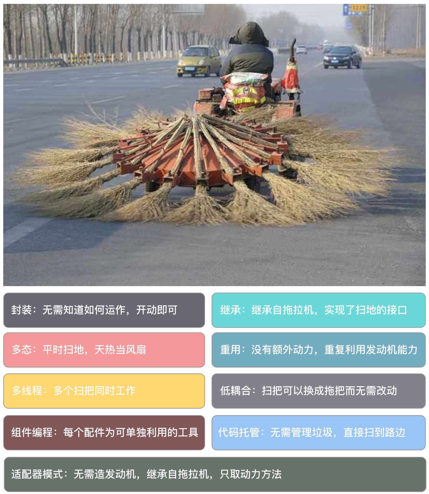


### 2.1 区别

* 类的出现并不能说明使用了面向对象
* 两者的一个核心区别：如何分配职责
* 过程式编程：
    * 表现为一系列命令和方法的连续调用
    * 控制代码根据不同的条件执行不同的职责
    * 这种自顶向下的控制方式导致了重复和相互依赖的代码遍布了整个项目
* 面向对象：
    将职责从客户端代码中移到专门的对象中，尽量减少相互依赖

### 2.2 举个🌰

> 假设我们需要创建一个读写配置文件的工具

#### 2.2.1 过程式解决方案

##### 1. 函数代码

```php
// 数据格式 key:value
function readParams(string $source): array {
    $params = [];
    // read text parameters from $source
    return $params;
}

function writeParams(array $params, string $source) {
    // write text parameters to $source
}
```

##### 2. 客户端代码

```php
$file = __DIR__ . "/params.txt";
$params = [
    "key1" => "val1",
    "key2" => "val2",
    "key3" => "val3",
];
writeParams($params, $file);
$output = readParams($file);
print_r($output);
```

> 这段代码较为紧凑且比较易于维护，但如果需要新的格式呢？

#### 2.2.2 增加XML格式

##### 1. 新增xml数据格式

```
<params>
    <param>
        <key>my key</key>
        <val>my val</val>
    </param>
</params>
```

##### 2. 解决方案1

解决该需求有很多方案，我们可以在**读写函数**中检查文件扩展名，这也是我们很常见的解决方案，即面向过程式

```php
function readParams(string $source): array {
    $params = [];
    if (preg_match("/\.xml$/i", $source)) {
        // read XML parameters from $source
    } else {
        // read text parameters from $source
    }
    return $params;
}

function writeParams(array $params, string $source) {
    if (preg_match("/\.xml$/i", $source)) {
        // write XML parameters to $source
    } else {
        // write text parameters to $source
}
```

如上所示，两个函数中都要检测文件扩展名，这样就存在了问题：

1. 代码重复性
2. 如果被要求其他格式的参数，就要始终保持两个函数的一致性

##### 3. 解决方案2

1. 下面用类的方式来处理该问题，首先，创建一个抽象的基类来定义类型接口

    ```php
    abstract class ParamHandler {
        protected $source;
        protected $params = [];
        public function __construct(string $source) {
            $this->source = $source;
        }
            
        public function addParam(string $key, string $val) {
            $this->params[$key] = $val;
        }
            
        public function getAllParams(): array {
            return $this->params;
        }
        
        // 检测文件扩展名，并根据文件扩展名返回制定的子类
        public static function getInstance(string $filename): ParamHandler {
            if (preg_match("/\.xml$/i", $filename)) {
                return new XmlParamHandler($filename);
            }
            return new TextParamHandler($filename);
        }
            
        abstract public function write(): bool;
        abstract public function read(): bool;
    }
    ```
    
    如上的代码中，定义了两个抽象方法 `write()` 和 `read()` 方法，确保 `ParamHandler` 类的任何子类都支持这个接口。
    
    > 把一个用于生成子对象的静态方法放在父类中是很方便的，但这样的设计也有问题， `ParamHandler` 类型现在只能与条件语句中规定的类一起工作。
    > 如果需要处理其他格式的文件，该怎么办？在设计模式分享中，我们将继续解决该问题。

2. 定义子类代码

    ```php
    class XmlParamHandler extends ParamHandler {
        public function write(): bool {
            // write XML
            // using $this->params
        }
        public function read(): bool {
            // read XML
            // and populate $this->params
        }
    }

    class TextParamHandler extends ParamHandler {
        public function write(): bool {
            // write text
            // using $this->params
        }
        public function read(): bool {
            // read text
            // and populate $this->params
        }
    }
    ```

3. 客户端代码

    客户端代码可以自动地根据文件扩展名来写入数据到问题和XML格式的文件。

    ```php
    $test = ParamHandler::getInstance(__DIR__ . "/params.xml");
    $test->addParam("key1", "val1");
    $test->addParam("key2", "val2");
    $test->addParam("key3", "val3");
    $test->write(); // writing in XML format

    $test = ParamHandler::getInstance(__DIR__ . "/params.txt");
    $test->read(); // reading in text format
    $params = $test->getAllParams();
    print_r($params);
    ```

### 2.3 总结

#### 2.3.1 职责

1. 过程式编程：
    * 控制代码的职责是判断文件格式，它判断了两次而不是一次；
    * 条件语句被绑定到函数中，但这仅是将判断的流程隐藏起来。
    * 对 `readParams()` 的调用必须发生在不同的地方，因此我们不得不在每个函数中重复检查文件扩展名（或执行其他检测操作）
2. 面向对象编程：
    * 在静态方法 `getInstance()` 中进行文件格式的选择，并仅需在 `getInstance()` 中检测文件扩展名一次，就可以决定使用哪一个核实的子类。
    * 客户端不负责读写功能，也不需要自己知道哪个子类就可以使用给定的对象。
3. 过程式代码忙于处理细节，面向对象代码只需一个接口即可，并且不用考虑实现的细节。
4. 面向对象由于实现由对象负责，而不是客户端，可以很方便地增加对新格式的支持。
    

#### 2.3.2 内聚

内聚（Cohesion）：一个模块内部各成分之间相关联程度的度量。

1. **各组件职责应清晰、分工明确**
2. 如果代码间的关联范围太广，维护难度会相应增加（在修改某部分代码的同时需要修改相关的代码）

> 前面的 `ParamHandler` 类将相关的处理过程集中起来。用于处理 XML 的类方法间可以共享数据，并且一个类方法中的改变可以很容易反映到另一个方法中（比如改变 XML 元素名），因此我们可以说 `ParamHandler` 类是高度内聚的。
> 
> 另一方面，过程式的例子把相关的过程分离，导致处理XML的代码在多个函数中同时出现

#### 2.3.3 耦合

1. 当系统各部分代码紧密绑在一起时，就会产生高耦合
2. 高耦合中一个组件的变化会迫使其他组件随之变化
3. 高耦合不是过程式代码特有，但过程式代码比较容易产生高耦合问题

> 对于前面的例子，面向过程在读、写函数中，使用了相同的文件扩展名检测来判断如何处理数据，这样对于需要新增一个格式的时候，就必须同时修改两个函数
> 
> 面向对象则是将每个子类彼此分开，也将其余客户端代码分开，如需新增其他格式，只需创建相应的子类，并在父类的静态方法中增加一行文件检查代码即可

#### 2.3.4 正交

正交（orthogonality）：将职责相关的组件紧紧组合在一起，而与外面系统环境隔开，保持独立。

> 在理想的正交情况下，任何操作都没有副作用。每个组件发生的改变都只影响到其自身。

1. 正交主张重用组件，期望不需要任何特殊配置就能把一个组件插入到系统中
2. 修改正交代码时，只会影响到被改动的代码本身，so，bug的影响只局限于它的作用于中；而内部高度相遇依赖的代码发生错误时，很容易引起连锁反应。
3. 高内聚、低耦合的设计只是相对的，需要根据随机应变，不要过度设计。

#### 2.3.5 代码重复

1. 重复是代码最常见的问题之一
2. 系统中的重复代码，很可能它们本应该放在一起
3. 重复通常以为着紧密耦合
4. 如果你修改了一个地方的代码，同时也需要修改另一个地方的代码，那么这些代码应该放在同一个地方


## 三、UML类图

    UML：Unified Modeling Language，统一建模语言

    类图是UML的一部分，在描述面向对象关系时非常有用


### 3.1 类

1. 类是类图的主要部分（见下图），用带有类名的方框来描述

    

2. 类的组成
    1. 第一行：类名
    2. 第二行：属性（可选）
    3. 第三行：方法名（可选）

3. 抽象类的两种表示（见下图）
    
    
    1. 用斜体类名表示 （常用）
    2. 增加 `{abstract}` 到类名下
        * `{abstract}` 语法是约束的一个例子
        * "约束" 在类图中用于描述特定元素将被使用
        * 花括号中的文字并没有特殊的结构，只是提供一个将应用于该元素的条件声明

4. 接口
    接口的定义方式和类相同，但接口必须使用一个衍型
    > 衍型：UML的一种扩展方式，UML是通用语言，但针对不同的领域和实际情况，用户可以通过自定义和扩展得到更有针对性的建模语言

    

### 3.2 属性

1. 属性（attribute）用来描述一个类的属性（property）
    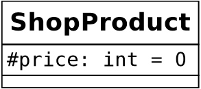

2. 可见性
    
    | 符号 | 可见性 | 说明 |
    | --- | --- | --- |
    | + | public | 所有代码都可以访问 |
    | - | private | 只有当前类可以访问 |
    | # | protected | 只有当前类和它的子类可以访问 |

### 3.3 方法

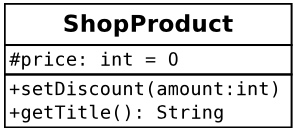

1. 可见性同属性
2. 参数在括号中，如有多个，逗号分隔
3. 如有返回值，用冒号来描述

### 3.4 继承

    
UML一般用“泛化” （generalization）来描述继承关系，用子类到父类的一条线来标识，线的顶端有一个空心闭合的箭头
    
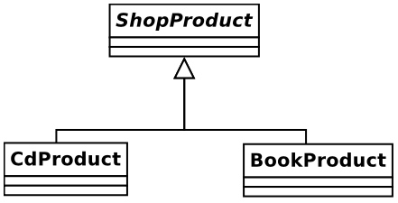

### 3.5 实现

UML用“实现”来描述接口和实现接口的类之间的关系，
    
> 如下图，如果 `ShopProduct` 类实现了 `Chargeable` 接口，就可以把它加入到类图中
    
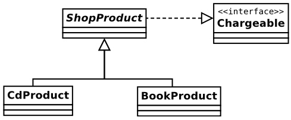

### 3.6 关联

关联：当一个类的属性保存了对另一个类的一个实例（或多个）的引用时，就产生了关联

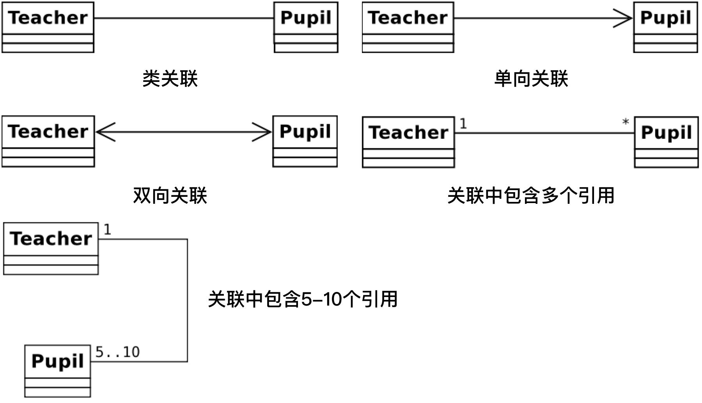


1. 类关联：
    * 创建了Teacher类和Pupil类之间的关联
    * 只是指出了Teacher对象拥有一个或多个对Pupil对象的引用，或者Pupil对象拥有一个或多个Teacher对象的引用
    * 但这个关系并不确定
2. 单向关联：
    * 用单向来描述关联的方向
    * 如果Teacher类拥有Pupil类的一个实例，但Pupil类没有Teacher类的实例，可以让箭头从Teacher指向Pupil类
3. 双向关联：
    * 用双向箭头来描述双向关联的关系
4. 多个引用：
    * 可以在关联中指定一个类的实例被其他类引用的次数
    * 可以通过把次数或范围放在每个类旁边来说明
    * 可以用星号（*）表示任意次数
    * 上图中最后一个表示一个Teacher对象拥有5-10个对Pupil对象的引用

### 3.7 聚合与组合

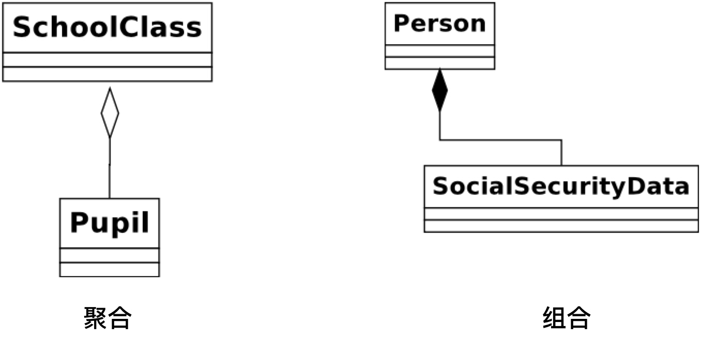


1. 与关联相似，聚合（aggregation）和组合（composition）都描述了一个类长持有其他类的一个或多个实例的情况
2. 通过聚合和组合，被引用的对象实例成为引用对象的一部分
3. 聚合
    * 被包含对象是容器的一个核心部分，但他们也可以同时被其他对象所包含
    * 用一条以空心菱形开头的线来说明
    * 上图中描述了SchoolClass类聚合了Pupil

    > 学生组成一个班级，但是相同的Pupil对象可以同时被不同的SchoolClass实例引用。如果要删除一个学校类，不需要同时删除它的引用的这些学生类，因为学生还可以加入其它班级
4. 组合
    * 组合是一个更强的关系
    * 在组合中，被包含对象只能被它的容器所引用；当容器被删除时，它也应该被删除
    * 用一条以实心菱形开头的线来说明

    > 如上图，Person类持有对SocialSecurityData对象的引用，而该SocialSecurityData对象实例只属于包含它的Person对象

### 3.8 依赖关系

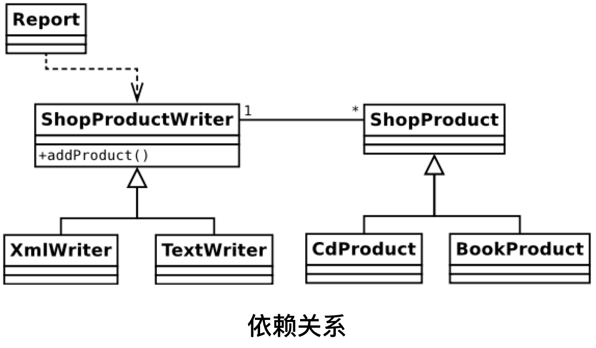


1. 一个对象使用另一个对象的关系在UML中被描述为一个依赖关系
2. 它一种暂时的关系，并非描述类之间的长久关系
3. 一个被使用的类可以作为类方法的参数传递或者作为方法调用的结果得到

> * 上图中Report类使用了ShopProductWriter对象
> * 这种关系由一条连接两个类的虚线和开放箭头表示
> * Report类并没有把ShopProductWriter保存为类的属性
> * ShopProductWriter对象将一组ShopProduct对象作为属性

### 3.9 注解

类图可以捕捉到系统的结果，但类图并不能解释类处理任务的过程

    例如3.8中，我们知道Report对象使用了ShopProductWriter，但我们并不知道具体是如何使用的
    
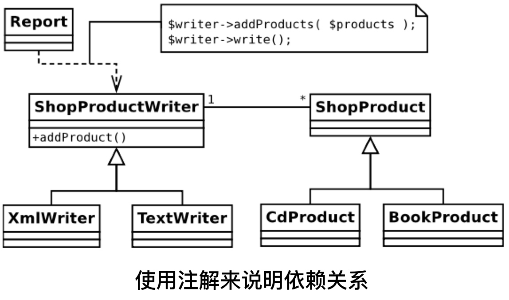

1. 注解由一个折角的方框组成，通常包含伪代码片段。
2. 注解使类图变得易于理解。

### 3.10 时序图

时序图（sequence diagram）:基于对象而不是基于类的，用于为系统中过程化的行为建模。

我们创建一个简单的时序图，为Report对象输出产品数据的过程建模。

#### 1. 参与者 

* 时序图从左到右展示了系统中的参与者
* 我们只使用雷鸣来标记对象
* 如果在途中有同一个类的多个对象实例在独立工作，可以使用label:class（如：product1:ShopProduct）格式来包含对象名


#### 2. 生命线

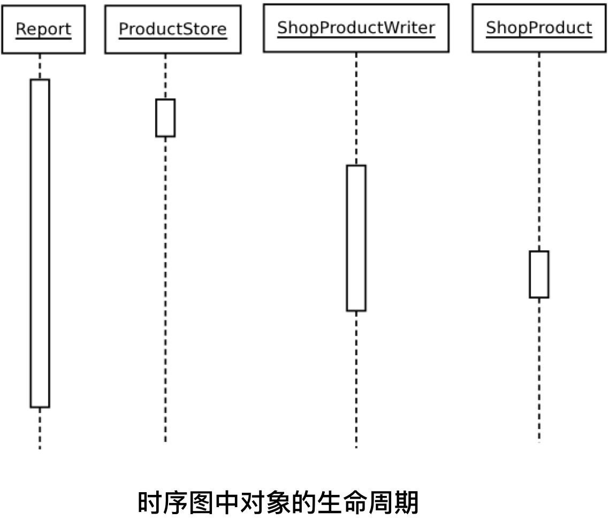


* 垂直的虚线就是生命线，展示了系统中对象的生命周期
* 生命线上的矩形说明了过程中的焦点，即某个对象的激活期
* 如上图，可以看出系统中的执行过程是如何在对象间移动的
* 在上图中，如果不显示对象间传递的消息，这个图很难被读懂，所以在下图中增加了消息传递的内容

#### 3. 完整的时序图

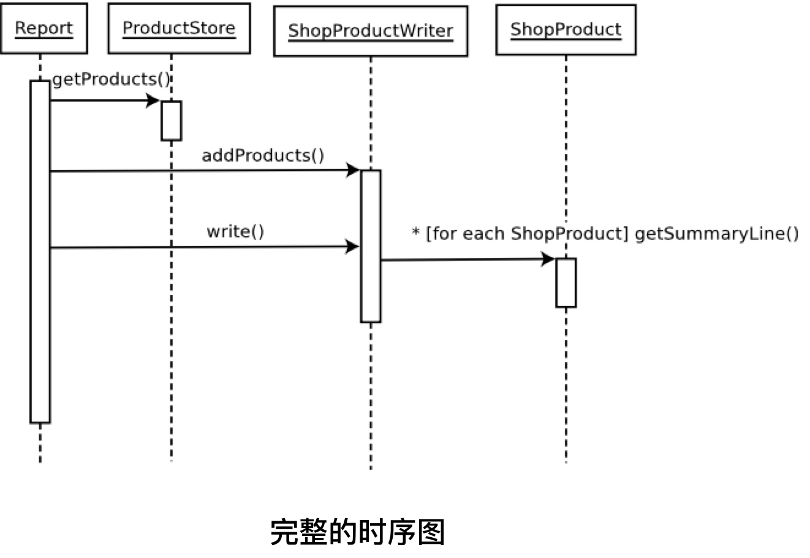

1. 上图中表示为一个完整的时序图
2. 箭头表示从一个对象传递到另一个对象
3. 返回值一般不写，也可以用一条被代用对象指向消息发送源对象的虚线来说明
4. 每个消息都用相关的方法调用来标记

## 四、 总结

### 4.1 OOP三大特性


### 4.2 OOP七大设计原则

#### 4.2.1. 单一职责原则
* Single-Responsibility Principle
* 类或方法要求功能单一
* 不要出现万能方法、万能类
* 方便后期维护(高内聚、低耦合)

#### 4.2.2. 开闭原则
* Open-Close Principal
* 对扩展开放，对修改封闭
* 如果类满足不了需求我们可以通过继承来扩展，最好不要在类的基础上进行修改

#### 4.2.3. 里氏替换原则
* Liskov-Substituion Principle
* 父类可以通过子类替代
* 接口可以通过实现类代替

#### 4.2.4. 依赖倒转原则
* Dependecy-Inversion Principle
* 要依赖抽象、而不是依赖具体的
* 开发中优先使用接口，但是如果接口不适合那么使用抽象类
* 如果都是未实现的方法，那么就用接口
* 如果有部分未实现方法还有部分实现的方法，那么使用抽象类

#### 4.2.5. 接口分离原则
* Interface-Segregation Principle
* 接口中的方法不应太多
* 合理使用接口的继承

#### 4.2.6. 合成复用原则
* 尽量使用组合达到拥有属性和方法的目的，减少继承的使用（钟情于组合而不是继承）
* 复用方式：
    * 继承
    * 聚合

#### 4.2.7. 迪米特原则:(或最少知识原则)

* 一个类尽量少的和别的类有关联
* 降低类之间的耦合性

### 4.3 Unix中的设计模式

> 以下这段话节选自陈皓博客，地址：https://coolshell.cn/articles/8961.html


不过，我们会发现上面OO搞出来的那么多模式在Unix下看来好像没有那么复杂，而且Unix下看起来并没有那么多模式，而且Unix中的设计模式无非就是这么几个关键词：**单一，简洁，模块，拼装**。我们再来看看OO设计的两大准则：**1）钟情于组合而不是继承，2）依赖于接口而不是实现**。还有S.O.L.I.D原则也一样（如果你仔细观察，你会发现SOLID原则在Unix下也是完美地体现）。你看，Unix和OO设计模式是不是完美的统一吗？

我有种强烈的感觉——**Unix对这些所谓的OO的设计模式实现得更好**。因为Unix就一条设计模式！再次推荐《*[The Art of Unix Programming](http://book.douban.com/subject/5387401/)*》


