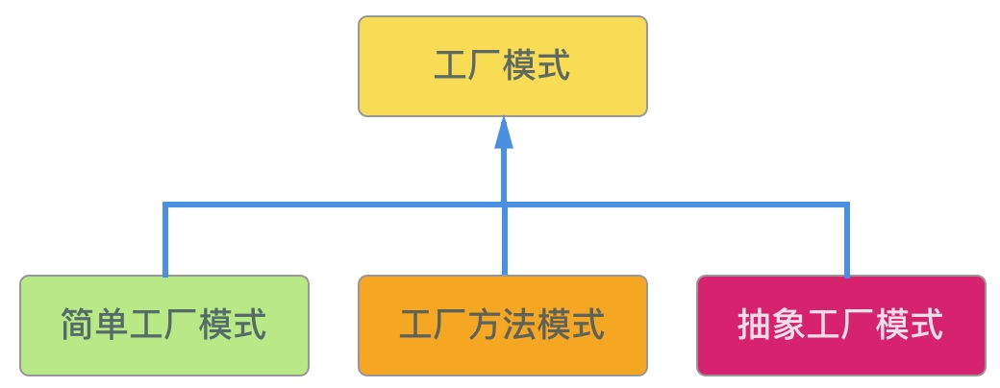
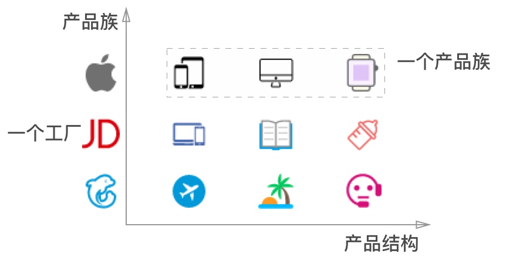
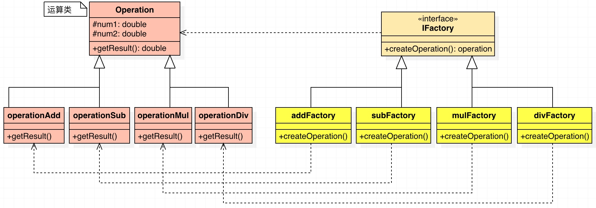
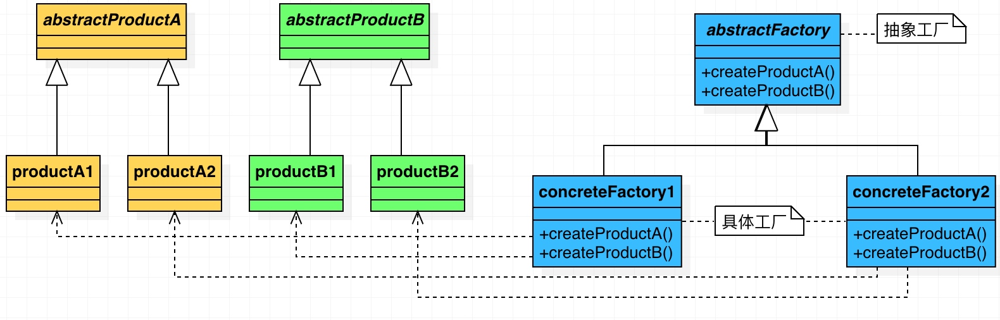

# Head First 面向对象与设计模式 （三） -- 三大工厂模式

> 一个射击学员刚入门，听到射击老师说射击的几个要素: 武器，子弹，武器装载子弹，武器打出子弹。这个学员跃跃欲试，就跑到Ak47工厂买了枪，然后跑到沙漠之鹰工厂买了子弹，AK47装载沙鹰子弹，然后打出。学员卒。


## 一、工厂模式概述


### 1.1 命名

**工厂模式**：最常用的**实例化对象模式**，是用**工厂方法代替`new`操作**的一种模式。

### 1.2 分类

根据抽象程度的不同，PHP工厂模式分为三种：




### 1.3 项目中的现状（问题）

在软件系统中经常面临着“对象”的创建工作，由于需求的变化，这个对象可能随之也会发生变化，但它却拥有比较稳定的接口。

为此，我们需要提供一种封装机制来隔离出这个易变对象的变化，从而保持系统中其他依赖该对象的对象不随着需求变化而变化。

### 1.4 意图

* 定义一个接口来创建对象，但让子类决定哪些类需要被实例化
* 工厂方法把实例化工作推迟到子类中取实现

### 1.5 解决方案

* 尽量松耦合，一个对象的依赖对象的变化与本身无关
* 具体产品与客户端剥离，责任分割





## 二、简单工厂模式

### 2.1 命名

简单工厂模式：通过**静态方法**来创建对象

> Simple Factory Pattern
> 又称为静态工厂方法模式(Static Factory Method)


### 2.2 问题

简单工厂的作用是**实例化对象**，**不需要**客户了解这个对象属于哪个具体的子类。
简单工厂**实例化的类**具有相同的**接口或者基类**，在子类比较固定并不需要扩展时，可以使用简单工厂。

知道了以上，那么问题来了：请用任意一种面向对象语言实现一个计算器程序，要求输入两个数和运算符号，得到结果。

### 2.3 解决方案


#### 2.3.1 可能的实现方式

```php
// 代码位置：codes/ch3/3_1.php
function opertion($num1, $num2, $operate) {
		
	$result = 0;
	switch ($operate) {
		case '+':
			$result = $num1 + $num2;
			break;
		case '-':
			$result = $num1 - $num2;
			break;
		case '*':
			$result = $num1 * $num2;
			break;
		case '/': // 请忽略异常
			$result = $num1 / $num2;
			break;
		default:
			$result = $num1 + $num2;
			break;
	}
	return $result;
}
	
echo opertion(1, 2, '+');
```

#### 2.3.2 简单工厂方式


```php
// 代码位置：codes/ch3/3_2.php
class operation {
	protected  $num1 = 0;
	protected  $num2 = 0;

	public function setNum1($num1) {
		$this->num1 = $num1;
	}

	public function setNum2($num2) {
		$this->num2 = $num2;
	}

	public function getResult() {
		$result = 0;
		return $result;
	}
}

class operationAdd extends Operation {
	public function getResult() {
		return $this->num1 + $this->num2;
	}
}

class operationMul extends Operation {
	public function getResult() {
		return $this->num1 * $this->num2;
	}
}

class operationSub extends Operation {
	public function getResult() {
		return $this->num1 - $this->num2;
	}
}

class operationDiv extends Operation {
	public function getResult() {
		return $this->num1 / $this->num2;
	}
}

class operationFactory {
	public static function createOperation($operation) {
		switch ($operation) {
			case '+':
				$oper = new operationAdd();
				break;
			case '-':
				$oper = new operationSub();
				break;
			case '/': // 请忽略异常处理
				$oper = new operationDiv();
				break;
			case '*':
				$oper = new operationMul();
				break;
		}
		return $oper;
	}
}
// 客户端代码
$operation = operationFactory::createOperation('+');
$operation->setNum1(1);
$operation->setNum2(2);
echo $operation->getResult()."\n";
```

### 2.4 效果

1. 优点
    * 可以使用户根据参数获得对应的类实例
    * 避免了直接实例化类，降低了耦合性
2. 缺点
    * 可实例化的类型在编译期间已经被确定，如果增加新类型，则需要修改工厂，不符合OCP（开闭原则）的原则。
    * 简单工厂需要知道所有要生成的类型，当子类过多或者子类层次过多时不适合使用。

## 三、工厂方法模式

* 面向对象设计强调“抽象类高于实现”
* 尽量一般化而非特殊化
* 该模式解决了当代码关注与抽象类型时如何创建对象实例的问题：

### 3.1 命名

定义一个对象接口，让子类来决定具体的对象实例化

> 工厂方法模式让类的实例化延迟到子类中

### 3.2 问题

框架需要为多个应用提供标准化的架构模型，同时也要允许独立应用定义自己的域对象并对其进行实例化。


### 3.3 解决方案

#### 3.3.1 UML图




#### 3.3.2 代码

```php
// 代码位置：codes/ch3/3_3.php
interface IFactory {
    public function createOperation();
}

class addFactory implements IFactory {
    public function createOperation() {
        return new operationAdd();
    }
}

class subFactory implements IFactory {
    public function createOperation() {
        return new operationSub();
    }
}

class mulFactory implements IFactory {
    public function createOperation() {
        return new operationMul();
    }
}

class divFactory implements IFactory {
    public function createOperation() {
        return new operationDiv();
    }
}

//客户端代码
$operationFactory = new AddFactory();
$operation = $operationFactory->createOperation();
$operation->setNum1(10);
$operation->setNum2(10);
echo $operation->getResult()."\n";
```
### 3.4 效果

好处：增加一个运算类（例如N次方类），只需要增加运算类和相对应的工厂，两个类，不需要修改工厂类。

缺点：增加运算类，会修改客户端代码，工厂方法只是把简单工厂的内部逻辑判断移到了客户端进行。


## 四、抽象工厂方法

### 4.1 命名

使用对象组合来，对象的创建被实现在工厂接口所暴露的出来的方法

### 4.2 问题

在一些项目中，我们很可能需要工厂来生成一组相关的类

### 4.3 解决方案




```php
// 抽象工厂
interface abstractFactory {
	// 创建等级结构为A的产品的工厂方法
	public function createProductA();
	// 创建等级结构为B的产品的工厂方法
	public function createProductB();
}
// 具体工厂1
class concreteFactory1 implements abstractFactory{
	public function createProductA() {
		return new productA1();
	} 
	public function createProductB() {
		return new productB1();
	}
}
// 具体工厂2
class concreteFactory2 implements abstractFactory{
	public function createProductA() {
		return new productA2();
	}
	public function createProductB() {
		return new productB2();
	}
}
 
// 抽象产品A
interface abstractProductA {
	public function getName();
}
// 抽象产品B
interface abstractProductB {
	public function getName();
}
// 具体产品Ａ1
class productA1 implements abstractProductA {
	private $_name;
	public function __construct() {
		$this->_name = 'product A1';
	}
	public function getName() {
		return $this->_name;
	}
}
// 具体产品Ａ2
class productA2 implements abstractProductA {
	private $_name;
	public function __construct() {
		$this->_name = 'product A2';
	}
	public function getName() {
		return $this->_name;
	}
}
// 具体产品B1
class productB1 implements abstractProductB {
	private $_name;
	public function __construct() {
		$this->_name = 'product B1';
	}
	public function getName() {
		return $this->_name;
	}
}
 
// 具体产品B2
class productB2 implements abstractProductB {
	private $_name;
	public function __construct() {
		$this->_name = 'product B2';
	}
	public function getName() {
		return $this->_name;
	}
}
// 客户端代码
class Client {
	public static function main() {
		self::run(new concreteFactory1());
		self::run(new concreteFactory2());
	}
	// 调用工厂实例生成产品，输出产品名
	public static function run(abstractFactory $factory) {
		$productA = $factory->createProductA();
		$productB = $factory->createProductB();
		echo $productA->getName(), "\n";
		echo $productB->getName(), "\n";
	}
}
Client::main();
```

### 4.4 效果

* 优点：
    * 具体产品从客户代码中被分离出来
    * 容易改变产品的系列
    * 将一个系列的产品族统一到一起创建
* 缺点：
    * 在产品族中扩展新的产品是很困难的，它需要修改抽象工厂的接口


## 五、总结

### 5.1 区别

* 简单工厂模式(静态方法工厂模式) ： 用来生产同一等级结构中的任意产品。（不能增加新的产品）
* 工厂模式 ：用来生产同一等级结构中的固定产品。（支持增加任意产品）
* 抽象工厂 ：用来生产不同产品种类的全部产品。（不能增加新的产品，支持增加产品种类）

### 5.2 适用范围

1. 简单工厂模式

    工厂类负责创建的对象较少，操作时只需知道传入工厂类的参数即可，对于如何创建对象过程不用关心。

2. 工厂方法模式

    满足以下条件时，可以考虑使用工厂模式方法

    1. 当一个类不知道它所必须创建对象的类时
    2. 一个类希望由子类来指定它所创建的对象时
    3. 当类将创建对象的职责委托给多个帮助子类中得某一个，并且你希望将哪一个帮助子类是代理者这一信息局部化的时

3. 抽象工厂模式

    满足以下条件时，可以考虑使用抽象工厂模式

    1. 系统不依赖于产品类实例如何被创建，组合和表达的细节。
    2. 系统的产品有多于一个的产品族，而系统只消费其中某一族的产品
    3. 同属于同一个产品族是在一起使用的。这一约束必须在系统的设计中体现出来。
    4. 系统提供一个产品类的库，所有产品以同样的接口出现，从而使客户端不依赖于实现。


参考：

* https://www.zhihu.com/question/20367734
* https://zh.wikipedia.org/wiki/%E6%8A%BD%E8%B1%A1%E5%B7%A5%E5%8E%82


