# Head First 面向对象与设计模式 （二）

## 一、UML复习

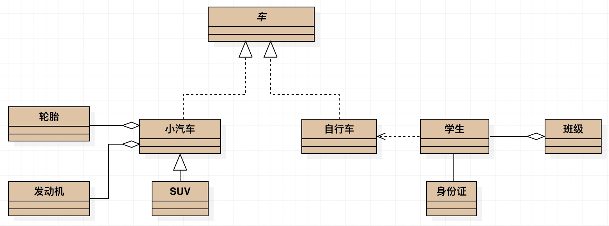

* 车的类图结构为`<<abstract>>`，表示车是一个抽象类；
* 它有两个继承类：小汽车和自行车；它们之间的关系为实现关系，使用带空心箭头的虚线表示；
* 小汽车为与SUV之间也是继承关系，它们之间的关系为泛化关系，使用带空心箭头的实线表示；
* 小汽车与发动机之间是组合关系，使用带实心箭头的实线表示；
* 学生与班级之间是聚合关系，使用带空心箭头的实线表示；
* 学生与身份证之间为关联关系，使用一根实线表示；
* 学生上学需要用到自行车，与自行车是一种依赖关系，使用带箭头的虚线表示；

## 二、设计模式

### 2.1 定义

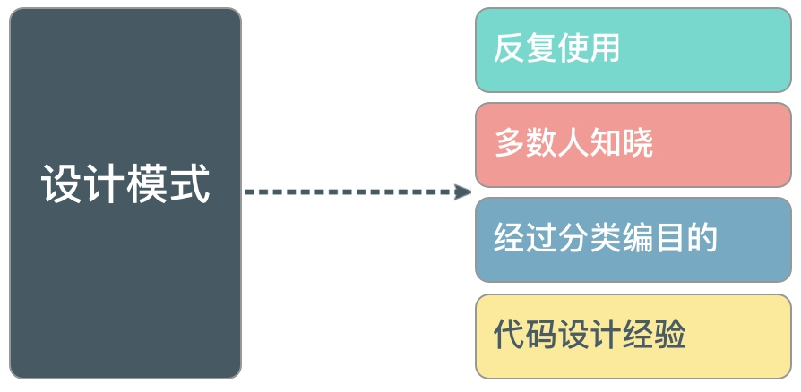

> 每个模式都描述着一种在我们的环境中一遍又一遍地出现的问题,并描述了对该问题的核心解决方案。以此方式你可以使用该方案上百万次,而从不需要重复做同样的事情。 -- 《A Pattern Language》 1977

### 2.2 概览

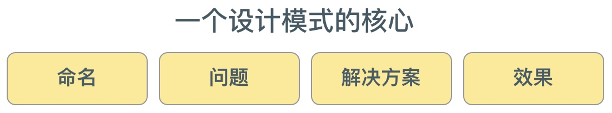

#### 2.2.1 命名

1. 丰富了程序员的语言
2. 简单的文字便可表示相当复杂的问题和解决方案

#### 2.2.2 问题

1. 描述了应该在何时使用模式
2. 应包含设计中存在的问题以及问题存在的原因

#### 2.2.3 解决方案

1. 该框架的解决方案，即如何设计这个模式
2. 描述了一个设计模式的组成成分，以及这些成分之间的相互关系、各自的职责、协作方式
3. 通常以UML类图或核心代码来描述

#### 2.2.4 效果

1. 描述了模式的优缺点
2. 描述了在使用模式时应权衡的问题

### 2.3、设计模式分类


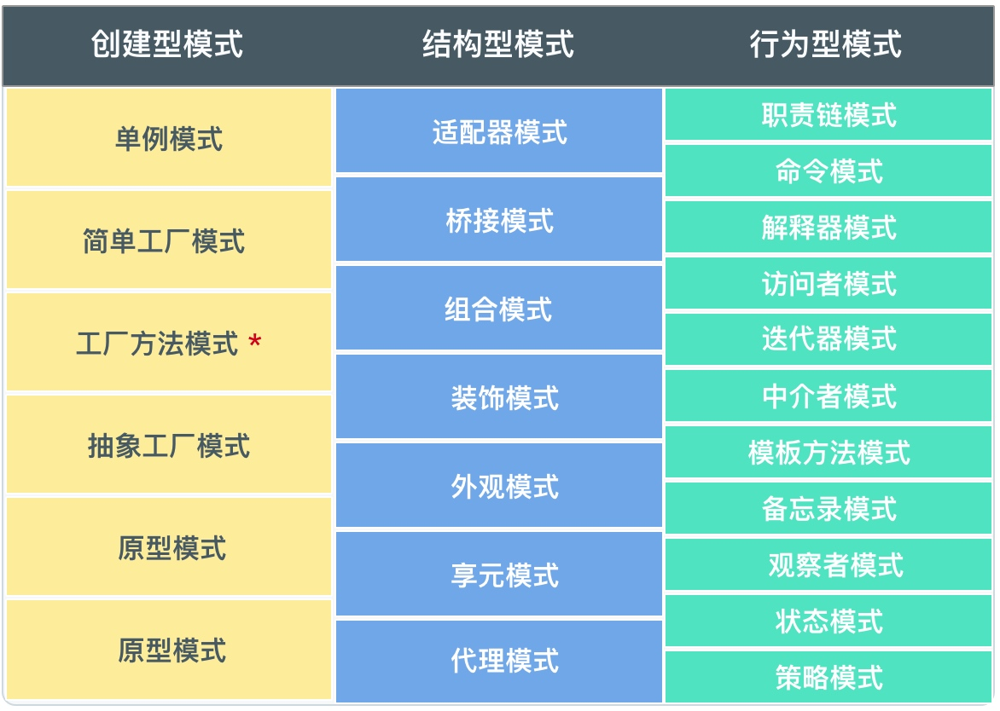


> GoF设计模式只有23个，各具特色
> 每个模式都为某一个可重复的设计问题提供了一套解决方案


#### 2.3.1 根据用途分类
1. 创建型模式：描述如何创建对象
2. 结构型模式：描述如何实现类或对象的组合
3. 行为型模式：描述类或对象怎样交互以及怎样分配职责

#### 2.3.2 根据处理类型分类

1. 类模式：主要是用于处理类之间的关系
2. 对象模式：主要是用于处理对象之间的关系

## 三、模式原则

> 设计模式**不只是简单的描述了问题的解决方案**，而且很重视解决方案的**可重用性**和**灵活性**。

### 3.1 组合与继承

* 继承是应对变化的环境及上下文设计的有效方式,然而它会限制灵活性,尤其当类承担多重责任的时候。

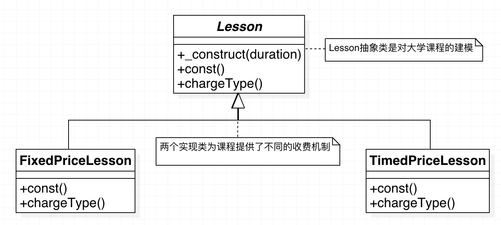


#### 3.1.1 问题

    代码codes/ch2/2_1.php

利用这种继承模式，可以在课程的实现之间切换。客户端代码只知道它是在处理Lesson对象，因此费用的细节就会变的很透明。

但如果引入一组新的特殊，比如我们需要处理演讲和研讨会，因为演讲和研讨会会以不同的方式注册登记和教授课程，所以它们会要求独立的类。因此在设计上现在会有两个分支，我们需要处理不同的定价策略并区分演讲和研讨会

下图中，我们不得不重复开发功能，否则无法使用继承树来管理价格机制。定价策略在Lecture和Seminar类中被重复实现。

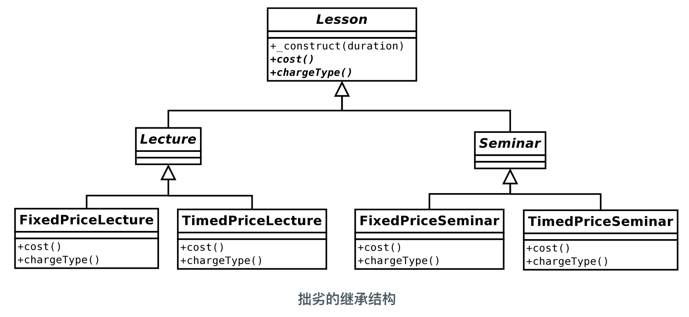


我们可能要考虑在父类Lesson中使用条件语句来移除那些不适宜的重复。把定价逻辑从继承树中一并迁移到父类中，但这与我们通常用多态替换条件的重构思想背道而驰，如下图。

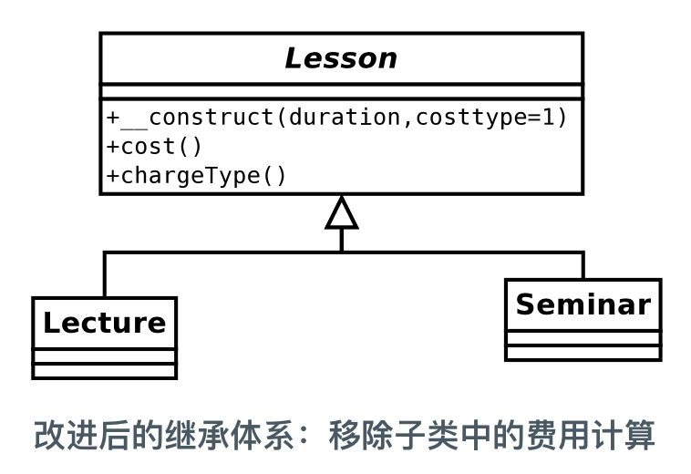


类结构变得更加便于管理，但在父类的代码中使用条件语句时一种倒退。

通常可以用多态来代替条件语句，但这里我们不得不在chargeType()和cost()方法中重复这些条件语句，因此代码重复似乎是注定的

#### 3.1.2 使用组合

    代码codes/ch2/2_2.php

* 针对上述问题，可以采用策略（Strategy）模式来解决
* 策略模式适用于将一组算法移入到一个独立的类型中
* 通过移走费用计算相关的代码，可以简化Lesson类， 如下图

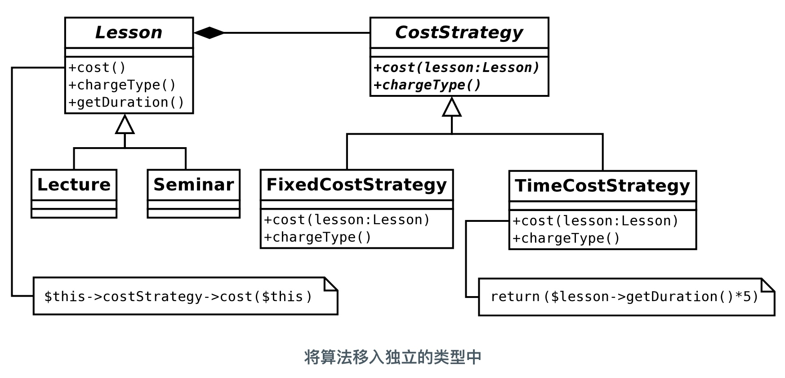


##### 1. 策略模式

1. 创建一个名为CostStrategy抽象类，定义抽象方法cost()和chargeType()
2. cost()方法需要一个Lesson实例，用于生成费用数据
3. 在CostStrategy里提供了两个实现，因为Lesson对象只于鏊CostStrategy类型的对象即可，不需要制定具体类型的子类的类型
4. 在任何时候都能通过创建CostStrategy的子类来添加新的算费算法，而这不会要求对任何Lesson类进行修改

##### 2. Lesson类的代码

```php
abstract class Lesson {
    private $duration;
    private $costStrategy;
    public function __construct(int $duration, CostStrategy $strategy) {
        $this->duration = $duration;
        $this->costStrategy = $strategy;
    }
    // 委托操作代码
    public function cost(): int {
        return $this->costStrategy->cost($this);
    }
    public function chargeType(): string {
        return $this->costStrategy->chargeType();
    }
    public function getDuration(): int {
        return $this->duration;
    }
    // more lesson methods...
}

class Lecture extends Lesson {
    // Lecture-specific implementations ...
}

class Seminar extends Lesson {
    // Seminar-specific implementations ...
}
```

1. Lesson类需要一个作为属性的CostStrategy对象
2. `Lesson::cost()`方法只调用`CostStrategy::cost()`
3. 委托：2. 中这种显式调用另一个对象的方法来执行一个请求的方式
4. CostStrategy对象便是Lesson的委托方
5. Lesson类不再负责计费，而是把计费任务传给CostStrategy类

##### 3. CostStrategy类及子类

```php
// 定义费用策略
abstract class CostStrategy {
    abstract public function cost(Lesson $lesson): int;
    abstract public function chargeType(): string;
}
// 实现固定模式付费
class FixedCostStrategy extends CostStrategy {
	public function cost(Lesson $lesson): int {
		return 30; 
	}
	public function chargeType(): string {
		return "fixed rate";
	}
}
// 实现按时间付费类
class TimedCostStrategy extends CostStrategy {
    public function cost(Lesson $lesson): int {
        return ($lesson->getDuration() * 5);
    }
    public function chargeType(): string {
        return "hourly rate";
    }
}
...
```

1. 通过传递不同的CostStrategy对象，可以改变Lesson对象计费的方式
2. 这种方式产生了高度灵活性的代码
3. 动态地组合及重组对象，远胜于将功能静态地建立在代码结构中

##### 4. 实现代码

```php
$lessons[] = new Seminar(4, new TimedCostStrategy());
$lessons[] = new Lecture(4, new FixedCostStrategy());
	
foreach ($lessons as $lesson) {
	print "lesson charge {$lesson->cost()}. ";
	print "Charge type: {$lesson->chargeType()}\n";
}
```

##### 5. 总结

1. 使用组合结构的效果之一：让我们关注类的职责
2. CostStrategy对象独立负责计算费用，而Lesson对象则负责管理课程数据
3. 使用组合比使用继承体系更灵活
4. 组合可以以多种方式动态地处理任务，但会降低代码的可读性 

### 3.2 解耦

1. 3.1.1是一个紧耦合的例子， _费用计算逻辑在Lecture和Seminar类型中都存在_
2. 对 `TimedPriceLecture` 的改变将会迫使在 `Timedpriceseminar` 中同样逻辑的相应变化。
3. 3.1.1中改善的继承体系解决方案，会在 `cost()` 和 `chargetype()` 方法之间生成了一个类似的依赖关系
4. 3.1.2中通过策略模式，将费用算法提取为 `Coststrategy` 类型,把算法放置在共同接口后,每个算法只需实现一次。

#### 3.2.1 问题

当系统中许多类都显式嵌入到一个平台或环境中时,其他类型的耦合仍时有发生。比如建立了一个基于 MYSQL 数据库的系统。你可能会用 `mysqli::query()` 来与数据库服务器交互。

如果现在你被要求在不支持 MYSQL 的服务器上部署系统,比如要把整个项目都转换成使用Sqlite,那么你可能被迫要改变整个代码,并且面临维护应用程序的两个并行版本的状况。

这里的问题不在于系统对外部平台的依赖。这样的依赖是无法避免的。我们确实需要使用与数据库交互的代码。但当这样的代码散布在整个项目中时,问题就来了。与数据库交互不是系统中大部分类的首要责任,因此最好的策略就是提取这样的代码并将其组合在公共接口后。这可以使类之间相互独立。同时,通过在一个地方集中你的“入口”代码,就能更轻松地切换到一个新的平台而不会影响到系统中更大的部分。这个把具体实现隐藏在一个于净的接口后面的过程,正是大家所知道的“封装”。

PEAR 中的 `PEAR::MDB2` 包(沿袭自 `PEAR::DB` )可以解决这个问题。该包支持对多个数据库的访问。最新的 PDO 扩展已将此模型移植到 PHP 语言中 MDB2 类提供了一个静态方法 `connect()`,它接受一个 DSN( Data Source name,数据源名)字符串参数。根据这个字符串的构成,它返回 `MmB2_Driver_common` 类的一个特定实现。因此对于字符串 "mysq1://", connect()方法返回一个MDB2_Driver_mysa1对象,而对于一个以 "sq1ite://" 开头的字符串,它将返回一个 MDB2_Driver_sqlite 对象。如下图


使用 PEAR::MDB2 包,可以从数据库平台的特殊性中将应用程序代码分离出来。你只要使用 SQL 语句,就可以在 MYSQL、 Sqlite、 MSSQL 和其他数据库上运行一个单一的系统而不需要改变一行代码(当然DSN除外,DSN是数据库环境必须被设定的一个点)。事实上, PEAR::MDB2 包在一定程度上也能帮助你管理不同的SQL语法—这是使你放弃PDO的速度与便捷而选择使用 PEAR::MDB2 包的一个原因

#### 3.2.2 降低耦合

    代码codes/ch2/2_3.php

例如,课程系统中应包含注册组件,从而向系统中添加新课程。添加了新课程后,应该通知管理员,这是注册程序的一部分。对于应该通过邮件发送通知还是通过文本消息发送通知,系统用户的意见不一致。实际上,他们太挑剔了,以至于你怀疑将来他们会想使用一种新的信息传达模式。此外,他们希望发生任何事情都会收到通知。所以,修改了通知模式的一处意味着要对多处做同样的修改。

如果已经硬编码了对 Mailer 类或 Texter 类的调用,那么系统就与特殊的通知模式紧密相关了。就像利用专门的数据库API时,系统就与某数据库平台紧密相关一样

下面的这些代码对使用通知程序的系统隐藏了通知程序的实现细节:

```php
class RegistrationMgr {
    public function register(Lesson $lesson) {
        // 处理该课程...
        // 通知某人...
        $notifier = Notifier::getNotifier();
        $notifier->inform("new lesson: cost ({$lesson->cost()})");
    }
}

abstract class Notifier {
    public static function getNotifier(): Notifier {
        // 更加配置或其他逻辑获得具体的类
        if (rand(1, 2) === 1) {
            return new MailNotifier();
        } else {
            return new TextNotifier();
        }
    }

    abstract public function inform($message);
}

class MailNotifier extends Notifier {
    public function inform($message) {
        print "MAIL notification: {$message}\n";
    }
}


class TextNotifier extends Notifier {
    public function inform($message) {
        print "TEXT notification: {$message}\n";
    }
}
```

1. 创建了 RegistrationMgr 作为 Notifier 类的示例客户端。 
2. Notifier 实现了一个静态方法 `getNotifier()`,该方法获取具体的 Notifier对象( TextNotifier 或 MailNotifier )。
3. 注意,具体应该使用哪个 Notifier对象取决于 `Notifier:: getNotifier()` 方法。

客户端代码：

```php
$lessons1 = new Seminar(4, new TimedCostStrategy());
$lessons2 = new Lecture(4, new FixedCostStrategy());
$mgr = new RegistrationMgr();
$mgr->register($lessons1);
$mgr->register($lessons2);
```

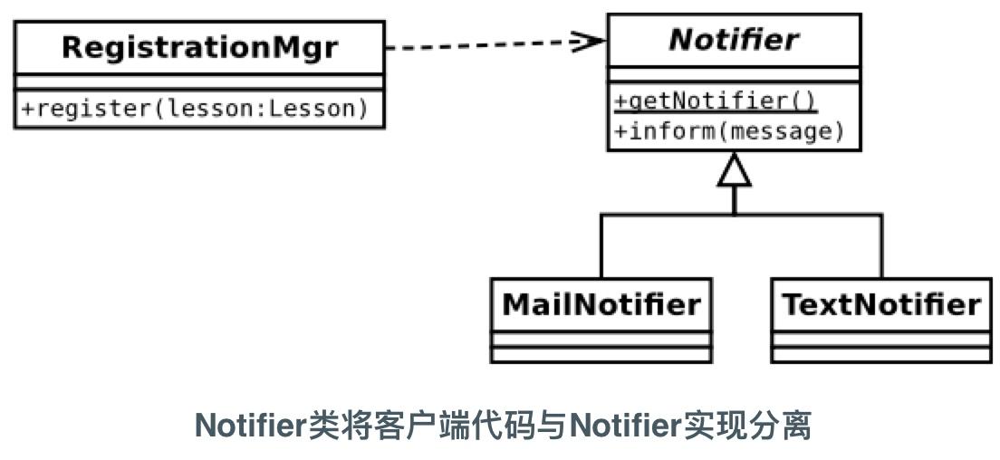


### 3.3 针对接口编程

把不同的实现隐藏在父类所定义的共同接口下。然后客户端代码需要一个父类的对象而不是一个子类的对象,从而使客户端代码可以不用关心它实际得到的是哪个具体实现。

我们在 Lesson::cost()和 Lesson::chargeType()中创建的并行条件语句,就是需要多态的常见标志。这样的条件语句使代码很难维护,因为条件表达式的改变必然要求与之对应的代码主体也随之改变,所以条件语句有时会被称作实现了一个“模拟继承”。

而通过把计费算法放置在一个实现 Coststrategy的独立的类中,我们可以移除重复代码,也可以使在未来加入新的计费策略变得更加容易。

从客户端代码的角度看,类方法参数为抽象或通用类型通常都是不错的主意。如果参数对对象类型要求过于严格,就会限制代码在运行时的灵活性。

当然,如何使用参数类型提示来调整参数对象的“通用性”是需要仔细权衡的。选择过于通用,则会降低方法的安全性。而如果需要某个子类型的特有功能,那么方法接受另一个子类类型则可能会有风险。

尽管如此,若参数的类型匹配限制过于严格,那么将无法得到多态带来的好处。下面是修改过的 Lesson类里的一段代码:

```php
public function __construct(int $duration, FixedCostStrategy $strategy) {
    $this->duration = $duration;
    $this->costStrategy = $strategy;
}
```

这个示例中的设计有两个问题。

1. Lesson对象现在与一个特定的费用策略绑定,这使我们丧失了组合动态组件的能力。
2. 对 Fixedpricestrategy类的显式引用迫使我们必须维护这个特殊实现


而通过要求一个公共的接口,你能将任何 Coststrategy实现合并到一个 Lesson对象

```php
public function __construct(int $duration, CostStrategy $strategy) {
    $this->duration = $duration;
    $this->costStrategy = $strategy;
}
```

换句话说,我们把 Lesson类从具体的费用计算中分离出来了。我们所做的就是提供接口并保证所提供的对象会实现接口

当然,面向接口编程无法回答如何实例化对象的问题。当我们说 Lesson对象能在运行时与任何 Coststrategy接口绑定时,我们回避了这么一个问题:“但是Coststrategy对象从哪里来呢?”

## 四、创建型模式

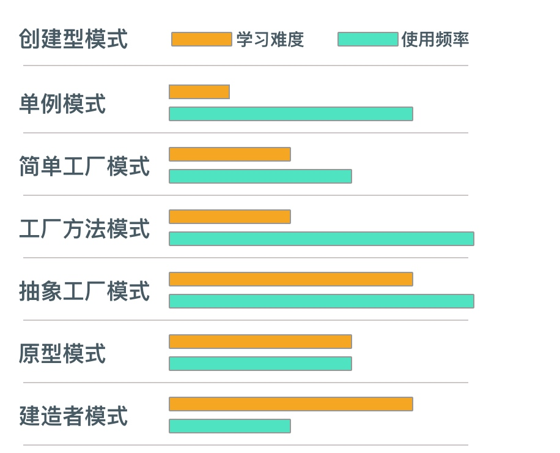

### 4.1 单例模式

#### 4.1.1 定义

**单例模式(Singleton Pattern)：**确保一个类仅有一个实例，并且提供一个访问它的全局访问点

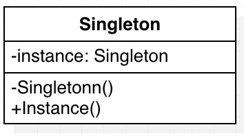


#### 4.1.2 特点

1. 一个类只有一个实例
2. 它必须自行创建这个实例
3. 必须自行向整个系统提供这个实例

#### 4.1.3 应用

* 数据库连接器
* 日志记录器 （可能有多个实例，比如有多个日志文件因为不同的目的记录不同到的日志）
* 应用锁文件 （理论上整个应用只有一个锁文件 …）

#### 4.1.4 实现

1. 不让进: 使类不能被实例化
2. 留后门: 设置静态方法
3. 给对象: 在静态方法里实例化该类
4. 判初夜: 判断是否是第一次产生该类的对象
5. 设静态: 静态方法里要使用静态属性


```php
class Test {
    private static $obj = null;//属性值为对象,默认为null

    // 设置 一个封装的构造方法
    private function __construct() {
        // 占位, 我就是不让你NEW我~~~
    }

    //后门
    public static function getObject() {
        echo "啊,我是后门,进吧!\n";
        if (self::$obj === null) {
            // 实例化一个对象
            self::$obj = new self();
        }

        // 返回的属性 其实就是本对象
        return self::$obj;
    }
}

/*
Test::getObject();//使用静态方法访问该类里的方法
exit;
*/

$t1 = Test::getObject();
$t2 = Test::getObject();
$t3 = Test::getObject();
$t4 = Test::getObject();
$t5 = Test::getObject();
$t6 = Test::getObject();
$t7 = Test::getObject();
$t8 = Test::getObject();

//判断 两个对象 是否是同一个对象
if ($t1 === $t6) {
    echo "哦, Yes! 是同一个实例\n";
} else {
    echo "哦, No! 不是同一个实例\n";
}
```

> 参考：[知乎](https://www.zhihu.com/question/35285158)


