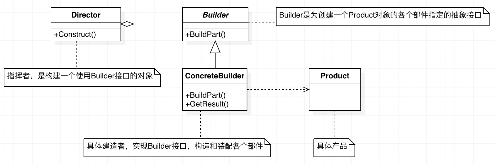

# Head First 面向对象与设计模式 （五）

## 一、建造者模式（Builder Pattern）

### 1.1 定义

建造者模式可以让一个产品的内部表象和产品的生产过程分离开，从而可以生成具有不同内部表象的产品。

建造者模式是一步一步创建一个复杂的对象，它允许用户只通过指定复杂对象的类型和内容就可以构建它们，用户不需要知道内部的具体构建细节。====

目的：消除其他对象的复杂创建过程，使用建造者设计模式不仅是最佳的做法，而且在某个对象的构造和配置方法改变时尽可能地减少重复的代码

#### 1.1.1 结构




### 1.2 角色

* Builder：抽象建造者
* ConcreteBuilder：具体建造者
* Director：指挥者
* Product：产品角色

> 客户端负责创建指导者和具体建造者对象。然后，客户把具体建造者对象交给指导者。客户一声令下，指导者操纵建造者开始创建产品。当产品创建完成后，建造者把产品返还给客户端。

#### 1.2.1 抽象建造者

* 定义一个抽象接口，规范产品各个组成成分的建造（即规范具体建造者的方法实现）
* 其中所规范的方法中必须包括建造方法和结果返回方法

#### 1.2.2 具体建造者

* 实现抽象建造者角色所定义的方法
* 具体建造者与业务逻辑关联性较大，应用程序最终会通过调用此角色中所实现的建造方法按照业务逻辑创建产品，在建造完成后通过结果返回方法返回建造的产品实例
* 一般在外部由客户或一个抽象工厂创建

#### 1.2.3 指挥者

* 此角色的作用是调用具体的建造者角色建造产品
* 指挥者与产品类没有直接关系，与产品类交谈的是具体抽象角色。

#### 1.2.4 产品角色

* 在指导者的指导下由建造者所创建的那个复杂的对象指挥者角色与客户端直接打交道，
* 它理解客户端的业务逻辑，
* 将客户端创建产品的请求拆分成对产品组成部分的请求，
* 然后调用具体产品角色执行建造操作。
* 它分离了客户端与具体建造者。

### 1.3 优缺点

#### 1.3.1 优点

建造者模式可以很好的将一个对象的实现与相关的“业务”逻辑分离开来，从而可以在不改变事件逻辑的前提下,使增加(或改变)实现变得非常容易。

#### 1.3.2 缺点

建造者接口的修改会导致所有执行类的修改。

### 1.4 场景与效果

#### 1.4.1 场景

1. 需要生成的产品对象有复杂的内部结构。
2. 需要生成的产品对象的属性相互依赖，建造者模式可以强迫生成顺序。
3. 在对象创建过程中会使用到系统中的一些其它对象，这些对象在产品对象的创建过程中不易得到。

#### 1.4.2 效果

1. 建造者模式的使用使得产品的内部表象可以独立的变化。使用建造者模式可以使客户端不必知道产品内部组成的细节。
2. 每一个Builder都相对独立，而与其它的Builder无关。
3. 模式所建造的最终产品更易于控制。

> [参考博客](http://www.cnblogs.com/lds85930/articles/643143.html)

### 1.5 比较

#### 1.5.1 抽象工厂

在抽象工厂模式中，每一次工厂对象被调用时都会返还一个完整的产品对象，而客户端可能会将这些产品组装成一个更大更复杂的产品，也可能不会。建造者模式则不同，它一点一点地建造出一个复杂的产品，而这个产品的组装过程发生在建造者内部。二者的区别在于是否有组装过程，组装过程发生的位置。这两个设计模式可以连起来用，客户端通过调用一个建造角色，间接调用另一个抽象工厂模式的工厂角色。工厂模式返还不同产品族的零件，而建造者模式则把它们组装起来。

#### 1.5.2 策略模式

建造者模式在结构上很接近于策略模式，事实上建造者模式是策略模式的一种特殊情况。二者的区别在于用意不同。建造者模式作用于客户端一点一点的建造新的对象，而策略模式的目的是为算法提供抽象的接口。

#### 1.5.3 模板方法模式

建造者模式在退化、失去指挥者角色后，可以发展到模板方法模式(即将建造过程的算法实现放在建造角色中)。

#### 1.5.4 合成模式

合成模式描述一个对象树的组成结构，而建造者模式则可以用来描述对象树的生成过程。

### 1.6 代码

```php
/**
 * 产品
 * 此处仅以一个产品类中的字符串演示产品
 */
class Product {　　　　　　　　　　　　　　　　　　　　　　　　　　
    /**
     * 产品的组成部分集合
     */
    private $_parts;
 
    public function __construct() {
        $this->_parts = array();
    }
 
    public function add($part) {
        return array_push($this->_parts, $part);
    }
 
    public function show() {
        echo "the product include:";
        array_map('printf', $this->_parts);
    }
}
 
/**
 * 抽象建造者 
 */
abstract class Builder {
 
    /**
     * 产品零件构造方法1
     */
    public abstract function buildPart1();
 
 
    /**
     * 产品零件构造方法2
     */
    public abstract function buildPart2();
 
 
    /**
     * 产品返还方法
     */
    public abstract function getResult();
}
 
/**
 * 具体建造者
 */
class ConcreteBuilder extends Builder {
 
    private $_product;
 
    public function __construct() {
        $this->_product = new Product();
    }
 
    public function buildPart1() {
        $this->_product->add("Part1");
    }
 
    public function buildPart2() {
        $this->_product->add("Part2");
    }
 
    public function getResult() {
        return $this->_product;
    }
}
 
/**
 * 导演者
 */
class Director {
 
    public function __construct(Builder $builder) {
        $builder->buildPart1();
        $builder->buildPart2();
    }
}
 
 
 
class Client {
 
     /**
     * Main program.
     */
    public static function main() {
        $buidler = new ConcreteBuilder();
        $director = new Director($buidler);
        $product = $buidler->getResult();
        $product->show();
    }
 
}
 
Client::main();
```

