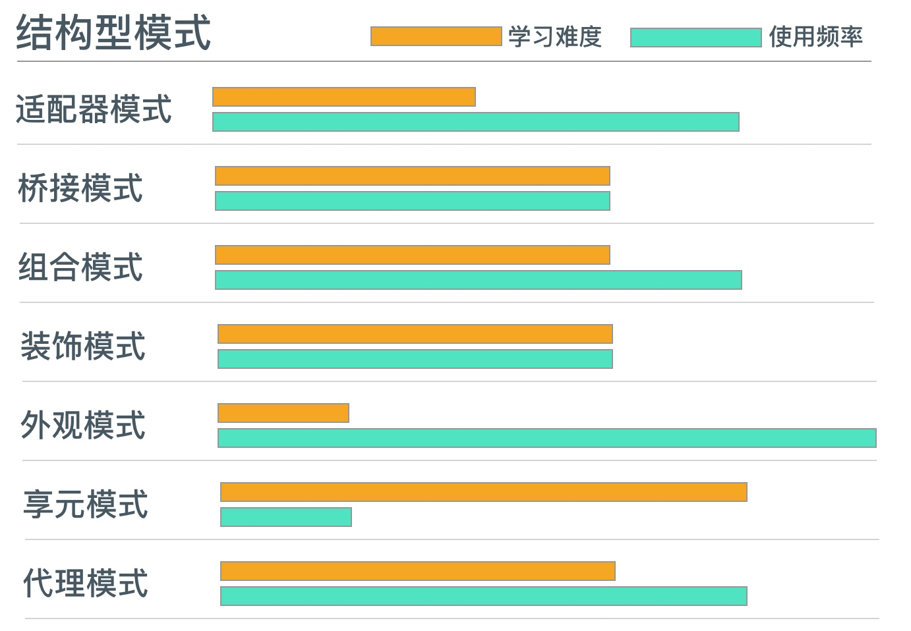
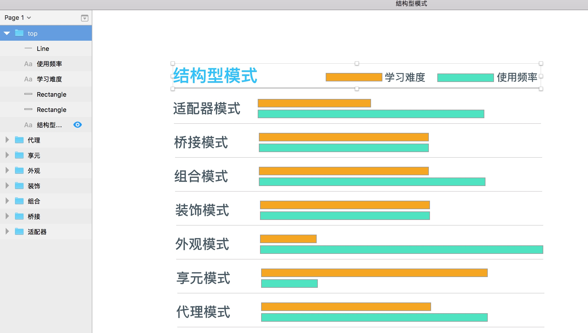
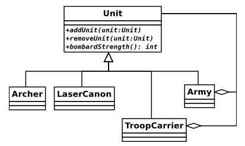
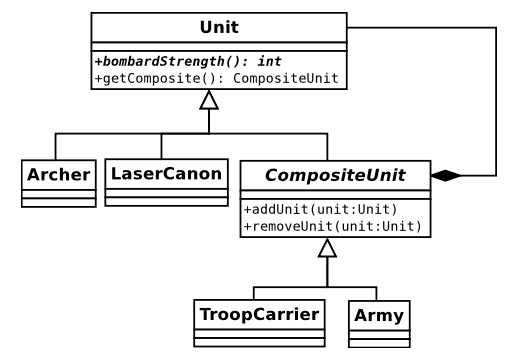

# Head First 面向对象与设计模式（六） -- 组合模式

## 一、结构型模式

在之前的分享中讨论了**创建对象的策略**，接下来三次分享将研究**构建类和对象**的策略。

> 组合优于继承：该原则体现了类和对象之间的组织弹性。

> 为了使项目更具灵活性，我们需要将类按一定结构组织起来，以便它们的对象在代码运行时能被构建为有用的结构




## 二、组合模式

### 2.1 概述

* 也许是将继承用于组合对象的最极端的例子。
* 可以很好地聚合和管理许多相似的对象，故对于客户端而言，一个独立对象和一个对象集合没有太大差别
* 使用时可能会懵逼，原因之一：模式中类的结构和对象的组织结构非常相似
* 模式中继承的层级结构是树形结构，
    * 由根部的基类开始
    * 分支到各个不同的子类
    * 在其继承树中可以轻松地生成枝叶
    * 也可以很容易遍历整个对象树中的对象

### 2.2 实例说明

如下图所示，top、代理、享元...可以看成一个集合，而每个集合中（如top），是文字、线条、矩形的一个集合，所有的又可以组合成一个更大的集合，即当前也页面




* 在这个例子中，我们处理组件的方式和处理集合的方式是一样的。
* 组合模式有助于我们为集合和组件之间的关系建立模型

### 2.3 问题演化

> 管理一组对象是很复杂的，尤其是当对象中还包含着自己的对象时。

如：待办列表包含着多个子任务


本次示例以“文明”游戏为基础设计一个系统。


#### 2.3.1 战斗单元类型

在文明中，玩家可以再一个由大量区块组成的地图上移动战斗单元，独立的单元被组合起来一起移动、战斗和防守。先定义一些战斗单元的类型（只含攻击功能）

```php
abstract class Unit {
    // 设置战斗单元对临近区域的攻击强度
    abstract public function bombardStrength(): int;
}
// 射手类
class Archer extends Unit {
    public function bombardStrength(): int {
        return 4; 
    }
}
// 激光炮类
class LaserCannonUnit extends Unit {
    public function bombardStrength(): int {
        return 44; 
    }
}
```

#### 2.3.2 组合战斗单元

```php
// 军队类
class Army {
    private $units = [];
    // 
    public function addUnit(Unit $unit) {
        array_push($this->units, $unit);
    }
    // 计算总的攻击强度
    public function bombardStrength(): int {
        $ret = 0;
        foreach ($this->units as $unit) {
            $ret += $unit->bombardStrength();
        }
        return $ret;
    }
}

// 客户端代码
$unit1 = new Archer();
$unit2 = new LaserCannonUnit();
$army = new Army();
$army->addUnit($unit1);
$army->addUnit($unit2);
print $army->bombardStrength();
```

当然，需求不可能一直这样简单，如果需要加入一些新的需求，比如军队应该可以与其他军队进行合并，（每个军队可以有自己的ID），同时军队还可以从整编中解散处理。

再具体一点，比如今天公爵（ArchDuke）和Soames将军的勇士可以一起并肩作战，但当国内发生叛乱时，公爵可以再任何时间将他的军队调回。

这时，我们可以修改Army类，使之可以像添加Unit对象一样添加Army对象：

```php
public function addArmy(Army $army) {
    array_push($this->armies, $army);
}

public function bombardStrength(): int {
    $ret = 0;
    foreach ($this->units as $unit) {
        $ret += $unit->bombardStrength();
    }
    foreach ($this->armies as $army) {
        $ret += $army->bombardStrength();
    }
    return $ret;
}
```


截止目前为止，需求（添加和抽取军队）还不算太复杂（但要记住，我们忽略的其他需求，比如：防御强度 - defensiveStrength()、移动矩阵 - movementRange()等方法也需要做类似的修改）

#### 2.3.3 又来新需求

ok，产品汪又来新的需求了：**运兵船**可以支持**最多10个战斗单元**以改进他们在**某些地形上**的活动范围。

#### 2.3.4 问题

* 运兵船与用于组合战斗单元的Army对象相似，但它也有一些自己的特性。
* 可以通过改进Army类来处理TroopCarrier（运兵船）对象，但以后可能会有更多对部队进行组合的需求
* 显然，我们需要一个更灵活的模型

回顾下已经建立的模型，所有已创建的类都需要bombardStrength()方法。

其实就功能上说，Army、Unit、TroopCarrier都有相同的功能，即：移动、攻击和防御。且包含这些对象的对象需要提供添加和移除其他对象的方法。

结论：因为容器对象与他们包含的对象共享同一个接口，所以他们应该共享同一个类型的家族

### 2.4 实现

组合模式定义了一个单根继承体系,使具有截然不同职责的集合可以并肩工作。

在之前的例子中我们已看到以上两点。组合模式中的类必须支持一个共同的操作集,以将其作为它们的首要职责。对我们来说, bombarastrength()方法便支持这样的操作。类同时必须拥有添加和删除子对象的方法。



模型中所有的部队单元都扩展子Unit类，客户端代码可以肯定任何Unit对象都支持bombardStrength()方法，因此完全可以像处理Archer对象那样处理Army对象。

Army和TroopCarrier类都被设计为**组合对象**，用于**包含Unit对象**。Archer和LaserCannon类则是**局部对象**，具有部队单元的操作功能，但不能包含其他Unit对象。

> 局部对象:也称为树叶对象。称为树叶是因为组合模式为树型结构,组合对象为枝干,单独存在的对象为树叶。树叶对象应该是最小单位,其中不能包含其他对象。
 

    局部对象是否需要遵循与上图中的组合对象同样的接口？
    即：在Archer、LaserCannon中，也实现了addUnit()方法
 
#### 2.4.1 Unit类 

可以看到，我们为所有的Unit对象设计了基本功能。

```php
abstract class Unit {
    abstract public function addUnit(Unit $unit);
    abstract public function removeUnit(Unit $unit);
    abstract public function bombardStrength(): int;
}
```


#### 2.4.2 Army类

一个组合对象是如何实现抽象方法的


```php
class Army extends Unit {
    private $units = [];
    public function addUnit(Unit $unit) {
        if (in_array($unit, $this->units, true)) {
            return;
        }
        $this->units[] = $unit;
    }   
    public function removeUnit(Unit $unit) {
        $idx = array_search($unit, $this->units, true);
        if (is_int($idx)) {
            array_splice($this->units, $idx, 1, []);
        }
    }
    public function bombardStrength(): int {
        $ret = 0;
        foreach ($this->units as $unit) {
            $ret += $unit->bombardStrength();
        }
        return $ret;
    }
}
```

Army对象可以保存任何类型的Unit对象，包括Army对象本身或者如Archer或LaserCannonUnit这样的局部对象。因为所有的部队单位都保证支持bombardStrength()方法，

Army::bombardStrength()方法只需遍历$units属性，调用每个Unit对象的bombardStrength()方法，就可以计算出整个军队总的攻击强度。

#### 2.4.3 再遇问题

组合模式的一个问题是如何实现add和remove方法。一般的组合模式会在抽象超类中添加add和remove方法。可以确保模式中的所有类都共享同一个接口，但这也意味着局部类必须也实现这些方法

```php
class UnitException extends \Exception {
}

class Archer extends Unit {
    public function addUnit(Unit $unit) {
        throw new UnitException(get_class($this) . " 是一个最小单元类，不能添加其他单元!");
    }
    public function removeUnit(Unit $unit) {
        throw new UnitException(get_class($this) . " 是一个最小单元类，不能添加其他单元!");
    }
    
    public function bombardStrength(): int {
        return 4; 
    }
}
```

#### 2.4.4 优化

实际上，我们并不希望在Archer对象中添加Unit对象(按常理，我们无法往一个射手中添加一个射手，这些基本单元应该无法添加其他单元)，所以在addUnit或removeUnit方式被代用时会抛出异常，这要求修改所有局部类的add/remove方法，因此我们可以再Unit类的addUnit或removeUnit方法中抛出异常

```php
abstract class Unit {
    public function addUnit(Unit $unit) {
        throw new UnitException(get_class($this) . " 是一个最小单元类，不能添加其他单元!");
    }
    public function removeUnit(Unit $unit) {
        throw new UnitException(get_class($this) . " 是一个最小单元类，不能添加其他单元!");
    }
    abstract public function bombardStrength(): int;
}

class Archer extends Unit {
    public function bombardStrength(): int {
        return 4; 
    }
}
```

这样做可以去除局部类中的重复代码,但是同时组合类不再需要强制性地实现 addUnit()和remoⅴeUnit()方法了,这可能会带来问题

#### 2.4.5 总结

优点：

* 灵活:因为组合模式中的一切类都共享了同一个父类型,所以可以轻松地在设计中添加新的组合对象或者局部对象,而无需大范围地修改代码。
* 简单:使用组合结构的客户端代码只需设计简单的接口。客户端代码没有必要区分一个对象是组合对象还是局部对象(除了添加新组件时)。客户端代码调用Army:: bombardStrength()方法时也会产生一些幕后的委托调用,但是对于客户端代码而言,无论是过程还是效果,都和调用 Archer:: bombardstrength()方法是完全相同的
* 隐式到达(implicit reach):组合模式中的对象通过树型结构组织。每个组合对象中都保存着对子对象的引用。因此对树中某部分的一个小操作可能会产生很大的影响。比如,我们可能会将一个父Am对象的某个子Army对象删除,并将其添加到另外一个父Am对象上去。这个简单的动作看似只对子Amy对象产生作用,但实际上却影响了子Ammy对象中所引用的Uni对象及其子对象的状态
* 显式到达(explicit reach):树型结构可轻松遍历。可以通过迭代树型结构来获取组合对象和局部对象的信息,或对组合对象和局部对象执行批量处理。

通常来说，从客户的角度，我们最能体会到使用模式带来的好处，eg：

```php
// 创建一个army对象
$main_army = new Army();
// 添加一些unit对象
$main_army->addUnit(new Archer());
$main_army->addUnit(new LaserCannonUnit());
// 创建一个新的army对象
$sub_army = new Army();
// 添加一些unit对象
$sub_army->addUnit(new Archer());
$sub_army->addUnit(new Archer());
$sub_army->addUnit(new Archer());
// 把第二个army对象添加到第一个army对象中去
$main_army->addUnit($sub_army);
// 所有的攻击强度计算都在幕后计算
print "attacking with strength: {$main_army->bombardStrength()}\n";
```

> 组合结构的所有复杂性都被完全隐藏了

### 2.5 效果

为什么要把addUnit、removeUnit这样的冗余方法加到并不需要它们的局部类中？ -- 在于Unit类的透明性

客户端代码在得到一个Unit对象时：

* 知道其中一定包含addUnit方法，组合模式的原则便是局部和组合类具有同样的接口
* 但仍然不知道调用Unit的addUnit方法是否安全

如果将add/remove方法降到下一级对象中，以便这些方法仅在组合类中使用，那么将会产生其他问题：

* 使用Unit对象时，我们不知道该对象是否默认支持addUnit方法
* 将冗余的类方法留在局部类中
* 这样做毫无意义且给系统设计带来其一，因为接口应该 关注于自己独有的功能

### 2.6 再次优化

> 我们可以继续分解组合



#### 2.6.1 优化Unit类

将组合类分解为getCompositeUnit子类，并删除add/remove方法

```php
abstract class Unit {
    public function getComposite() {
        return null;
    }
    abstract public function bombardStrength(): int;
}
```

#### 2.6.2 新增getComposite方法

```php
/* CompositeUnit 混合作战单元类 
 * 因为CompositeUnit没有实现bombardStrength()方法，
 * 所以CompositeUnit声明为抽象类abstract
 */
abstract class CompositeUnit extends Unit {
    private $units = [];
    public function getComposite(): CompositeUnit {
        return $this;
    }
    public function addUnit(Unit $unit) {
        if (in_array($unit, $this->units, true)) {
            return;
        }
        $this->units[] = $unit;
    }
    public function removeUnit(Unit $unit) {
        $idx = array_search($unit, $this->units, true);
        if (is_int($idx)) {
            array_splice($this->units, $idx, 1, []);
        }
    }
    public function getUnits(): array {
        return $this->units;
    }
}
```

#### 2.6.3 客户端

```php
class UnitScript {
    /* 有两个Unit类型的参数，第一个是新的Unit对象，第二个是之前 的Unit对象 */
    public static function joinExisting(Unit $newUnit, Unit $occupyingUnit): CompositeUnit {
        $comp = $occupyingUnit->getComposite();
        if (!is_null($comp)) {
            /* 如果第二个Unit对象是一个CompositeUnit对象，那么直接add */
            $comp->addUnit($newUnit);
        } else {
            /* 如果第二个Unit对象不是一个CompositeUnit对象，那么创建一个Army对象，将两个Unit存入这个Army对象 */
            $comp = new Army();
            $comp->addUnit($occupyingUnit);
            $comp->addUnit($newUnit);
        }
        return $comp;
    }
}
```


